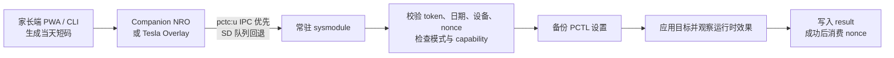
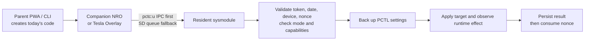

<div align="center">
  

  # 任你玩 · PlayWise

  **Play Wise. Play More.**

  面向 Nintendo Switch 的本地游玩时间控制与离线加时方案。

  [简体中文](#简体中文) | [English](#english)

  [](LICENSE)
</div>

---

## 简体中文

任你玩（PlayWise）是一个面向 Nintendo Switch 自制系统环境的本地游玩时间控制项目。它通过常驻 sysmodule、Companion NRO、Tesla Overlay 和家长端离线 PWA，让家长可以配置本地时间规则，并向孩子签发当天有效、一次性使用的 8 位数字加时码。

项目优先保证协议、队列、控制策略和失败恢复路径可测试。默认配置为只观察、不写入 PCTL 的 `observe` 模式；所有真实写入能力都必须经过备份、控制模式和真机 capability probe 的保护。

> [!WARNING]
> 本项目会接触 Nintendo Switch 的非公开 PCTL 命令和家长控制状态，仅适合了解 Atmosphere、自制系统和故障恢复流程的用户。构建成功不能代替真机验证。首次使用应从 `safe-nro` 或 `observe-boot2` 开始，确认恢复手段后再启用 `grant` 或 `enforce`。

### 核心能力

- **8 位离线加时码**：v2 数字短码绑定设备和 UTC+8 当天，支持 5–120 分钟、5 分钟一档；成功写入后 nonce 才会被消费。
- **Companion NRO**：显示今日状态、剩余时间和最近执行结果，并提供 PIN 保护的家长区。
- **Tesla Overlay**：在覆盖层中输入离线码，通过相同的后台协议提交请求；不读取 `grant_secret`，也不直接访问 PCTL。
- **家长端 PWA**：通过 Web Crypto 在浏览器本地生成短码，首次加载后可离线使用，密钥不会提交到静态服务器。
- **常驻 sysmodule**：验证请求、管理 nonce、执行规则、写前备份、调用 PCTL，并持久化结构化结果。
- **双通道请求传输**：Switch 客户端优先使用 `pctc:u` IPC；服务不可用时回退到原子化 SD 文件队列，已接受的请求不会重复提交。
- **安全控制策略**：支持 `disabled`、`observe`、`grant` 和 `enforce`，并通过独立能力探针保护 play timer 写入、强制阻止和暂停软件路径。

### 工作原理



`grant_secret` 只应保存在家长端可信设备和 Switch 的本地配置中。签名校验、nonce 管理及 PCTL 权限边界均位于 sysmodule；NRO 和 Overlay 只是请求客户端。

### 安全原则

- 默认 `control_mode` 是 `observe`，默认 package 不包含 `boot2.flag`。
- `disable.flag` 优先于所有控制模式，可阻止后台继续执行控制操作。
- 所有 PCTL 写入都必须先创建备份；备份失败时禁止写入。
- 无效 token、dry-run、PCTL 写入失败或结果持久化失败不得消费 nonce。
- play timer 写入必须同时通过 raw write 与 runtime effect 探针。
- `raw_block` 和 `suspend` 只有在各自的真机探针通过后才可用。
- Tesla 能否覆盖官方硬限制弹窗并接收输入取决于 HOS、Atmosphere 和 nx-ovlloader 组合，必须在目标主机上重新验证。

### 快速开始

#### 前置条件

- 一台可运行 Atmosphere 的 Nintendo Switch，以及可直接读写的 SD 卡。
- 主机的日期、时间和时区必须正确。离线码日期绑定、每日规则和 PCTL 计时都依赖主机时间；首次启用或变更固件后应先完成时间同步。
- Windows 和 Python 3，用于本地工具、测试与安装脚本。
- 构建 NRO、Overlay、sysmodule 和 package 时，需要按项目配置启动本地 devkitPro 容器：`root@127.0.0.1:1888`，仓库挂载到 `/ws/switch-play-time-control-local`。
- 使用 Overlay 时，需自行安装与当前系统版本匹配的 nx-ovlloader 和 Tesla Menu；本项目 package 不捆绑这两个组件。

先运行无第三方依赖的本地回归：

```powershell
python .\tools\test.py
```

涉及 C、Makefile、NRO、sysmodule 或最终 package 时，使用唯一的容器构建入口：

```powershell
python .\tools\package_remote.py
```

脚本会清理旧产物、运行 C/Python 测试，并在 `build/packages/` 中生成和校验五类 zip：

| Package | 模式 | 启动 sysmodule | 用途与风险 |
| --- | --- | --- | --- |
| `safe-nro` | `observe` | 否 | 最安全的 UI/文件协议入口；不包含 Overlay。建议首次使用。 |
| `disabled-boot2` | `disabled` | 是 | 安装完整组件但拒绝控制请求，适合停用与恢复排查。 |
| `observe-boot2` | `observe` | 是 | 常驻只读验证，不写 PCTL、不消费 nonce。建议首次验证后台时使用。 |
| `grant-boot2` | `grant` | 是 | 允许通过 capability gate 的显式加时和家长操作；启用前必须完成快速设备测试。 |
| `enforce-boot2` | `enforce` | 是 | 在 `grant` 基础上自动对账时间规则；只应在 grant 业务链路验证完成后使用。 |

将选定的 zip 解压到电脑上的目录，再使用 PowerShell 安装脚本复制并校验 SD 卡内容：

```powershell
.\tools\install_package_to_sd.ps1 -SourceFolder <解压目录> -Drive H -Apply
```

安装脚本会要求确认目标盘根目录。完整的首次安装、快速设备测试、分阶段启用和恢复流程见[测试指南](docs/测试指南.md)。不要跳过其中的真机验证阶段。

### 常见使用

#### 预览家长端 PWA

```powershell
python .\tools\ptc_frontend_server.py
```

在浏览器打开 `http://127.0.0.1:8765`。正式在手机上使用时，应将 `tools/ptc_frontend/` 部署到可信的 HTTPS 静态站点；普通局域网 HTTP 地址不保证 Web Crypto 和 PWA 可用。真实 `grant_secret` 只应保存在可信家长设备中。

#### 从命令行生成 30 分钟短码

```powershell
python .\tools\grant_code.py --tier-minutes 30 --device kid-switch --secret replace-with-long-random-secret
```

命令默认使用 UTC+8 当天日期，并通过本地状态为同一设备和日期递增 v2 nonce。示例 secret 只是占位符，不应在真实部署中使用。

#### 家长控制未生效时先同步时间

如果配置、能力探针和请求结果均正常，但家长控制仍未实际生效，请先确认主机日期、时间和时区正确，再完整执行一次网络时间同步并重启复测。可使用 Tesla 时间同步工具 [QuickNTP](https://github.com/ppkantorski/QuickNTP)，也可参考包含时间同步工具的 [22.5 整合包说明](https://docs.qq.com/doc/DVW9PVE5sU0FEd0tP)。

已有实际案例在降级至 19.x、20.x、21.x、22.0 以及重新升级到 22.5 后仍无法生效，运行 22.5 整合包内的时间同步工具后恢复。该现象说明时间状态应作为固件升降级后的优先排查项，但目前不能据此认定特定固件版本存在兼容性问题，也不能认定 QuickNTP 是项目运行的强制依赖。上述链接均为第三方资源，请自行核对版本、来源和使用风险。

#### 启用真实控制

1. 使用 `safe-nro` 或 `observe-boot2` 验证 UI、请求和只读状态。
2. 安装 `grant-boot2`，从 Companion 的“安全工具”运行快速设备测试，确认写入、运行时效果和自动恢复全部通过。
3. 按测试指南验证离线加时与家长操作，再按需运行 `raw_block` 或 `suspend` 的独立能力探针。
4. 只有 grant 链路稳定后才安装 `enforce-boot2`，验证自动对账、去重和跨日行为。

紧急停用时创建 `sdmc:/switch/play-time-control/flags/disable.flag`。如需完全停止 boot2，删除 `sdmc:/atmosphere/contents/4200000000BD2300/flags/boot2.flag`，或安装 `disabled-boot2`。如果官方限制已经生效，仍应使用官方 PIN 或 Nintendo Parental Controls App 恢复访问。

### 项目结构

```text
common/       纯 C 协议、token、时间、规则与控制策略
platform/     host doubles 与 Switch 存储、时间、PCTL adapter
sysmodule/    队列编排、IPC 服务和 Atmosphere boot2 sysmodule
companion/    共享客户端、Companion NRO 与 Tesla Overlay
tools/        短码、协议探测、PWA、打包和安装工具
tests/        Python、C host、前端与打包回归测试
docs/         产品、架构、协议、开发和真机验证文档
```

`common` 不依赖 libnx、文件系统、SD 卡路径、UI 或真实时钟。真实平台行为被限制在 adapter 层，使协议和业务策略能够在 host 环境中重复测试。

### 开发与贡献

本地 Python、协议和安全打包回归统一使用：

```powershell
python .\tools\test.py
```

C、Makefile、NRO、sysmodule 或 package 改动的权威验证统一使用：

```powershell
python .\tools\package_remote.py
```

提交改动前请先阅读[开发指南](docs/开发指南.md)、[架构](docs/架构.md)、[协议](docs/协议.md)和相关测试。新增协议行为应同时补充成功/失败测试及必要文档，并保持默认 `observe`、fail-open、写前备份和 nonce 消费规则不变。

### 项目状态与限制

- token v1/v2、请求队列、控制策略、备份门、nonce、PWA、IPC fallback 和 package 安全规则已有 host 自动测试覆盖。
- play timer 写入与 runtime effect 快速探针已在真机通过，但新设备、固件或 Atmosphere 组合仍需重新执行快速测试。
- `raw_block` 与 `suspend` 路径已实现，但在目标设备的独立 capability probe 通过前保持关闭。
- Tesla Overlay 能否在官方游玩时间硬限制弹窗之上显示和接收输入，不能由 host 测试或构建成功证明。
- 本仓库当前不提供预构建 GitHub Release；请使用上述本地容器入口生成可校验的 package。

当前进度与剩余验收项见[实施路线图](docs/实施路线图.md)。

### 文档

- [开发文档](docs/开发文档.md)：项目入口、当前实现重点和核心原则。
- [产品说明](docs/产品说明.md)：用户角色、功能和交互设计。
- [架构](docs/架构.md)：模块边界、依赖方向和运行链路。
- [协议](docs/协议.md)：SD 卡布局、token、请求/result 和错误契约。
- [开发指南](docs/开发指南.md)：编码规范、稳定性要求和合并检查。
- [测试指南](docs/测试指南.md)：本地测试、构建打包、真机验收和恢复。
- [实施路线图](docs/实施路线图.md)：已实现能力和后续工作。

### 许可证与声明

本项目使用 [Apache License 2.0](LICENSE)。第三方组件保留各自许可证；vendored libtesla 的来源、许可证和补丁说明位于 `companion/overlay/vendor/libtesla/`。

本项目是独立的开源项目，与 Nintendo、Atmosphere、libnx、Tesla Menu 或 nx-ovlloader 的作者及维护者无隶属或背书关系。Nintendo Switch 是 Nintendo 的商标。

---

## English

PlayWise is a local play-time control project for Nintendo Switch homebrew environments. It combines a resident sysmodule, a Companion NRO, a Tesla Overlay, and an offline parent-side PWA so parents can manage local time rules and issue device-bound, single-use 8-digit extension codes that are valid for the current day.

The project prioritizes testable protocols, queues, control policies, and recovery paths. The default configuration is the read-only `observe` mode. Every real PCTL write is protected by backups, control-mode checks, and capability probes that must be verified on hardware.

> [!WARNING]
> This project interacts with undocumented Nintendo Switch PCTL commands and parental-control state. It is intended for users who understand Atmosphere, homebrew deployment, and device recovery. A successful build is not a substitute for hardware validation. Start with `safe-nro` or `observe-boot2`, and confirm your recovery path before enabling `grant` or `enforce`.

### Features

- **8-digit offline extension codes**: v2 numeric codes are bound to a device and the current UTC+8 date, with 5–120 minute tiers in 5-minute increments. A nonce is consumed only after a successful write.
- **Companion NRO**: shows today's state, remaining time, and the latest operation, with a PIN-protected parent area.
- **Tesla Overlay**: accepts offline codes and submits them through the same backend protocol. It never reads `grant_secret` or accesses PCTL directly.
- **Parent-side PWA**: generates codes locally with Web Crypto, works offline after its first load, and never sends the secret to the static server.
- **Resident sysmodule**: validates requests, manages nonces, evaluates rules, creates backups, calls PCTL, and persists structured results.
- **Dual request transport**: Switch clients prefer `pctc:u` IPC and fall back to an atomic SD-card file queue when the service is unavailable. Accepted requests are never submitted twice.
- **Guarded control modes**: supports `disabled`, `observe`, `grant`, and `enforce`, with separate capability probes for play-timer writes, raw blocking, and software suspension.

### How it works



`grant_secret` should exist only on a trusted parent device and in the Switch's local configuration. Signature verification, nonce management, and PCTL authority remain inside the sysmodule. The NRO and Overlay are request clients, not security boundaries.

### Safety model

- The default `control_mode` is `observe`, and the default package does not contain `boot2.flag`.
- `disable.flag` takes precedence over every control mode and stops control operations.
- Every PCTL write requires a backup. A backup failure blocks the write.
- Invalid tokens, dry runs, PCTL failures, and result-persistence failures never consume a nonce.
- Play-timer writes require both the raw-write and runtime-effect probes to pass.
- `raw_block` and `suspend` remain unavailable until their own hardware probes pass.
- Tesla access over the official hard-limit dialog depends on the HOS, Atmosphere, and nx-ovlloader combination and must be revalidated on the target console.

### Quick start

#### Requirements

- A Nintendo Switch capable of running Atmosphere and an SD card you can access directly.
- The console date, time, and time zone must be correct. Offline-code date binding, daily rules, and PCTL timers depend on the console clock. Synchronize time before the first enablement and after firmware changes.
- Windows and Python 3 for local tools, tests, and the installation script.
- The configured local devkitPro container for NRO, Overlay, sysmodule, and package builds: `root@127.0.0.1:1888`, with the repository mounted at `/ws/switch-play-time-control-local`.
- For the Overlay, install nx-ovlloader and Tesla Menu versions compatible with your system. They are not bundled in this project's packages.

Run the dependency-free local regression suite first:

```powershell
python .\tools\test.py
```

For changes involving C, Makefiles, the NRO, sysmodule, or final packages, use the single container build entry point:

```powershell
python .\tools\package_remote.py
```

The script removes stale artifacts, runs the C and Python tests, and creates and verifies five zip packages under `build/packages/`:

| Package | Mode | Starts sysmodule | Purpose and risk |
| --- | --- | --- | --- |
| `safe-nro` | `observe` | No | Safest UI/file-protocol entry; excludes the Overlay. Recommended for a first run. |
| `disabled-boot2` | `disabled` | Yes | Installs all components but rejects control requests; useful for disabling and recovery diagnostics. |
| `observe-boot2` | `observe` | Yes | Resident read-only validation; never writes PCTL or consumes nonces. Recommended for initial backend validation. |
| `grant-boot2` | `grant` | Yes | Allows explicit extension and parent operations that pass capability gates. The quick device test must pass first. |
| `enforce-boot2` | `enforce` | Yes | Adds automatic rule reconciliation to `grant`. Use only after validating the grant workflow. |

Extract the selected zip on the PC, then use the PowerShell installer to copy and verify the SD-card contents:

```powershell
.\tools\install_package_to_sd.ps1 -SourceFolder <extracted-folder> -Drive H -Apply
```

The installer asks you to confirm the target drive root. See the [test guide](docs/测试指南.md) for the complete first-install, quick-device-test, staged enablement, and recovery procedure. Do not skip its hardware-validation stages.

### Common tasks

#### Preview the parent PWA

```powershell
python .\tools\ptc_frontend_server.py
```

Open `http://127.0.0.1:8765` in a browser. For real phone use, deploy `tools/ptc_frontend/` to a trusted HTTPS static origin. Plain LAN HTTP does not reliably provide Web Crypto or PWA support. Store a real `grant_secret` only on trusted parent devices.

#### Generate a 30-minute code from the CLI

```powershell
python .\tools\grant_code.py --tier-minutes 30 --device kid-switch --secret replace-with-long-random-secret
```

The command defaults to the current UTC+8 date and advances a local v2 nonce state for the same device and date. The secret shown above is a placeholder and must not be used in a real deployment.

#### Synchronize time when parental controls do not take effect

If configuration, capability probes, and request results all look correct but parental controls still do not take effect, verify the console date, time, and time zone, perform a full network time synchronization, then reboot and test again. You can use the Tesla time-sync tool [QuickNTP](https://github.com/ppkantorski/QuickNTP), or refer to the [22.5 bundle notes](https://docs.qq.com/doc/DVW9PVE5sU0FEd0tP), which include a time-sync tool.

In one observed case, downgrading through 19.x, 20.x, 21.x, and 22.0 and then upgrading back to 22.5 did not restore the behavior; running the time-sync tool from the 22.5 bundle did. This makes clock state a useful first diagnostic after firmware changes, but it does not establish a firmware compatibility defect or make QuickNTP a required dependency. Both links point to third-party resources; verify their version, provenance, and risks before use.

#### Enable real control

1. Use `safe-nro` or `observe-boot2` to validate the UI, request path, and read-only status.
2. Install `grant-boot2` and run the quick device test from Companion's safety tools. Confirm that the write, runtime effect, and automatic restoration all pass.
3. Follow the test guide to validate offline extensions and parent operations, then run the separate `raw_block` or `suspend` capability probes only if needed.
4. Install `enforce-boot2` only after the grant path is stable, then validate automatic reconciliation, deduplication, and day rollover.

For an emergency stop, create `sdmc:/switch/play-time-control/flags/disable.flag`. To stop boot2 entirely, remove `sdmc:/atmosphere/contents/4200000000BD2300/flags/boot2.flag` or install `disabled-boot2`. If an official restriction is already active, use the official PIN or Nintendo Parental Controls App to restore access.

### Repository layout

```text
common/       Pure C protocols, tokens, time, rules, and control policy
platform/     Host doubles and Switch storage, time, and PCTL adapters
sysmodule/    Queue orchestration, IPC service, and Atmosphere boot2 sysmodule
companion/    Shared clients, Companion NRO, and Tesla Overlay
tools/        Code generation, protocol probe, PWA, packaging, and installer
tests/        Python, C host, frontend, and package regression tests
docs/         Product, architecture, protocol, development, and device guides
```

`common` does not depend on libnx, filesystems, SD-card paths, UI, or a real clock. Platform behavior is isolated behind adapters so protocols and business policy can be tested repeatedly on a host machine.

### Development and contributing

Use the single entry point for local Python, protocol, and safe-package regressions:

```powershell
python .\tools\test.py
```

Use the authoritative container verification for changes to C, Makefiles, the NRO, sysmodule, or packages:

```powershell
python .\tools\package_remote.py
```

Before contributing, read the [development guide](docs/开发指南.md), [architecture](docs/架构.md), [protocol](docs/协议.md), and the relevant tests. New protocol behavior must include success and failure coverage plus any required documentation. Preserve the default `observe` mode, fail-open behavior, backup gate, and nonce-consumption rules.

### Project status and limitations

- Token v1/v2, request queues, control policy, backup gates, nonces, the PWA, IPC fallback, and package safety rules have host-side automated coverage.
- The play-timer write and runtime-effect quick probe have passed on real hardware, but the quick test must be rerun for new consoles, firmware, or Atmosphere combinations.
- The `raw_block` and `suspend` paths are implemented but remain disabled until their separate capability probes pass on the target device.
- Host tests and successful builds cannot prove that the Tesla Overlay remains visible and interactive over the official play-time hard-limit dialog.
- This repository currently provides no prebuilt GitHub Release. Build verified packages through the local container entry point above.

See the [implementation roadmap](docs/实施路线图.md) for current progress and remaining acceptance work.

### Documentation

- [Development overview](docs/开发文档.md): entry point, current implementation focus, and core principles.
- [Product specification](docs/产品说明.md): user roles, features, and interaction design.
- [Architecture](docs/架构.md): module boundaries, dependencies, and runtime flow.
- [Protocol](docs/协议.md): SD-card layout, tokens, requests/results, and error contract.
- [Development guide](docs/开发指南.md): coding rules, stability requirements, and merge checks.
- [Test guide](docs/测试指南.md): local tests, package builds, hardware acceptance, and recovery.
- [Implementation roadmap](docs/实施路线图.md): completed capabilities and remaining work.

### License and disclaimer

This project is licensed under the [Apache License 2.0](LICENSE). Third-party components retain their own licenses. The vendored libtesla source, license, and patch notes are under `companion/overlay/vendor/libtesla/`.

This is an independent open-source project. It is not affiliated with or endorsed by Nintendo, Atmosphere, libnx, Tesla Menu, nx-ovlloader, or their authors and maintainers. Nintendo Switch is a trademark of Nintendo.
