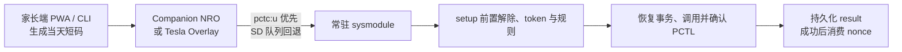

<div align="center">
  

  # 任你玩 · PlayWise

  **Play Wise. Play More.**

  Nintendo Switch 本地游玩时间控制与离线加时方案。

  [简体中文](#简体中文) | [English](#english)

  [](LICENSE)
</div>

---

## 简体中文

任你玩（PlayWise）面向 Nintendo Switch 自制系统环境，由常驻 sysmodule、Companion NRO、Tesla Overlay 和家长端离线 PWA 组成。家长可以设置本地时间规则，并签发当天有效、绑定设备且只能成功使用一次的 8 位数字加时码。

> [!WARNING]
> 项目会访问非公开 PCTL 命令和家长控制状态，只适合熟悉 Atmosphere、自制系统和 SD 卡恢复流程的用户。构建成功不能代替真机验证。首次设备或 HOS/PCTL 行为变化后，必须验证前置解除、真实加时和安装快照恢复。

### 核心能力

- 5–120 分钟、5 分钟一档的 v2 离线加时码；可通过在线[家长网页控制台](https://selfuppen.github.io/playwise/)（支持 PWA 离线使用）直接签发，密钥只保存在家长端浏览器和 Switch 本地配置中。
- Companion NRO 提供孩子状态页、数字码输入和 PIN 保护的家长区。
- Tesla Overlay 可在覆盖层提交同一请求，不读取 `grant_secret`、不直接访问 PCTL。
- sysmodule 首次启动先保存安装前 PCTL snapshot 并解除当天当前限制，随后验证 token、管理 nonce、执行规则和恢复事务。
- Switch 客户端优先使用 `pctc:u` IPC，服务不可用时回退到原子化 SD 文件队列。
- 单一完整 package 默认 `enforce`；`grant` 可作为运行时配置，`observe/disabled` 仅保留旧配置的非写兼容行为。



### 快速开始

本地 Python、协议和安全打包回归：

```powershell
python .\tools\test.py
```

涉及 C、Makefile、NRO、sysmodule 或最终 package 时，通过本地 devkitPro 容器构建：

```powershell
python .\tools\package_remote.py
```

脚本会清理旧产物、运行 C/Python 测试，并在 `build/packages/` 只生成和校验 `playwise-<timestamp>.zip`。该包包含 sysmodule、Companion、Overlay 和 `boot2.flag`，初始配置为 `enforce`。

完整的配置、安装、加时和恢复流程见[使用指南](docs/使用指南.md)。

### 安全边界

- package 默认 `enforce` 并包含 `boot2.flag`；首次引导完成前阻止普通写入和 Enforce。
- 所有普通 PCTL 写入都进入持久化恢复事务，写后确认运行时目标；失败立即回滚，无法证明恢复时创建 `disable.flag`。
- `flags/retry_setup_release.flag` 与 `flags/restore_install_snapshot.flag` 的恢复优先级高于 `disable.flag`。
- 无效 token、dry-run、写入失败或结果持久化失败不得消费 nonce。
- `raw_block` 和 `suspend` 在各自真机探针通过前保持关闭。
- 官方家长控制是整台主机级别；本项目 PIN 不能替代 Nintendo 官方 PIN 或 App。

### 当前状态

协议、队列、setup 状态机、崩溃恢复、控制策略、PWA、IPC fallback、Companion、Overlay、sysmodule 和单包布局已有自动测试。真机只保留单包端到端验收及按 PCTL、引导、输入、Enforce、raw block 或 suspend 改动范围触发的专项测试。

### 文档

- [使用指南](docs/使用指南.md)：构建、安装、配置、日常使用与恢复。
- [开发指南](docs/开发指南.md)：架构边界、依赖规则、安全不变量与贡献要求。
- [协议](docs/协议.md)：配置、token、请求/result、错误和 PCTL 证据契约。
- [测试指南](docs/测试指南.md)：本地、容器、UI 和真机验收。

## English

PlayWise is a local play-time control project for Nintendo Switch homebrew environments. It combines a resident sysmodule, a Companion NRO, a Tesla Overlay, and an offline parent-side PWA. Parents can manage local time rules and issue device-bound, single-use 8-digit extension codes valid for the current day.

> [!WARNING]
> This project accesses undocumented PCTL commands and parental-control state. It is intended for users familiar with Atmosphere, homebrew deployment, and SD-card recovery. A successful build is not hardware validation. New devices or relevant HOS/PCTL changes require focused validation of setup release, a real grant, and installation-snapshot restore.

### Features

- v2 offline codes for 5–120 minutes in 5-minute tiers, generated via the online [Parent Web Console](https://selfuppen.github.io/playwise/) (with offline PWA support).
- A child status/code-entry UI and a PIN-protected parent area in the Companion NRO.
- A Tesla Overlay that submits the same request without reading `grant_secret` or calling PCTL.
- A resident sysmodule that releases the current restriction during setup, validates tokens, and wraps ordinary PCTL writes in persistent recovery transactions.
- `pctc:u` IPC first, with an atomic SD-card queue fallback.
- One complete Enforce package; raw block and suspend remain separately gated high-risk capabilities.

### Quick start

Run the local Python, protocol, and package-safety regression suite:

```powershell
python .\tools\test.py
```

For C, Makefile, NRO, sysmodule, or final-package changes, use the local devkitPro container entry point:

```powershell
python .\tools\package_remote.py
```

It produces one verified `playwise-<timestamp>.zip` under `build/packages/`, containing the sysmodule, Companion, Overlay, and `boot2.flag`, with Enforce as the initial mode.

The detailed guides are currently maintained in Chinese:

- [User guide / 使用指南](docs/使用指南.md)
- [Development guide / 开发指南](docs/开发指南.md)
- [Protocol / 协议](docs/协议.md)
- [Test guide / 测试指南](docs/测试指南.md)

Setup captures an installation snapshot and releases the current restriction before normal control begins. Every ordinary PCTL write is recoverable and runtime-confirmed; raw block and suspend stay independently gated. The local Companion PIN is not the Nintendo parental-control PIN.

## License

Licensed under [Apache License 2.0](LICENSE). This independent project is not affiliated with or endorsed by Nintendo, Atmosphere, libnx, Tesla Menu, or nx-ovlloader. Nintendo Switch is a Nintendo trademark.
