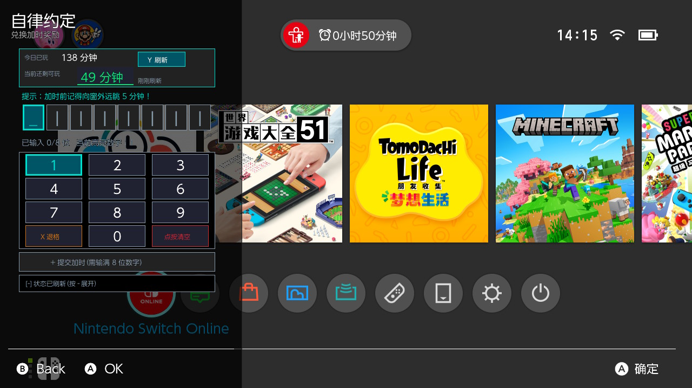
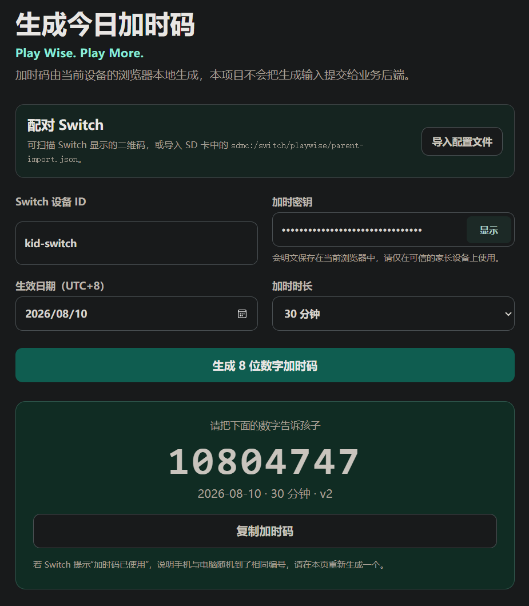

  

  # 任我玩 · PlayWise

  **Play Wise. Play More.**

任我玩（项目仓库名 NX-PlayWise）是面向已安装自定义固件（推荐 Atmosphère）的 Nintendo Switch 的本地游玩时间管理工具。家长可在主机上设置额度和计划；需要临时加时时，生成当天有效的 8 位加时码并告诉孩子，孩子在 Switch 上兑换。日常生成和兑换无需 Switch 联网，也不需要 Nintendo Account 或 PlayWise 服务器。

> [!WARNING]
> 未破解的零售主机无法使用。PlayWise 依赖 Nintendo 官方家长控制正常计时，并要求开启“时间到了暂停软件”。安装前请用非关键游戏验证到时确实暂停软件。限制生效后，PlayWise 主机应用可能无法打开；请事先安装并试用游戏内浮窗（Tesla Overlay）。

## 快速开始

1. 在 Switch 的“系统设置 → 家长控制”启用官方家长控制和“时间到了暂停软件”，验证亮屏使用会计入额度、到时会阻断软件。
2. 准备 Atmosphère、Homebrew Menu，以及 Ultrahand 或其他 Tesla 浮窗管理器。PlayWise 安装包不包含浮窗管理器。
3. 首次使用下载 `playwise-complete-<版本>.zip`：其中的 `playwise-<版本>.zip` 安装 Switch 端，`playwise-offline.html` 是备用的离线家长网页。将标准包内的 `atmosphere` 和 `switch` 目录合并到 SD 卡根目录后重启。
4. 从 Homebrew Menu 打开“任我玩”，按向导设置家长区入口、PlayWise PIN、主题并确认接管。孩子需要加时时，按下文选择主机应用或游戏内浮窗兑换。

完整的[安装、首次设置、使用与升级步骤](docs/使用指南.md)见使用指南。

## 加时码操作演示

### 孩子使用加时码：受限时用游戏内浮窗

> 使用加时码：在Switch 生成或兑换加时码均无需联网。

每日额度耗尽后，Nintendo 原生弹窗可能阻断 Homebrew 和 PlayWise 主机应用。用预先设置的 Ultrahand/Tesla 快捷键打开浮窗管理器，选择“任我玩”（`playwise.ovl`）；输入家长给的 8 位码，核对预计结果并确认兑换。家长还可在浮窗中输入 PlayWise PIN，单次授权增加分钟或设为今日不限时。就寝限制可跳过本次、关闭计划或恢复安装前快照。

> 两图是旧版真机操作示意，分别展示浮窗管理器入口和 PlayWise 浮窗可覆盖 HOME 打开；当前按钮、确认页和可用操作以已安装版本为准。它们不是当前候选的真机验收截图。详见[受限时使用游戏内浮窗](docs/使用指南.md#受限时使用游戏内浮窗)。

### 家长生成加时码：手机扫码

> 生成加时码：
> 使用公开家长网页扫二维码跳转到生成时码的网页时，家长的手机或电脑需要能访问github;
> 也可以使用`playwise-complete-<版本>.zip` 安装包里面的`playwise-offline.html` 备用的离线家长网页，此时手机/电脑也无需联网，配置好后可以长期使用(生成加时码需要的key和id存到浏览器里面了), 步骤和密钥保护说明见[使用指南：在手机或电脑上生成](docs/使用指南.md#在手机或电脑上生成)。

在 Switch 家长区打开“离线加时 → 手机/电脑生成”，验证 PlayWise PIN 后显示配对二维码。用可信的家长手机或电脑扫码，在打开的[家长网页](https://selfuppen.github.io/NX-PlayWise/)确认“导入此设备”；选好与 Switch 本地日期一致的日期和加时分钟数，即可在浏览器中生成 8 位码并告诉孩子。网页在浏览器本地计算代码，不向 PlayWise 业务后端提交密钥或代码，不用每次扫码，可反复生成。

第一张图中的二维码已替换成**公开演示配置**，不能用于真实家庭设备；第二张是家长网页的历史界面示意，实际日期和操作以当前设备为准。公开网页在部分网络环境下可能无法访问；此时可用完整交付包中的 `playwise-offline.html` 导入配置文件，或在 Switch 家长区直接生成。步骤和密钥保护说明见[使用指南：在手机或电脑上生成](docs/使用指南.md#在手机或电脑上生成)。

## 主要功能

- **当天调度**：今日额度、快速加时、今日不限时、清除今日调整。
- **长期计划**：每周计划、国家节假日、临时日期计划和就寝时间。
- **自主缓冲**：可选的每日一次 5/10/15 分钟自主缓冲，以及今天、明天和规则来源说明。
- **离线加时**：Switch 本机或家长网页生成离线加时码；成功兑换一次后失效。每日上限可能使实际增加少于代码面额。
- **活动记录**：本机家庭活动记录和 7/30 天额度消耗估算。统计范围是“本机使用”，缺失日期保持未知；按游戏明细尚不可用。
- **支持与恢复**：诊断导出、紧急停用、安装前状态恢复，以及完整覆盖安装后的安全热加载。

具体页面使用说明，参见[使用指南](docs/使用指南.md)。

## 推荐环境与验证状态

当前候选的资格目标为 Nintendo Switch OLED、HOS 22.5.0 和 Atmosphère 1.11.2。2026-08-10 的记录是早于当前 PCTL 改动的历史证据。候选默认是 `pending`；只有发布 Zip 的 SHA-256 与同目录 `qualification.json` 完全匹配，才表示该原包在记录环境通过资格验证。其他构建或系统版本均视为未验证。

推荐使用 [Ultrahand Overlay](https://github.com/ppkantorski/Ultrahand-Overlay) 管理 PlayWise 游戏内浮窗。也可参考[大气层包安装与使用说明](https://docs.qq.com/doc/DVW9PVE5sU0FEd0tP)准备运行环境；相关交流群为“switch大气层超频折腾群”（QQ群 `1051287661`）。这些外部项目与社群不包含在 PlayWise 安装包中，也不代表 PlayWise 对其背书。

PlayWise PIN 只保护本项目的家长区，不是 Nintendo 官方家长控制 PIN。PlayWise 不重置官方 PIN，也不解绑官方手机 App。Nintendo 官方计时按主机使用时间累计，HOME 和系统设置等亮屏使用也可能消耗额度，见[官方说明](https://support.nintendo.com/jp/switch/parentalcontrols/app/setting_change.html)。

## ROADMAP

| 功能特性                          | 当前状态                                                                          |
| --------------------------------- | --------------------------------------------------------------------------------- |
| 中国国家法定节假日时间设置        | 已实现，内置 2026 年日历                                                          |
| 日期计划、规则预览、每日自主缓冲  | 已实现；自主缓冲默认关闭                                                          |
| 家庭活动记录、7/30 天额度消耗估算 | 已实现；缺失日期标为未知                                                          |
| 主机应用暗黑模式                  | 已实现三态主题；浮窗保持固定暗色                                                  |
| 自定义快捷键录制                  | 验证中；预设组合已开放，录制入口暂未发布                                          |
| 就寝时间（bedtime）               | 标准版已提供跨夜计划、后台限制和浮窗恢复；新安装默认关闭，真机资格仍为`pending` |
| 按游戏时间统计                    | `pdm:qry` 真机证据门禁中，当前显示不可用                                        |

每日额度耗尽和就寝时间生效后，PlayWise 侧只保留浮窗作为主机内操作入口：每日限制可兑换加时码，或由家长单次授权增加分钟、设为今日不限时；就寝限制可跳过本次、关闭计划或恢复安装前快照。Nintendo 原生弹窗的官方 PIN 临时解锁仍由 Nintendo 提供。若浮窗或后台不可用，PlayWise 没有可靠的主机内自救路径，也不会自动写入启动恢复旗标。

## 项目文档

- [使用指南](docs/使用指南.md)
- [开发指南](docs/开发指南.md)
- [开发环境指南](docs/开发环境指南.md)
- [协议](docs/协议.md)
- [测试指南](docs/测试指南.md)
- [PCTL 集成架构](docs/PCTL集成架构.md)

## 致谢与许可

实现思路参考 [gmaitxqqq/switch-pctltcp-remoteandlocal](https://github.com/gmaitxqqq/switch-pctltcp-remoteandlocal) 和 [tailiang2008/NX-Pctl-Manager](https://github.com/tailiang2008/NX-Pctl-Manager)。项目采用 Apache License 2.0，与 Nintendo、Atmosphère、libnx 或 Ultrahand Overlay 无隶属或背书关系。
