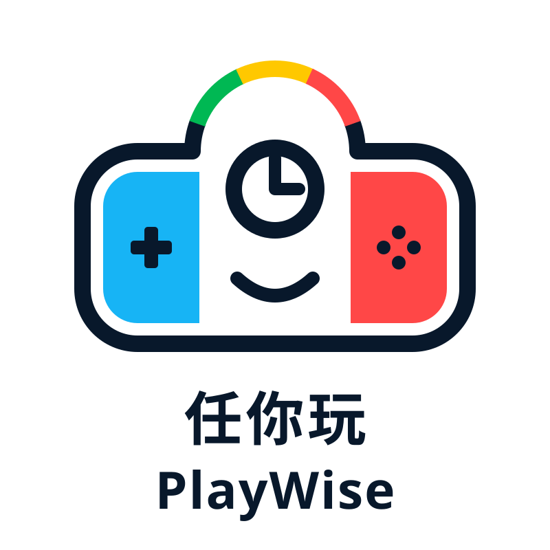
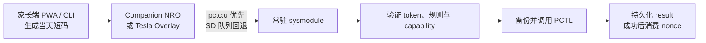

<div align="center">
  

  # 任你玩 · PlayWise

  **Play Wise. Play More.**

  Nintendo Switch 本地游玩时间控制与离线加时方案。

  [简体中文](#简体中文) | [English](#english)

  [](LICENSE)
</div>

---

## 简体中文

任你玩（PlayWise）面向 Nintendo Switch 自制系统环境，由常驻 sysmodule、Companion NRO、Tesla Overlay 和家长端离线 PWA 组成。家长可以设置本地时间规则，并签发当天有效、绑定设备且只能成功使用一次的 8 位数字加时码。

> [!WARNING]
> 项目会访问非公开 PCTL 命令和家长控制状态，只适合熟悉 Atmosphere、自制系统和 SD 卡恢复流程的用户。构建成功不能代替真机验证。首次设备或 HOS/Atmosphere 变化后必须按 `safe → disabled → observe → grant` 完整基线启用，确认恢复方式后再执行真实写入。

### 核心能力

- 5–120 分钟、5 分钟一档的 v2 离线加时码；密钥只保存在家长可信设备和 Switch 本地配置中。
- Companion NRO 提供孩子状态页、数字码输入和 PIN 保护的家长区。
- Tesla Overlay 可在覆盖层提交同一请求，不读取 `grant_secret`、不直接访问 PCTL。
- sysmodule 验证 token、管理 nonce、执行规则、写前备份、调用 PCTL 并持久化结果。
- Switch 客户端优先使用 `pctc:u` IPC，服务不可用时回退到原子化 SD 文件队列。
- `disabled`、`observe`、`grant`、`enforce` 四种控制模式及独立 capability gate。



### 快速开始

本地 Python、协议和安全打包回归：

```powershell
python .\tools\test.py
```

涉及 C、Makefile、NRO、sysmodule 或最终 package 时，通过本地 devkitPro 容器构建：

```powershell
python .\tools\package_remote.py
```

脚本会清理旧产物、运行 C/Python 测试，并在 `build/packages/` 生成和校验五类 package：

| Package | 模式 | boot2 | 用途 |
| --- | --- | --- | --- |
| `safe-nro` | `observe` | 否 | 最安全的 UI 和文件协议入口，不包含 Overlay |
| `disabled-boot2` | `disabled` | 是 | 安装完整组件但拒绝控制请求，用于停用和恢复排查 |
| `observe-boot2` | `observe` | 是 | 常驻只读验证，不写 PCTL、不消费 nonce |
| `grant-boot2` | `grant` | 是 | 允许通过 capability gate 的显式加时和家长操作 |
| `enforce-boot2` | `enforce` | 是 | 在 `grant` 基础上按规则自动对账 |

完整的配置、安装、加时和恢复流程见[使用指南](docs/使用指南.md)。

### 安全边界

- 默认模式为 `observe`，默认 package 不包含 `boot2.flag`。
- `flags/disable.flag` 优先于所有模式；所有 PCTL 写入必须先成功备份。
- 无效 token、dry-run、写入失败或结果持久化失败不得消费 nonce。
- play timer 业务写入要求 raw write 与 runtime effect 探针都通过。
- `raw_block` 和 `suspend` 在各自真机探针通过前保持关闭。
- 官方家长控制是整台主机级别；本项目 PIN 不能替代 Nintendo 官方 PIN 或 App。

### 当前状态

协议、队列、控制策略、PWA、IPC fallback、Companion、Overlay、sysmodule 和 package 已有 host 自动测试。Companion 提供单请求“一键基础测试”，先验证解除当前限制和精确恢复，再留下有限测试额度；`grant` 真实加时、`enforce` 长期行为、`raw_block`、`suspend` 以及 Overlay 能否覆盖官方硬限制弹窗仍需在目标 HOS、Atmosphere 和 nx-ovlloader 组合上按[测试指南](docs/测试指南.md)验收。

### 文档

- [使用指南](docs/使用指南.md)：构建、安装、配置、日常使用与恢复。
- [开发指南](docs/开发指南.md)：架构边界、依赖规则、安全不变量与贡献要求。
- [协议](docs/协议.md)：配置、token、请求/result、错误和 PCTL 证据契约。
- [测试指南](docs/测试指南.md)：本地、容器、UI 和真机验收。

## English

PlayWise is a local play-time control project for Nintendo Switch homebrew environments. It combines a resident sysmodule, a Companion NRO, a Tesla Overlay, and an offline parent-side PWA. Parents can manage local time rules and issue device-bound, single-use 8-digit extension codes valid for the current day.

> [!WARNING]
> This project accesses undocumented PCTL commands and parental-control state. It is intended for users familiar with Atmosphere, homebrew deployment, and SD-card recovery. A successful build is not hardware validation. On a new device or after relevant HOS/Atmosphere changes, run the full `safe → disabled → observe → grant` baseline before enabling normal writes.

### Features

- v2 offline codes for 5–120 minutes in 5-minute tiers.
- A child status/code-entry UI and a PIN-protected parent area in the Companion NRO.
- A Tesla Overlay that submits the same request without reading `grant_secret` or calling PCTL.
- A resident sysmodule that validates tokens, tracks nonces, backs up settings, applies policy, and persists results.
- `pctc:u` IPC first, with an atomic SD-card queue fallback.
- Four control modes and separate hardware capability gates for high-risk operations.

### Quick start

Run the local Python, protocol, and package-safety regression suite:

```powershell
python .\tools\test.py
```

For C, Makefile, NRO, sysmodule, or final-package changes, use the local devkitPro container entry point:

```powershell
python .\tools\package_remote.py
```

It produces five verified packages under `build/packages/`:

| Package | Mode | boot2 | Purpose |
| --- | --- | --- | --- |
| `safe-nro` | `observe` | No | Safest UI/file-protocol entry; no Overlay |
| `disabled-boot2` | `disabled` | Yes | Full install with control requests disabled |
| `observe-boot2` | `observe` | Yes | Resident read-only validation |
| `grant-boot2` | `grant` | Yes | Explicit grants and parent operations after capability checks |
| `enforce-boot2` | `enforce` | Yes | Automatic rule reconciliation after the grant workflow is proven |

The detailed guides are currently maintained in Chinese:

- [User guide / 使用指南](docs/使用指南.md)
- [Development guide / 开发指南](docs/开发指南.md)
- [Protocol / 协议](docs/协议.md)
- [Test guide / 测试指南](docs/测试指南.md)

The default mode is `observe`; the default package has no `boot2.flag`; `disable.flag` always wins; and every PCTL write requires a backup. The local Companion PIN is not the Nintendo parental-control PIN. Hardware behavior must be revalidated after relevant HOS, Atmosphere, or nx-ovlloader changes.

## License

Licensed under [Apache License 2.0](LICENSE). This independent project is not affiliated with or endorsed by Nintendo, Atmosphere, libnx, Tesla Menu, or nx-ovlloader. Nintendo Switch is a Nintendo trademark.
