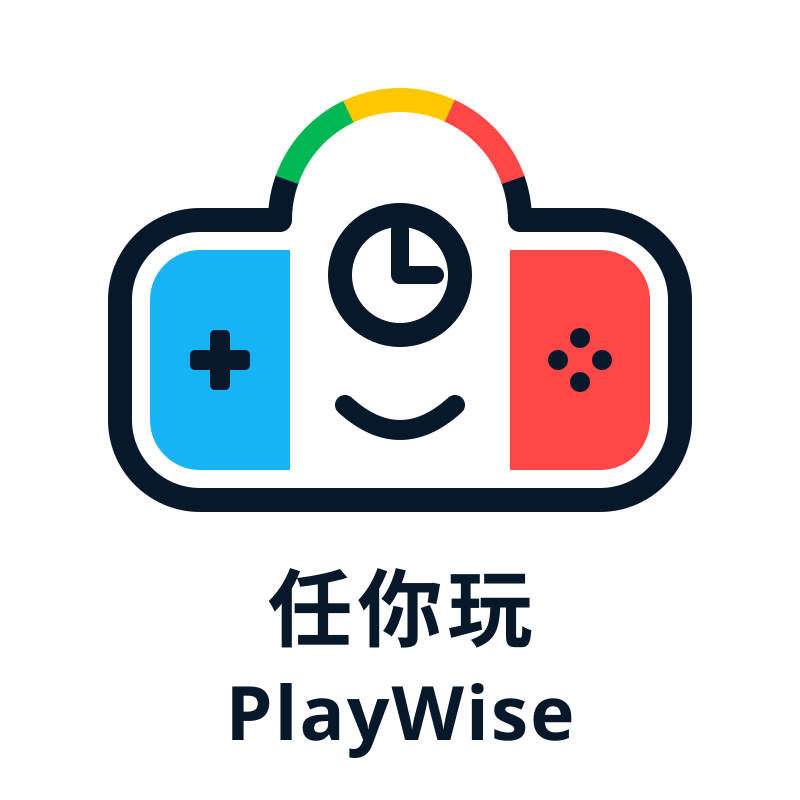
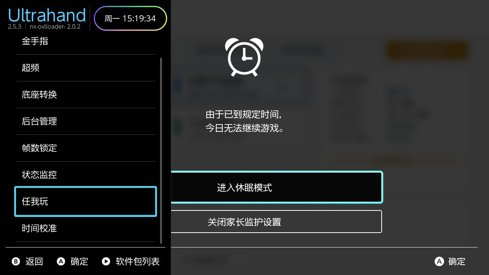
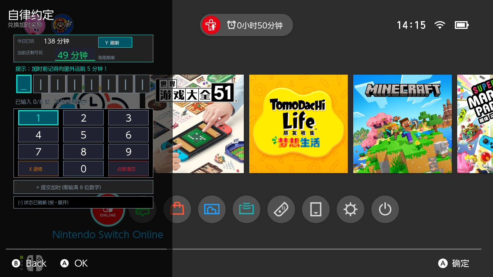
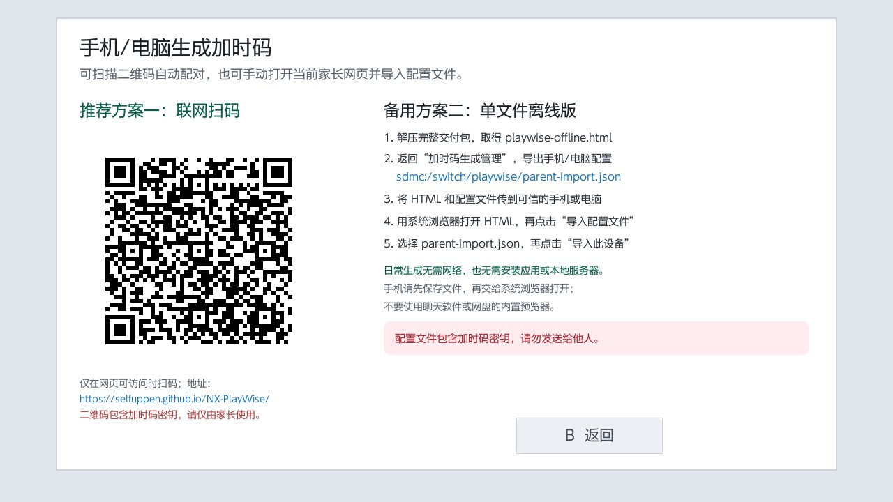
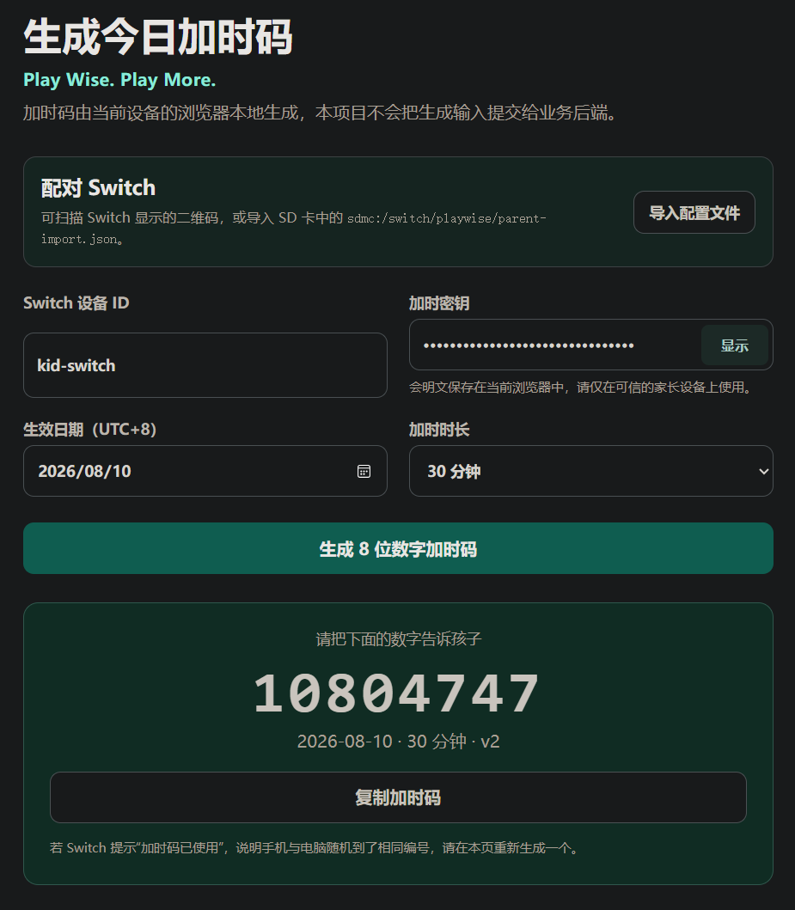
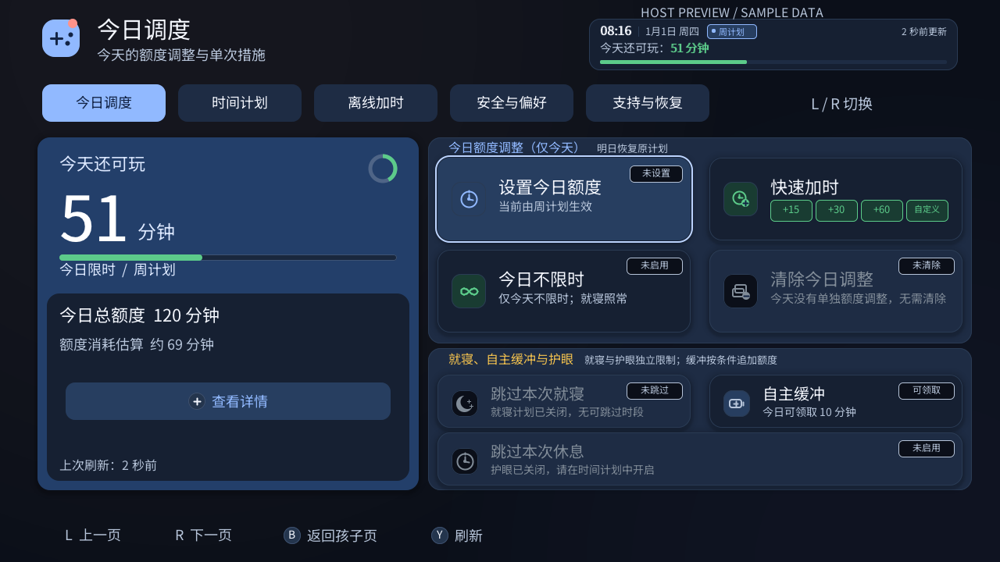
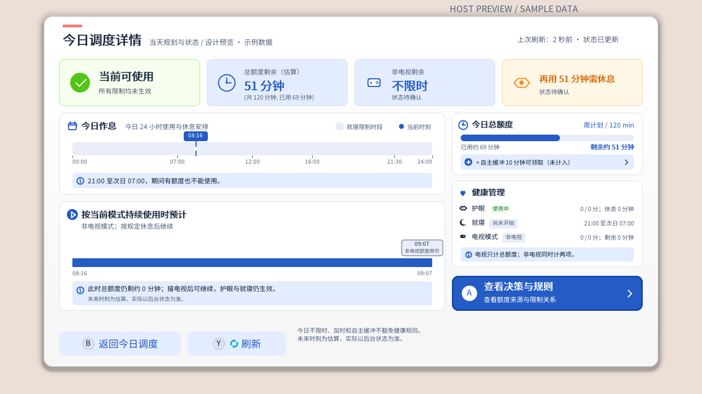

  

  # PlayWise

  **Play Wise. Play More.**

  [English](README_en.md) | [简体中文](README.md)

**PlayWise** (Repository: `NX-PlayWise`, Chinese name: 任我玩) is a local playtime management tool for Nintendo Switch consoles running Custom Firmware (Atmosphère recommended). Parents can configure weekly schedules, holiday allowances, and bedtime rules, or generate daily 8-character grant codes for children to redeem on the Switch. Generating and redeeming grant codes requires no internet connection on the Switch, nor any Nintendo Account or PlayWise backend servers.

## Design Philosophy

Fixed schedules provide clear, predictable routines; temporary adjustments allow flexibility for special occasions. Even when parents are away, extra playtime can be granted as a reward for children to redeem independently without constantly altering long-term rules. Temporary adjustments are valid only for the current day, automatically reverting to regular schedules the next day.

> [!WARNING]
> Stock (unmodified) retail consoles are not supported. PlayWise relies on Nintendo's native Parental Controls for accurate time tracking with Parental Controls enabled. Before installing, verify time tracking and restriction behavior on a non-critical game. Once a restriction takes effect, the PlayWise homebrew app may not be launchable; make sure to install and test the in-game overlay (Tesla Overlay) beforehand.

## Quick Start

1. Enable Nintendo Parental Controls: Settings → Parent Control settings → Parental Controls settings (restrictions set by a parent or guardian) → I do not have a smart device → Next → Next. Complete the system prompts, then verify time tracking and restriction behavior. The setup wizard also offers “Enable Controls Help” with these steps.
2. Ensure you have Atmosphère, Homebrew Menu, and Ultrahand Overlay (or another Tesla overlay menu). Note: PlayWise packages do not include overlay loaders.
3. For first-time installation, download `playwise-complete-<version>.zip`: extract `playwise-<version>.zip` for the Switch, while `playwise-offline.html` serves as a standalone offline parent web tool. Copy and merge the `atmosphere` and `switch` folders from the standard package to the root of your SD card, then reboot.
4. Launch **PlayWise** from Homebrew Menu, follow the onboarding wizard to configure the parent portal entry, PlayWise PIN, theme, and confirm takeover. When children need extra playtime, redeem codes via the homebrew app or the in-game overlay.

See the [User Guide](docs/USER_GUIDE.md) for full instructions on [installation, initial setup, usage, and upgrades](docs/USER_GUIDE.md).

## Grant Code Workflow

### Redeeming Grant Codes (Children): In-Game Overlay When Restricted

> **Grant Codes**: Generating and redeeming grant codes on the Switch does not require any network connection.

Once the daily limit is reached, Nintendo's native restriction dialog may prevent Homebrew Menu and the PlayWise main app from opening. Press your configured Ultrahand/Tesla shortcut to open the overlay menu, select **PlayWise** (`playwise.ovl`), enter the 8-character code from the parent, verify the previewed result, and confirm redemption. Parents can also enter the PlayWise PIN directly in the overlay to grant one-time minutes or set unlimited play for today. Bedtime restrictions can be skipped for the current session, turned off, or reverted to pre-installation settings.

View In-Game Overlay Preview

|  |  |
| :---: | :---: |

> The two screenshots above are historical hardware reference captures demonstrating overlay menu entry and launching PlayWise overlay over the HOME menu; actual buttons, confirmation dialogs, and available actions depend on the installed release version. See [Using In-Game Overlay When Restricted](docs/USER_GUIDE.md#using-in-game-overlay-when-restricted) for details.

### Generating Grant Codes (Parents): Mobile QR Code Scan

> **Generating Grant Codes**:
> When scanning the QR code to open the public web generator, the parent's phone or PC needs access to GitHub Pages (`selfuppen.github.io`).
> Alternatively, you can use the standalone `playwise-offline.html` from `playwise-complete-<version>.zip`. In offline mode, your phone/PC requires no internet connection at all; once configured, the pairing key and device ID are saved locally in browser storage for repeated use. See [User Guide: Generating on Phone or PC](docs/USER_GUIDE.md#generating-on-phone-or-pc) for setup and secret protection guidelines.

In the Switch Parent Portal, navigate to **Offline Grant → Generate on Phone/PC**, verify your PlayWise PIN, and display the pairing QR code. Scan it with a trusted smartphone or computer to open the [Parent Web App](https://selfuppen.github.io/NX-PlayWise/), confirm **Import Device**, select the date (matching your Switch's local date) and grant minutes, and generate the 8-character code locally. The code is calculated entirely inside your browser without uploading secrets or codes to any server, eliminating the need to rescan every time.

View Mobile Pairing & Web App Preview

|  |  |
| :---: | :---: |

The QR code in the first screenshot has been replaced with a **public demo configuration** and cannot be used on real home devices. The second image shows a historical web interface preview; actual dates and operations reflect your current device. If the public web app is unreachable under certain network environments, use `playwise-offline.html` from the complete delivery bundle or generate codes directly on the Switch console. Detailed steps and security considerations are documented in [User Guide: Generating on Phone or PC](docs/USER_GUIDE.md#generating-on-phone-or-pc).

## Key Features

- **Daily Dispatch**: Today's playtime limit, quick grant, unlimited play for today, and reset today's adjustments.
- **Long-Term Schedules**: Weekly schedules, statutory holidays, specific date overrides, and bedtime schedules.
- **Self Buffer**: Optional daily once-per-day 5/10/15-minute grace period buffer with detailed rule breakdowns for today and tomorrow.
- **Offline Grant Codes**: Generate 8-character grant codes on-console or via the web app; invalidated after a single successful redemption. Daily hard limits may cap added minutes below the face value.
- **Activity History**: Local family activity logs and 7/30-day playtime allowance analytics. Scoped to total console screen time; missing dates remain unknown; per-title breakdown is currently pending.
- **Support & Recovery**: Diagnostics export, emergency disable, rollback to pre-installation settings, and safe reload after in-place upgrades.

For detailed walkthroughs of each page, see the [User Guide](docs/USER_GUIDE.md).

View Parent Portal Daily Dispatch & Rule Breakdown Preview

## FAQ

**Why is the game still playable when PlayWise shows "Limit Reached" / 0 minutes remaining?**
First, ensure that Nintendo official Parental Controls is enabled and has not been temporarily unlocked. Next, synchronize the Switch system clock via internet NTP, for example using DBI's "Tools → NTP Time Sync" or [QuickNTP (Tesla time sync tool)](https://github.com/ppkantorski/QuickNTP). After successful clock synchronization, refresh PlayWise status and test with a non-critical game to confirm that restrictions take effect. Time synchronization is a recommended troubleshooting step, though it may not resolve every edge-case timer inconsistency. See [User Guide: FAQ](docs/USER_GUIDE.md#frequently-asked-questions-faq) and [Issue #1](https://github.com/selfuppen/NX-PlayWise/issues/1) for details.

## Recommended Environment & Verification Status

The current baseline qualification target is Nintendo Switch OLED, HOS 22.5.0, and Atmosphère 1.11.2. The 2026-08-10 record is historical evidence prior to current PCTL modifications. Build candidates default to `pending`; when the maintainer verifies primary features on real hardware, specifying device model, HOS, and Atmosphère in the packaging command records `manual_verified` in `build.json`. This represents a manual testing declaration; only when the released Zip's SHA-256 matches `qualification.json` in the same directory has the exact build package passed full qualification testing in the documented environment. Packaging details are described in the [Development Environment Guide](docs/DEVELOPMENT_ENVIRONMENT_GUIDE.md#full-switch-build).

We recommend using [Ultrahand Overlay](https://github.com/ppkantorski/Ultrahand-Overlay) to manage the PlayWise in-game overlay. You may also refer to community CFW guides such as the [Atmosphère Installation & Setup Guide](https://docs.qq.com/doc/DVW9PVE5sU0FEd0tP); related community group: "switch大气层超频折腾群" (QQ Group `1051287661`). These external resources and communities are not bundled with PlayWise packages and do not imply official endorsement.

The PlayWise PIN protects only this project's Parent Portal and is completely distinct from the Nintendo official Parental Controls master PIN. PlayWise cannot reset Nintendo's master PIN or unpair the official mobile app. Nintendo's native timer tracks total console screen-on time, meaning active time in HOME menu and System Settings also consumes daily allowance, as noted in [Nintendo Support](https://support.nintendo.com/jp/switch/parentalcontrols/app/setting_change.html).

## Roadmap

| Feature | Status | Implementation Date |
| :--- | :--- | :--- |
| Region holiday calendars | Built-in China 2026 plus [manual JSON import](docs/自制节假日日历格式.md) | 2026-10-04 |
| Main app dark mode / 3-state theme | Implemented (overlay retains fixed dark theme) | 2026-08-13 |
| Date schedules, rule preview, daily self-buffer | Implemented (self-buffer disabled by default) | 2026-08-24 |
| Family activity history & 7/30-day allowance analytics | Implemented (missing dates marked as unknown) | 2026-08-24 |
| Bedtime schedule | Implemented (overnight schedules, background restriction, overlay recovery; disabled by default) | 2026-09-11 |
| In-game overlay: child redemption & parent quick actions | Implemented (redeem grant codes, claim self-buffer, and quick unlock via overlay) | 2026-09-28 |
| Daily dispatch dashboard & decision breakdown preview | Implemented (card grouping, temporary quota preview, decision flow drill-down) | 2026-09-29 |
| Switch-native interactive sound effects (audout engine) | Implemented (12 Switch-style sound effects, dial audio, and sound toggle) | 2026-10-01 |
| Multi-language internationalization (Traditional Chinese & English) | Implemented (bilingual interface & docs, language decoupling) | 2026-10-02 |
| Destructive action long-press charge-up & safety protection | Implemented (charge-up confirmation with continuous audio feedback, instant cancel) | 2026-10-02 |
| Custom shortcut recording | In validation (presets available, recording entry unreleased) | TBD |
| Per-title playtime statistics | TODO (`pdm:qry` hardware verification gated; currently marked unavailable) | TBD |

Once daily limit or bedtime takes effect, the in-game overlay remains PlayWise's only on-console interactive entry: for daily limits, users can redeem grant codes, or parents can grant temporary minutes or unlimited play for today; for bedtime, users can skip the session, disable the schedule, or restore pre-installation settings. Temporary bypass via Nintendo master PIN in the native dialog remains handled by Nintendo. If the overlay or sysmodule is unavailable, PlayWise does not provide an on-console recovery fallback or auto-write recovery flags.

## Documentation

- [User Guide](docs/USER_GUIDE.md) ([简体中文](docs/使用指南.md))
- [Developer Guide](docs/DEVELOPER_GUIDE.md) ([简体中文](docs/开发指南.md))
- [Development Environment Guide](docs/DEVELOPMENT_ENVIRONMENT_GUIDE.md) ([简体中文](docs/开发环境指南.md))
- [Protocol Specification](docs/PROTOCOL.md) ([简体中文](docs/协议.md))
- [Testing Guide](docs/TESTING_GUIDE.md) ([简体中文](docs/测试指南.md))
- [PCTL Integration Architecture](docs/PCTL_ARCHITECTURE.md) ([简体中文](docs/PCTL集成架构.md))

## Acknowledgements & License

Implementation concepts referenced [gmaitxqqq/switch-pctltcp-remoteandlocal](https://github.com/gmaitxqqq/switch-pctltcp-remoteandlocal) and [tailiang2008/NX-Pctl-Manager](https://github.com/tailiang2008/NX-Pctl-Manager). Released under the Apache License 2.0. PlayWise is an independent project and is not affiliated with or endorsed by Nintendo, Atmosphère, libnx, or Ultrahand Overlay.

## Download Statistics

