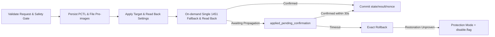

<div align="center">

  [English](PCTL_ARCHITECTURE.md) | [简体中文](PCTL集成架构.md)

</div>

# PCTL Integration Architecture

PCTL is the Nintendo Switch system Parental Controls service. Standard PlayWise release distributions manage Nintendo console playtime limits, system timers, and alarms; they do not offer private forced screen locking, suspension, or app termination as product commitments. Official documentation clarifies that even when no game is actively running, playtime still accumulates whenever the console is in active use; status confirmation checks whether Nintendo Parental Controls is enabled, with no separate suspension switch required. Restriction behavior must be observed on hardware; see [Nintendo Play Time Documentation](https://support.nintendo.com/jp/switch/parentalcontrols/app/setting_change.html).

## Isolation Boundaries

```text
Console Application (NRO) / In-Game Overlay
        │ Release request
        ▼
Background Service (sysmodule) Security State Machine
        │ transaction + confirmation
        ▼
PCTL adapter
        │ short-lived pctl / pctl:s session
        ▼
Horizon PCTL
```

- NRO and Overlay never access PCTL directly, nor do they decide whether a request is safe.
- `common/` contains no libnx headers, SD card filesystem paths, or 0x44 raw layout definitions.
- `platform/switch/pctl_adapter.c` is the sole platform boundary for private commands and layout definitions.
- Host tests use `PtcPctlStub` to inject writes, observations, and recovery failures.
- Release packages never persist a capability matrix or expose probe requests.

## Boot Preflight and Takeover

On first launch, read-only preflight checks execute before any setup writes:

1. Release manifest matches compiled binary versions;
2. `set:sys` successfully reads HOS version, firmware digest, and product model;
3. Execution under Atmosphère can be verified;
4. PCTL service initializes and reads current state;
5. Settings snapshot length, hash, and layout conform to the active protocol;
6. No unrecoverable legacy transactions remain from previous boots.

Only runtime environments matching Nintendo Switch OLED, HOS 22.5.0, and Atmosphère 1.11.2 simultaneously are marked `verified`; other structurally valid combinations are marked `accepted_unknown` and require parental confirmation. Atmosphère is identified by querying `spl:` for Exosphere configuration key `65000` and parsing the version string; environment JSON stores the detection source, raw value, and parsed version. If the service is unavailable or returns an illegal value, it is recorded as unknown and never fabricated as Atmosphère. Snapshot, layout, legacy boot transaction, PCTL read, or manifest verification failures enter read-only `protection` mode, which standard release packages cannot bypass.

Only after final parental confirmation does PlayWise:

- Atomically save `backups/install_pctl_snapshot.json` without ever overwriting an existing valid snapshot;
- Reconfirm that current `0x44` raw data, timers, today's total quota, and remaining minutes still match the read-only inspection results;
- Save the current daily policy as a takeover rule valid only for today, activating automatic management immediately;
- Never alter today to unlimited play temporarily or invoke private command `1451`. If system state changes during verification, takeover is refused and the console retains its status quo.

## Standard Write Transactions

Setting today's total quota, quick grant, unlimited play for today, clearing today's quota adjustments, and background Enforce share a unified recovery framework:



`disable.flag` only blocks new PCTL control writes. PCTL status queries, diagnostics, and recovery routines continue operating normally, ensuring Support & Recovery pages remain accessible during failures.

Enforce routines, day-boundary crossings, startup recovery, future rule edits, and unchanged daily rules must never trigger `1451` fallback. A single invocation is allowed only during immediate parent/child interactive modifications when target settings have taken effect exactly but the countdown timer is not running, or when extra time / unlimited play has not yet cleared an instantaneous restriction. If target settings are inaccurate, or fallback/read-back fails, exact rollback occurs using the existing snapshot. Private command `1455 restricted_now` describes only instantaneous system restriction state; it cannot prove whether notifications are visible or whether games have suspended or exited.

State queries prioritize obtaining runtime fields via low-privilege `pctl` sessions. Field logs on bound environments show that while `1453/1454` may succeed, `1455` might only respond on `pctl:s`; the adapter layer therefore reuses the short-lived `pctl:s` session opened for reading private settings to query `1455` only if low-privilege queries fail. This does not loosen qualification constraints: if neither channel is available, `restricted_now` remains unknown, immediate writes fail, and exact rollback executes against the snapshot.

## Private Command Evidence

Local libnx sources do not provide public wrappers for `StartPlayTimer (1451)`, `GetPlayTimerRemainingTime (1454)`, `GetPlayTimerSpentTimeForTest (1952)`, `GetPlayTimerSettings (145601)`, or `SetPlayTimerSettingsForDebug (195101)`. Parameter units and 0x44 raw layouts must never be inferred from the absence of libnx definitions.

On 2026-08-30, tracked source code review of local Atmosphère checkout `8e96a489033b8597ec76c0055373642848d93af0` (`1.11.2-1-g8e96a4890`) showed that boot2 launches `SystemProgramId::Pctl` (`0x010000000000002E`) as a standard system program in both normal and maintenance boots; `stratosphere/` implements no PCTL sysmodule replacement, `ams_mitm` module tables contain no PCTL MITM entries, and `libstratosphere` includes no PCTL IPC catalog. Direct entry points examined were `libraries/libstratosphere/source/boot2/boot2_api.board.nintendo_nx.cpp`, `stratosphere/ams_mitm/source/amsmitm_module_management.cpp`, and `libraries/libstratosphere/include/stratosphere/ncm/ncm_system_content_meta_id.hpp`.

This source-level evidence proves only that "the examined Atmosphère version does not actively replace or intercept PCTL at the CFW layer." It does not establish Nintendo PCTL private command signatures, parameter units, 0x44 raw layouts, timer semantics, or restriction visibility, nor does it guarantee identical behavior in other Atmosphère commits/tags. Atmosphère source code is valuable for investigating boot2, SM/PM, and runtime compatibility, but all PCTL private behavior remains governed solely by repository specifications, deterministic tests, and bound hardware A/B evidence.

`1454` returns remaining playtime. Although the name and return structure of `1952` resemble elapsed playtime, hardware A/B evidence does not demonstrate that it accumulates only during foreground gameplay; observed hardware behavior suggests it tracks wall-clock duration since Play Timer activation. Consequently, the Switch adapter never reads `1952`. On restricted days, "configured daily minutes − 1454 remaining minutes" represents only an allowance consumption estimate, never actual in-game playtime; on unrestricted days, it reports "allowance consumption estimate unavailable."

Hardware diagnostics on 2026-08-20 revealed the risk of background routines actively invoking `1451 StartPlayTimer` during day-crossing synchronization. Daily Enforce in standard releases therefore only synchronizes and reads back current daily settings, never activating timers. The risk here is not that "HOME menu should not accumulate time"—screen-on time counting toward limits is native Nintendo behavior—but that background routines might erroneously trigger a timing cycle during unattended, standby, or day-crossing syncs. Whether standby is excluded and how wake-up restores timing must be proven independently by `timer_activation_ab` on bound hardware/HOS targets.

Device Lab run `1787669306-5331fd74a2626e81` from 2026-08-25 serves as historical evidence: all six phase entries in the raw report are non-empty, `restriction_effect.after.1455.value=true`, and `restoration.proved=true` with `restore_verdict=exact_restore_proved`. The raw attachment retained `manual_observation:null`; operators later confirmed witnessing on-screen restriction alerts and physical game suspension. Human witness declarations and machine reports are archived separately without rewriting historical JSON or promoting older runs to complete; formal qualification still requires recording `restriction_visible + paused_or_suspended` in focused mode on HEAD.

In that same run, `home_started` recorded 75 seconds of `1952` growth while `1454` remained at 0, confirming the factual finding `home_usage_counted` consistent with Nintendo's console usage definitions; this also demonstrated that `1952` cannot be interpreted directly as foreground gameplay duration. Historical `unsafe_for_home_start` tags remain for schema parsing backward-compatibility only. Older reports queried `1457` only once at the conclusion of the restricted phase, yielding `known=true, signaled=false`, which cannot determine notification display or suspension.

Enhanced run `1787681083-b411b3488b91fee0` on 2026-08-26 completed all six automated phases under `2.0.2-alpha+d1fa4dcdfa11`, proving `exact_restore_proved`. During the restricted phase, `1455=true`, timer flipped from true to false, and both `1952` and negative `1454` changed by only ~1 second; operators confirmed visible alerts and software suspension. Raw attachments maintained `manual_observation:null` and `complete:false` without retrospective edits; formal qualification requires new candidate reports.

Focused run `1788368835-3e64cea6860e4c1a` formally recorded `restriction_visible + paused_or_suspended` within the report: `1455` toggled from false to true in the restricted phase, 1457 was sampled 131 times without triggering, writes modified only expected header offsets `0, 1, 2` and daily offsets `47, 49`, and `exact_restore_proved` was verified. This reinforced behavioral proof for alerts and suspension, but `environment.runtime` was null and the build identity showed `source_dirty:true` from an unknown container, precluding qualification entry. Device Lab now enforces reading runtime and build identities before initiating sessions, and qualification tools treat missing runtime metadata as hard errors.

Checking 1457 131 times across 15 seconds without a trigger while system restrictions successfully appeared proves that 1457 is not a prerequisite for alert display or restriction enforcement. It records only raw Results, poll counts, and initial trigger times, with no role in completeness, visibility, or product qualification. The 1458 raw/libnx comparison yielded `comparable:true, value_equal:true`. Writing all-zero 0x44 baseline data resulted in modifications to header bytes `0, 1, 2` and daily bytes `39, 41`: the former matches expected header initialization `0x0101/0x0001` explicitly written by the adapter, not unexpected mutation. Because the baseline was entirely zeros, the three static phases (foreground, suspended, standby) were insufficient to establish lifecycle conclusions; subsequent A/B modes mandate a non-empty Nintendo weekly schedule.

Private behavior relies strictly upon:

- Repository protocol specifications and fixed layout adapters;
- Host-side known vectors and failure injections;
- Real hardware A/B qualification of candidate release artifacts on explicitly documented models and HOS versions.

When system versions or firmware digests change, structural preflight success permits only parental acceptance under unknown compatibility; it never automatically constitutes a new verified baseline.

## Device Lab

`raw_block`, `suspend`, high-risk capability probes, guided lifecycle forensics, and fault injection reside in the isolated Device Lab:

- Title ID `4200000000BD23F0`;
- Lab sysmodule exposes IPC `pwtl:u`, though the Device Lab Overlay currently communicates via an SD request queue rather than connecting directly;
- SD card root: `sdmc:/switch/playwise-device-lab`;
- NRO provides a Chinese status wizard for safe entry and recovery; the dedicated Overlay defaults to a persistent 4-item qualification campaign, retaining focused, Timer activation A/B, and advanced 6-phase freeform modes;
- Release package omits `boot2.flag` by default;
- Not built by the standard distribution target `make packages`.

Prior to switching sysmodules, the NRO queries `pm:shell` to confirm the source PID. When available, the source sysmodule enters quiescence, completes ongoing serialized operations, and confirms no active recovery before the NRO writes the boot journal; the target is launched only after the source PID terminates, followed by verifying the new PID, boot ID, profile, and release ID for runtime-ready status. Returning to the standard background service follows the exact same sequence; if the standard service was not originally active, the Lab simply exits. If any step fails to prove safe, the journal is preserved and a fallback reboot is executed. Under ideal qualification runs, no reboot is required at either boundary; fallback paths require at most one reboot per boundary, and a second PCTL owner is never launched concurrently. Schema v2 boot journals remain backward-compatible with v1 and `.tmp` generational recovery rules.

NRO status checks read existing flags, journals, and sessions; actual transitions are executed by the original transaction functions. Recovery waiting requires asynchronous page refreshing; normal boot flags may only be restored when `exact_restore_proved` is verified or if a session was never created. Error screens explain whether changes occurred and what next steps to take before showing result codes, transaction phases, request IDs, and paths.

The dedicated Overlay submits state machine requests strictly through the fixed request queue in the Lab SD root. Default qualification campaigns sequentially execute Timer activation A/B, legacy slots `pause_on_game_a`, `pause_on_game_b`, and `pause_off_game_b`; the legacy `original_pause_state` field is recorded at start and original settings are checked at completion. These fields came from an earlier suspension-switch assumption and do not establish a separate suspension setting on the current console or add a standard status check. Do not fabricate prerequisites or claim campaign qualification when hardware cannot establish them. After each report completes, operators can proceed to the next item or close the overlay to return to the NRO, without toggling flags. Failed observations preserve reports and allow retrying the current slot; closing the overlay, entering sleep mode, or re-entering the Lab resumes state from `campaign.json`. Freeform `restriction_quick`, `timer_activation_ab`, and advanced `full` modes remain selectable. Real restriction phases execute only after long-press confirmation, accompanied by an independent 15-second recovery window; every session independently saves and restores full `0x44` raw data and timers byte-for-byte.

When a restricted phase restores automatically, the session remains in `awaiting_observation`: recovery requests cannot skip or discard pending human observations, the overlay hides immediate restore buttons, and the NRO directs the operator back to the overlay. Human observations distinguish alert visibility from whether the game resumed, suspended, exited, or could not be determined; `restriction_visible` confirms only visual alert display. Focused mode requires 1/1, full mode requires 6/6, and formal reports are generated only when both observation tiers and `exact_restore_proved` are satisfied; A/B mode requires 7/7 schema v2 phases and exact restore, without extraneous human restriction observations. Report `summary.complete` indicates process execution completeness; A/B activation evidence and full-mode lifecycle evidence are denoted by `activation_evidence_complete` and `lifecycle_evidence_complete` (`null` when not applicable). An all-zero baseline full report can complete collection and restore, but lifecycle evidence remains `false`. Schema v1 reports remain historical evidence and cannot promote current release candidates.

The Overlay supports controller and touch input across standard phases, observation dialogs, retries, and immediate recovery; the two-second confirmation for restricted phases accepts only controller buttons. Device Lab builds link against the Switch Simplified Chinese shared system font regardless of console language settings. Corrupted `session.json` files must never be treated as "unstarted"; the interface halts progression and prompts preserving on-device diagnostics.

Reports separate command dispatchability, wire shapes, and product semantics. Commands `1006/1031/1035/1457/1458` record raw/libnx comparisons and `comparable` flags; equality evaluates to false if either side fails. The sysmodule queries actual HOS version before initializing libnx version state, executing version-gated public wrappers. Commands `1451–1455`, `145601/195101`, and Lab-only `1952` capture raw values and Results; the restricted phase polls `1457` non-blockingly every 100 ms and latches results, saving check counts and initial monotonic trigger times for forensic reference. Reports also preserve complete `0x44` hex dumps before and after phases, target weekdays, expected byte ranges, all altered offsets, and out-of-range modified offsets, embedding actual `environment.json` and Device Lab `build.json` to bind hardware model, HOS, firmware digest, and candidate build metadata together. Command `1952` is excluded from Release adapter status queries. No Lab evidence can serve directly as a qualification verdict for standard release builds.

Tracked source comparisons on 2026-08-30 bind to local versions: libnx `dbcc1beafc6b47b5ffbeb8ba82463a7d45da40bb`, vendored libtesla upstream `f766e9b607a05e9756843cbd62b3bfb98be1646c`, and Atmosphère `8e96a489033b8597ec76c0055373642848d93af0`. Build manifests must also record devkitA64 version, installed libnx package version, container image tags/digests, git commits, and tracked dirty status; release builds fail if libnx is unresolvable. Release candidates default to `qualification=pending`; only commits with zero tracked modifications, matching reports, and identical Zip/binary SHA-256 in `qualification.json` can be promoted, and promotion must never recompile binaries.
