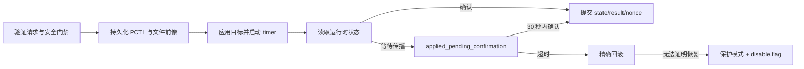

# PCTL 集成架构

PCTL 是 Nintendo Switch 的系统家长控制服务。PlayWise Release 只管理游玩额度、系统计时和提醒；它不把私有强制锁屏能力作为产品承诺。

## 隔离边界

```text
Companion / Overlay
        │ Release request
        ▼
Sysmodule 安全状态机
        │ transaction + confirmation
        ▼
PCTL adapter
        │ 短时 pctl / pctl:s session
        ▼
Horizon PCTL
```

- NRO 与 Overlay 不直接访问 PCTL，也不决定 request 是否安全。
- `common/` 不包含 libnx、SD 路径或 0x44 raw layout。
- `platform/switch/pctl_adapter.c` 是私有命令和布局的唯一平台边界。
- host 测试使用 `PtcPctlStub` 注入写入、观察和恢复失败。
- Release 不持久化 capability matrix，也不提供 probe 请求。

## 启动预检与接管

首次启动在任何 setup 写入前执行只读检查：

1. release manifest 与编译版本一致；
2. `set:sys` 可读取 HOS、firmware digest 和产品型号；
3. 能确认是否运行于 Atmosphère；
4. PCTL service 可初始化并读取状态；
5. settings snapshot 长度、hash 和 layout 符合当前协议；
6. 没有无法恢复的旧事务。

命中 OLED/HOS 22.5.0 基线记为 `verified`；其他结构正常组合记为 `accepted_unknown`，需要家长确认。snapshot、layout、旧事务、PCTL 读取或 manifest 失败进入只读 `protection`，Release 不允许绕过。

家长最终确认后才：

- 原子保存 `backups/install_pctl_snapshot.json`，且永不覆盖现有有效 snapshot；
- 解除当前限制并确认状态；
- 进入 5 秒同步宽限；
- 激活规则自动应用。

## 普通写入事务

设置今日额度、加时、今日不限时、恢复周计划和 Enforce 共用恢复框架：



`disable.flag` 只阻止新的 PCTL 控制写入。PCTL status read、诊断和恢复继续工作，因此支持页在故障时仍可用。

## 私有命令证据

当前本机 libnx 源码不提供 `StartPlayTimer (1451)`、`GetPlayTimerRemainingTime (1454)`、`GetPlayTimerSpentTimeForTest (1952)`、`GetPlayTimerSettings (145601)` 或 `SetPlayTimerSettingsForDebug (195101)` 的公开封装。不得用“libnx 没有定义”推断参数单位或 0x44 raw 布局。

`1454` 返回剩余时长；`1952` 返回独立的 `nn::TimeSpanType` 已用时。适配层优先使用 `1952`，因此不限时日也可以报告当前已玩分钟；若 1952 在当前 HOS 或 service session 上失败，限时日回退到“配置总分钟 − 1454 剩余分钟”，不限时日保持“已玩暂不可用”。1952 的名称包含 `ForTest`，是否在目标 HOS 上持续累计、跨 service session 可读以及 UTC+8 换日重置，必须通过真机 A/B 记录确认，不能仅凭命令名推断。

私有行为只能依据：

- 仓库协议和固定 layout adapter；
- host 端已知向量与失败注入；
- 最终构建产物在明确记录的机型/HOS 上进行 A/B 真机验证。

版本或 firmware digest 变化时，即使结构预检通过，也只能由家长接受为未知兼容；它不自动成为新的已验证基线。

## Device Lab

`raw_block`、`suspend`、危险 capability probe 和故障注入位于独立 Device Lab：

- Title ID `4200000000BD23F0`；
- IPC `pwtl:u`；
- SD 根目录 `sdmc:/switch/playwise-device-lab`；
- NRO 持续显示危险水印；
- package 默认无 `boot2.flag`；
- 不由公开 `make packages` 构建。

LAB 可绕过 Release 的兼容认证，但每个探针本身仍必须 snapshot、执行、确认并恢复；恢复无法证明时同样写入 LAB 根目录下的 `disable.flag`。任何 LAB 证据都不能自动升级为公开 Release 资格结果。
