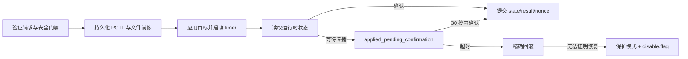

# PCTL 集成架构

PCTL 是 Nintendo Switch 的系统家长控制服务。PlayWise 标准分发构建只管理游玩额度、系统计时和提醒；它不把私有强制锁屏能力作为产品承诺。

## 隔离边界

```text
主机应用 / 游戏内浮窗
        │ Release request
        ▼
后台服务（sysmodule）安全状态机
        │ transaction + confirmation
        ▼
PCTL adapter
        │ 短时 pctl / pctl:s session
        ▼
Horizon PCTL
```

- NRO 与 Overlay 不直接访问 PCTL，也不决定 request 是否安全。
- `common/` 不包含 libnx、SD 路径或 0x44 raw layout。
- `platform/switch/pctl_adapter.c` 是私有命令和布局的唯一平台边界。
- host 测试使用 `PtcPctlStub` 注入写入、观察和恢复失败。
- Release 不持久化 capability matrix，也不提供 probe 请求。

## 启动预检与接管

首次启动在任何 setup 写入前执行只读检查：

1. release manifest 与编译版本一致；
2. `set:sys` 可读取 HOS、firmware digest 和产品型号；
3. 能确认是否运行于 Atmosphère；
4. PCTL service 可初始化并读取状态；
5. settings snapshot 长度、hash 和 layout 符合当前协议；
6. 没有无法恢复的启动遗留事务。

命中 OLED/HOS 22.5.0 基线记为 `verified`；其他结构正常组合记为 `accepted_unknown`，需要家长确认。snapshot、layout、启动遗留事务、PCTL 读取或 manifest 失败进入只读 `protection`，标准分发构建不允许绕过。

家长最终确认后才：

- 原子保存 `backups/install_pctl_snapshot.json`，且永不覆盖现有有效 snapshot；
- 再次确认当前 `0x44`、timer、今日总额度和剩余时长仍与只读采集结果一致；
- 把当前今日策略保存为仅当天有效的接管规则，并直接激活自动控制；
- 不把今日临时改成不限时，也不调用私有命令 `1451`。若验证期间状态发生变化，则保留现状并拒绝接管。

## 普通写入事务

设置今日总额度、加时、今日不限时、恢复周计划和 Enforce 共用恢复框架：



`disable.flag` 只阻止新的 PCTL 控制写入。PCTL status read、诊断和恢复继续工作，因此支持页在故障时仍可用。

## 私有命令证据

当前本机 libnx 源码不提供 `StartPlayTimer (1451)`、`GetPlayTimerRemainingTime (1454)`、`GetPlayTimerSpentTimeForTest (1952)`、`GetPlayTimerSettings (145601)` 或 `SetPlayTimerSettingsForDebug (195101)` 的公开封装。不得用“libnx 没有定义”推断参数单位或 0x44 raw 布局。

`1454` 返回剩余时长。虽然 `1952` 名称和返回形态看起来像已用时，但当前没有真机 A/B 证据证明它只在游戏前台运行时累计；已有设备现象显示它可能接近 Play Timer 启动后的墙钟时长。因此 Switch 适配层不读取 `1952`。限时日的“配置总分钟 − 1454 剩余分钟”也只能称为额度消耗估算，不能冒充实际游戏时间；不限时日返回“额度消耗估算暂不可用”。

2026-08-20 的真机诊断进一步证明：后台在午夜调用 `1451 StartPlayTimer` 后，即使用户没有打开屏幕或游戏，60 分钟额度仍会归零。标准分发的每日 Enforce 因而只同步并回读当天设置，绝不调用 1451；实际计时生命周期继续由 Horizon 管理。未来若要由 PlayWise 主动调用 1451/停止命令，必须先取得可靠的前台应用启动、挂起、恢复、退出证据，并完成 HOME、游戏前台、游戏挂起、主机待机和跨日场景的 A/B，不得仅凭“应用进程存在”推断游戏正在运行。

私有行为只能依据：

- 仓库协议和固定 layout adapter；
- host 端已知向量与失败注入；
- 当前候选构建产物在明确记录的机型/HOS 上进行 A/B 真机验证。

版本或 firmware digest 变化时，即使结构预检通过，也只能由家长接受为未知兼容；它不自动成为新的已验证基线。

## Device Lab

`raw_block`、`suspend`、危险 capability probe、引导式生命周期取证和故障注入位于独立 Device Lab：

- Title ID `4200000000BD23F0`；
- IPC `pwtl:u`；
- SD 根目录 `sdmc:/switch/playwise-device-lab`；
- NRO 以中文状态向导提供“启用实验后台 / 恢复正常后台 / 查看最新报告”三个事务化入口，自动根据 boot journal、Lab 服务、session 和恢复证明突出下一步；专用 Overlay 以中文六阶段进度页持续显示危险水印；
- package 默认无 `boot2.flag`；
- 不由标准分发目标 `make packages` 构建。

NRO 在启用时记录标准与 Lab `boot2.flag` 的原状态：若标准后台原本启用，将其原子改名为唯一旁路备份，再创建 Lab flag；恢复时先请求 Lab sysmodule 恢复并证明会话前 PCTL 状态，证明成功或尚未创建会话后，才删除由该事务创建的空 Lab flag，并按 journal 精确恢复标准 flag 原本存在或不存在的状态。已有备份、未知 Lab flag、journal 损坏或外部并发修改都不会被覆盖，而是进入恢复提示。因此标准与 Lab sysmodule 不会同时竞争 PCTL；完整流程开始和结束各重启一次。该事务不修改标准二进制、配置、规则、凭据、日志或业务备份。

NRO 的状态检查只读取现有 flag、journal 与 session；真正切换仍由原事务函数完成。恢复等待必须异步刷新页面，只有 `exact_restore_proved` 或从未创建过会话时才允许恢复正常 boot flag。中文错误页先说明是否发生过更改和下一步，再按需展开结果码、事务阶段、请求 ID 与路径。

专用 Overlay 通过 `pwtl:u` 和 Lab SD 根目录提交固定状态机请求。普通阶段异步采样 75 秒；真实限制阶段只在用户对“无未保存进度的非关键游戏”长按确认后执行，sysmodule 写入 0 分钟并启动 timer，同时设定独立的 15 秒恢复期限。Overlay、进程或主机中断后，持久化阶段仍可继续；限制期限已过时后台优先恢复。恢复必须同时证明完整 `0x44` 和 timer 与会话前一致，否则写入 Lab `disable.flag` 并拒绝后续写入，只保留立即恢复能力。

Overlay 的普通阶段、观察选项、重试和立即恢复同时支持手柄与触摸；限制阶段的两秒确认不接受触摸。Device Lab 构建固定加载 Switch 简体中文共享字体，不依赖当前系统语言。损坏的 `session.json` 不得按“尚未开始”处理，界面必须停止新阶段并引导保留现场。

报告把命令可调用性、wire shape 与产品语义分开。`1006/1031/1035/1457/1458` 保存 raw/libnx 对照；`1451–1455`、`145601/195101`、Lab-only `1952` 保存原始值和 Result；限制阶段还记录 `1457` 事件及 `1458` alarm 证据。`1952` 不进入 Release adapter 的状态读取路径。任何 Lab 证据都不能直接作为标准分发构建的资格结果。
