[Documentation index](../README_en.md)

<div align="center">

  [English](USER_GUIDE.md) | [简体中文](使用指南.md)

</div>

# User Guide

## Eye care breaks (device validation pending)

In the parent's Time Plan, enable Eye Care and set 1–240 minutes of use and 1–60 minutes of rest. Tap ±1 or ±10 minute buttons, or use the controller's left/right buttons for one-minute steps and ZL/ZR for ten-minute steps. It is off by default, with 40 minutes of use and 10 minutes of rest preset. The Time Plan card's badge shows the Eye Care switch state. Before first enablement, confirm Nintendo Parental Controls is enabled and verify that the overlay is available. Status confirmation checks whether Nintendo Parental Controls is enabled.

Enabling starts a new cycle at current usage. Reducing the use period may start a break immediately; disabling releases the eye care restriction immediately. Awake HOME use counts, sleep pauses usage accumulation, and sleep counts toward a break. The child view and overlay show remaining use or break time; an unavailable reading is shown as unknown. During a break, a parent can verify their PIN in the overlay or Today's Schedule and choose “Skip this break”; this applies only to the current break and starts a new cycle. Daily allowance and bedtime restrictions take precedence and reset the eye care cycle.

An originally unlimited day temporarily uses a 1440-minute PCTL limit for counting while eye care is enabled. The UI still identifies the original rule and temporary cap; disabling restores unlimited mode. Hardware A/B checks of the 1440-minute reading, sleep behavior, and actual pause and resume remain pending. See the [Testing Guide](../开发/TESTING_GUIDE.md) before release.

Ordinary idle time reaching the configured rest duration also begins a new cycle. After 30 minutes of use and a full 10-minute rest, another 10 minutes counts as only 10 minutes in the new cycle; shorter rests retain the previous cycle. Minute polling of official usage may delay recognition by about one minute. Unchanged reliable readings after wake can prove rest even without ticks during sleep; unknown readings cannot prove natural rest. Midnight preserves accumulated usage and unfinished breaks; only the daily allowance changes.

During protection or deactivation, a parent may verify their PIN and skip the same unfinished eye-care break even when its countdown has reached zero. Recovery retains deactivation; resuming management still requires parental confirmation in Support & Recovery. Bedtime and genuine daily allowance restrictions take precedence. New operations awaiting an earlier setting's confirmation prompt a status refresh and retry without replacing that pending setting.

This guide is intended for parents and children using **PlayWise** (Repository: `NX-PlayWise`, Chinese name: 任我玩) on a Nintendo Switch running Custom Firmware. For first-time installation, using the complete delivery bundle is recommended; when parents generate grant codes on a phone or PC, pairing via network QR code scan as described below is recommended.

> [!IMPORTANT]
> PlayWise relies on Nintendo's native Parental Controls for playtime tracking and usage restrictions. Screen-on activities such as HOME menu and System Settings may also consume playtime. Before installation, please verify on a game with no unsaved progress: confirm that official playtime accumulates, and that time restrictions take effect as expected. PlayWise does not alter official system switches on your behalf, nor can it repair underlying system timer anomalies.

> [!WARNING]
> Once daily playtime is exhausted or bedtime restrictions take effect, Nintendo's native lock screen dialog may prevent games, Homebrew Menu, HOME menu, System Settings, and the PlayWise console app from being opened. On the Switch side, PlayWise provides the in-game overlay (Tesla Overlay) as the primary on-device access and recovery interface; make sure to install and test the overlay before configuring strict limits. The native Nintendo dialog can still be temporarily unlocked using your official Nintendo Parental Controls PIN; this is a completely separate authorization from the PlayWise PIN.

## Installation

### Prerequisites & Clean Installation

You will need a Nintendo Switch running Atmosphère and Homebrew Menu, a computer-readable SD card, and an independently installed overlay manager such as Ultrahand Overlay or Tesla Menu. The PlayWise package includes the PlayWise overlay binary (`playwise.ovl`), but does not bundle an overlay manager/loader.

1. Complete the Nintendo official Parental Controls verification described above, and back up any existing PlayWise data on your SD card.
2. For first-time setup, extract `playwise-complete-<version>.zip`. It contains the standard Switch package `playwise-<version>.zip` and the parent offline tool `playwise-offline.html`.
3. Power off your Switch and remove the SD card. Extract the standard package and verify that the top level contains two folders: `atmosphere` and `switch`. Merge both into the root of your SD card, overwriting any identical files.
4. Safely eject the SD card, reinsert it into the Switch, and reboot. Open Homebrew Menu, launch **PlayWise** (任我玩), and complete the onboarding wizard in the next section.
5. Open your installed overlay manager (e.g. Ultrahand) and confirm that **PlayWise** (`playwise.ovl`) appears in the list. Familiarize yourself with the overlay hotkey while games are still accessible.

The standard installation package does not place PINs, encryption keys, or operating rules in the root `switch/playwise/` directory. Existing installations should follow the [Upgrades](#upgrades) section to preserve user data; do not use full-clean options during standard upgrades.

### Qualification Status

Current release candidates qualify specifically against Nintendo Switch OLED, HOS 22.5.0, and Atmosphère 1.11.2. Only when the SHA-256 checksum of the release Zip perfectly matches `qualification.json` in the same directory can the package be considered verified in recorded environments. Without matching records or when running on different environments, the build must be considered unverified. Legacy screenshots, host previews, and Eden emulator results do not constitute qualification evidence.

## Initial Setup

The wizard has three steps. Check and save errors appear inline and never prevent continuing. Finishing the wizard does not mean controls are active. Saved progress resumes on reopening; settings that could not be saved may need to be entered again.

1. **Environment & preparation**: Choose Follow System (default), 简体中文, 繁體中文, or English. The language selector title and help remain bilingual Chinese/English; the rest of the wizard changes immediately. Compare your console with the reference environment (OLED, HOS 22.5.0, Atmosphère 1.11.2), check that Nintendo Parental Controls is enabled, and test the overlay. Disabled or unreadable controls offer “Enable Controls Help” with the system settings steps and allow continuing. The card directly displays console date, time and time zone alongside DBI / QuickNTP time sync guidance without requiring network or manual toggle.
2. **Parent settings**: Fresh installs use PlayWise PIN `110`; change it if possible. Existing PINs stay unchanged. Uses a dual-column card layout: the left card manages parent PIN security and status; the right card provides theme selection, overlay shortcut configuration, and switches for Eye Care Rest and Bedtime Schedule. Both Eye Care and Bedtime switches default to "Disabled" and can be explicitly toggled on by parents during setup (preset to 40m play / 10m rest, and 21:00 weekdays / 22:00 weekends respectively, and can be customized further in Parent Zone).
3. **Confirm & enter parent area**: The summary board provides an overview of environment, quota, PIN, eye care, and bedtime status. Choose “Enable & enter parent area” or “Enter parent area without enabling”. Enabling saves pre-install settings and safely preserves today’s total and remaining allowance. Confirmed success enters Today's Schedule. Skipping, failure or an unconfirmed result enters Support & Recovery with Export diagnostics focused. You can enter Support while activation is pending; the original request keeps being checked without resubmission.

When there is a problem, select **Support & Recovery → Export diagnostics**, copy the file from the displayed path, and attach it to your issue report. Export works without the background service and marks missing or stale status. Missing PINs or failed authentication still permit read-only Support and sanitized diagnostics; other parent features require valid PIN authorization. A finished wizard never reopens merely because controls remain inactive or protected.

Use left/right to change language, up/down to select actions, A to activate, and Plus to continue. Step 1 reviews environment and time guidance; on step 2, press X or select with A to edit PIN, or navigate right to switch themes, shortcuts, and toggle eye care / bedtime; on step 3, X enters Support without enabling. PIN entry retains its existing touch, stick and numeric keyboard controls.

<details>
<summary>Three setup screens and Child Zone preview</summary>

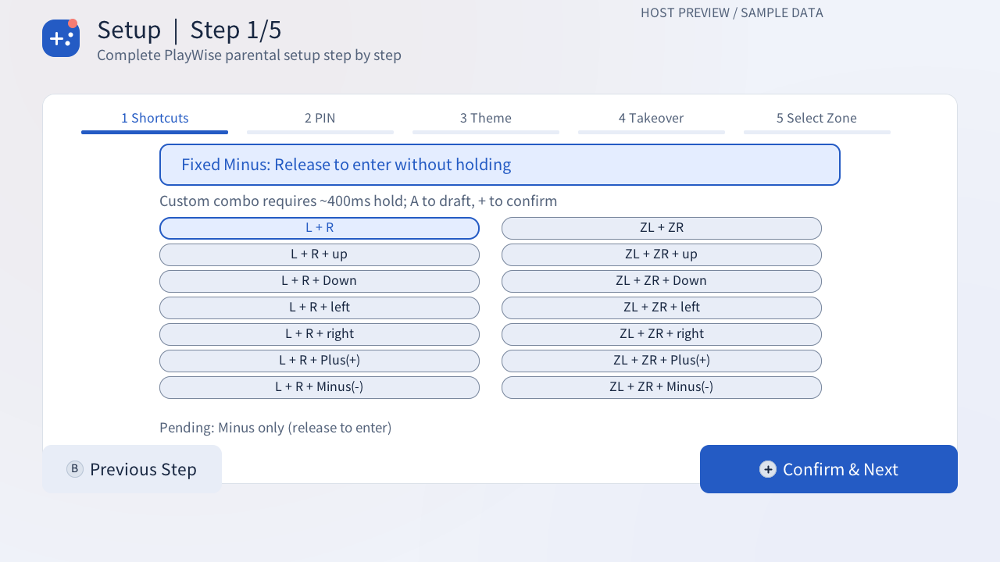
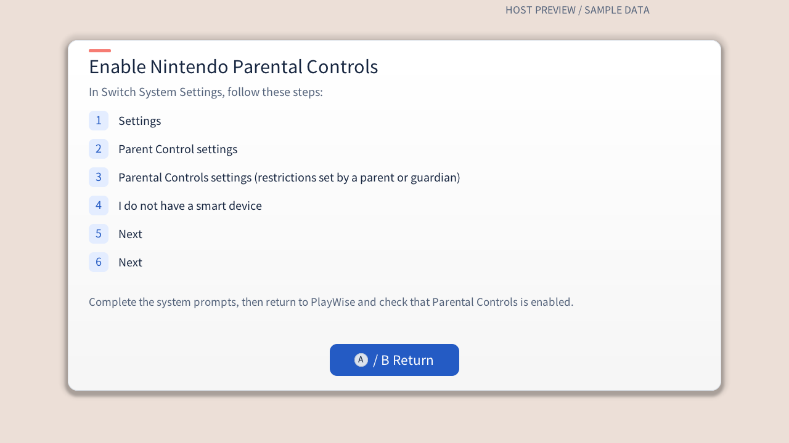
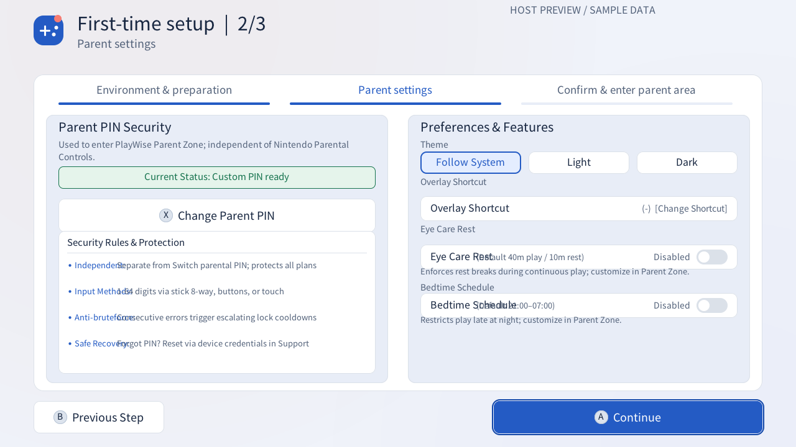
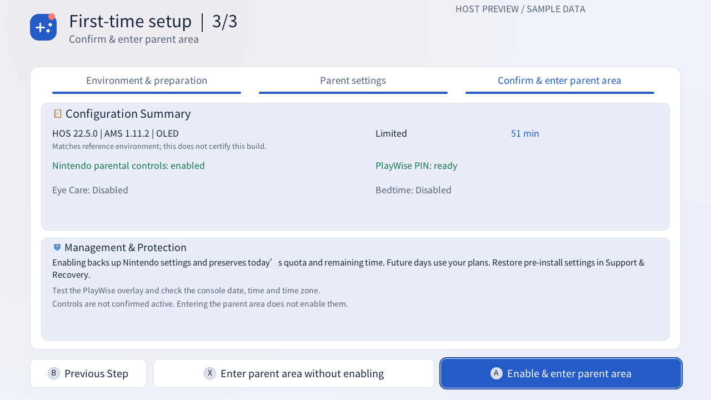

Child Zone home screen preview:

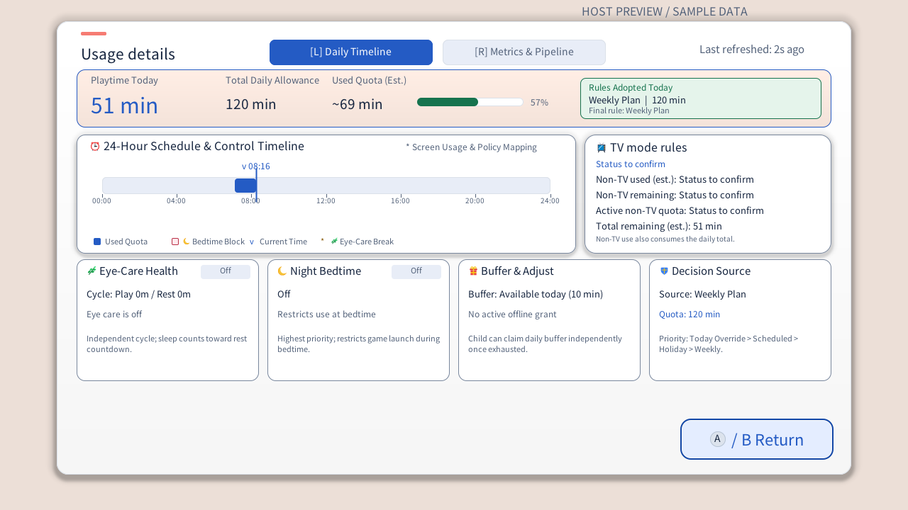
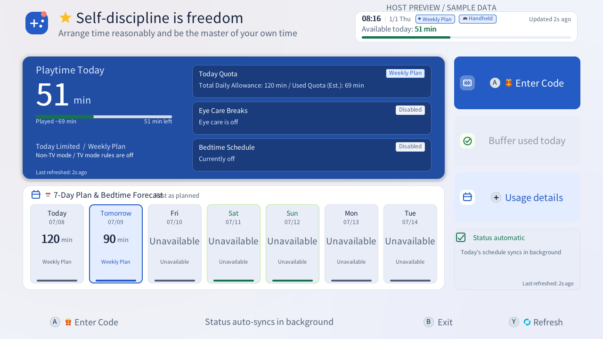

Parent Zone today schedule preview:
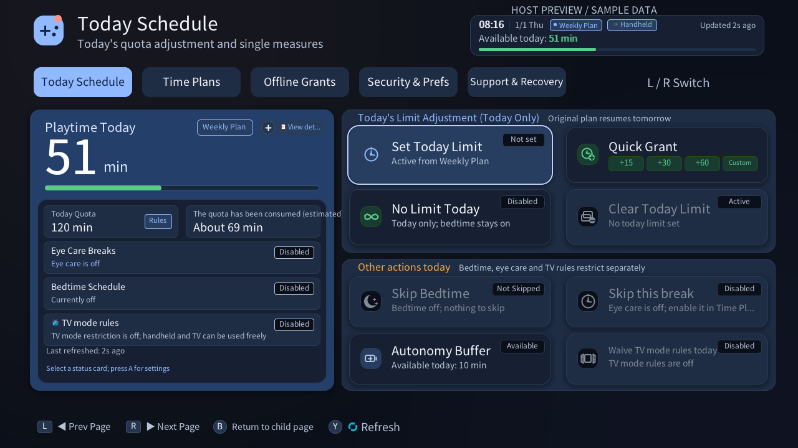
</details>

These console images are generated from production drawing code with static mock data and bear the `HOST PREVIEW / SAMPLE DATA` watermark. They are layout previews rather than hardware screenshots, and do not represent hardware controller, touch, font, or PCTL acceptance.

### Enable Nintendo Parental Controls

If Nintendo Parental Controls has not been configured, set it up on the console:

1. From Switch HOME, open System Settings → Parental Controls → Parental Controls Settings.
2. Choose “If You Do Not Have a Smart Device”, then select Next → Next.
3. Follow the system prompts to configure restrictions and a Nintendo Parental Controls PIN, then save. Parents should keep this PIN; it is separate from the PlayWise PIN.
4. Return to PlayWise, close help and press `Y` to refresh. Check that official Parental Controls is enabled. If status remains unknown, record it and export diagnostics from Support & Recovery.
5. Confirm controls have not been temporarily unlocked with the official PIN, then test counting and expiry restrictions with a game that has no unsaved progress. An enabled setting alone does not prove actual blocking.

If an official PIN or Nintendo Parental Controls phone app link already exists, follow the system prompts and use the existing PIN or phone app to check settings.

On setup step 1, tap “Enable Controls Help” or select it with the direction buttons and press `A` to open the detail dialog. Press `A` / `B` or tap Return to close it, keeping the current step and selection. Viewing help does not change system settings or treat an unknown status as enabled.

### Synchronize the Switch Clock

From Switch HOME, open System Settings → System → Date and Time. Check that the date, time and time zone match the console's location. Menu names depend on system language; verify the time zone after syncing too. If clock sync is missing or uncertain, choose one of the following online methods.

**Using DBI:**

1. Connect the Switch to a network that can reach an NTP service, then open your installed DBI from Homebrew Menu.
2. Open Tools → NTP Time Sync, start synchronization and wait for the tool's result.
3. On success, check date, time and time zone in System Settings, then return to PlayWise, press `Y` to refresh and retry the original action. On failure, record the error and check the network before retrying; an attempted sync is not a successful sync.

**Using the QuickNTP overlay:**

1. Have [QuickNTP](https://github.com/ppkantorski/QuickNTP) and an Ultrahand / Tesla overlay manager installed, and connect the Switch to a network that can reach an NTP service.
2. Open the overlay manager with its shortcut and select QuickNTP. Follow the tool's prompts to synchronize time and wait for the result; button names depend on the installed version.
3. On success, close the overlay, check date, time and time zone in System Settings, then return to PlayWise, press `Y` to refresh and retry the original action. On failure, record the tool's message and check the network before retrying.

For counting or expiry restriction issues, retest counting and blocking with a non-critical game after syncing and refreshing. Record the sync method, success and retry results. PlayWise does not automatically detect successful clock sync, and syncing is not a guaranteed fix. Offline code generation and redemption still require no network.

## Daily Playtime Management

Parent Zone consists of five top-level tabs: **Today's Schedule, Time Plans, Offline Grants, Security & Preferences, Support & Recovery**. Press controller `L/R` shoulder buttons to cycle through tabs. The top status bar displays console local time, remaining playtime for today, and last update timestamp; if status has not updated for over 120 seconds, it displays the rule category and timestamp labeled "Last Confirmed" with a prompt to press `Y` to refresh, hiding outdated remaining minutes. When status has not yet been fetched on first launch, it likewise prompts pressing `Y` to refresh.

- **Today's Schedule**: The default landing page in Parent Zone, designed for immediate, highest-priority temporary interventions for today's playtime;
- **Time Plans**: Edit long-term rules including weekly schedules, national holidays, scheduled date limits, bedtime rules, and autonomy buffer policies;
- **Offline Grants**: Generate 8-digit offline grant codes on the Switch console or parental phone/PC for children to redeem when restricted;
- **Security & Preferences**: Modify PIN, theme, Parent Zone shortcut, and view on-device family activity history;
- **Support & Recovery**: Independent top-level tab offering playtime management activation, retry repair, emergency disable, restore pre-installation settings, and diagnostic log export.

### Today's Schedule

"Today's Schedule" is the central command deck for managing your child's playtime for the current day. Its core design principles are:

- **Highest-Priority Temporary Override**: Temporary adjustments made here take absolute precedence over scheduled date limits, national holiday allowances, and regular weekly schedules;
- **Single-Day Validity Without Disrupting Long-Term Plans**: All adjustments made on this page apply only to the current day. At 00:00 midnight, they automatically expire and revert smoothly to normal regular schedules without altering or corrupting your established routine.

Daily playtime limits and bedtime restrictions operate independently: setting "Unlimited Play Today" or adding minutes does not bypass bedtime limits; clearing today's adjustment reinstates underlying plans, which may decrease remaining time. Review the rule origin and projected outcome on the confirmation dialog before submitting.

The Today's Schedule tab features seven quick-action cards and a full-screen details view. The first four cards pertain to "Today's Limit Adjustments (Today Only)" and reset the next day; the latter three cover bedtime, autonomy buffer, and eye care. Bedtime and eye care restrict independently, while autonomy buffer adds playtime today only when eligible.

1. **Set Today's Limit (Total Playtime for Today)**:
   - **Status Badge**: The top-right badge indicates current limit status: "Active", "Unlimited", "Unset" (determined by long-term schedule), "Cleared" (temporary adjustment just removed), "Pending", "Awaiting Confirmation", "Bedtime Restricted", or "Disabled".
   - **Underlying Inheritance Explanation**: When no temporary limit is set today, the dynamic subtitle clearly explains which rule layer governs today (e.g. "Determined by weekly schedule", "Determined by national holiday", or "Determined by scheduled date limit").
   - **Adjustment & Safe Confirmation**: Press `A` or tap to enter the editor. Choose "Limited" to set total minutes, or choose "Unlimited Today"; switch modes using `ZL/ZR`. When opening the limit editor, if status is older than 120 seconds or unconfirmed, it automatically refreshes; you can also tap "Refresh Latest Status" or click right stick `R3` to refresh manually. Pressing `+` to save re-reads console status: if transitioning from unlimited back to limited today, a confirmation dialog appears first; if the new limit is less than or equal to already played time, the confirmation requires a 1-second deliberate hold. If already limited and the new limit exceeds played time, it submits directly. If refresh fails or played time is unavailable, inputs are preserved without submitting. Unlimited play, quick grants, and clearing adjustments follow their respective confirmation workflows.

   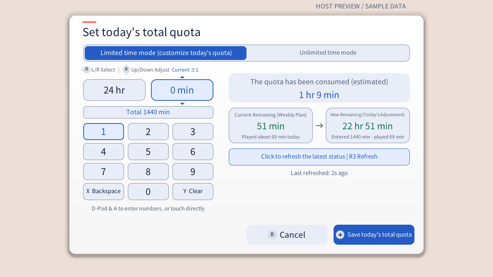
   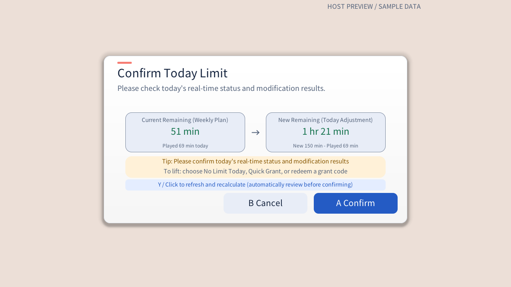

2. **Quick Grant**:
   - Designed for temporary rewards or granting bonus playtime. Provides `+15 min`, `+30 min`, `+60 min` quick options, plus a `Custom` minute stepper (1–120 minutes).
   - Selecting an option opens a secondary confirmation panel comparing current remaining time against projected time after grant; if truncated by the daily maximum ceiling (1440 min), actual added minutes and an amber notice are shown before confirming.
   - When today is already unlimited, the card is grayed out and displays "Unlimited today, grant not needed"; use "Set Today's Limit" to restore limits. In this state, neither controller confirmation nor touch will initiate a grant request.

   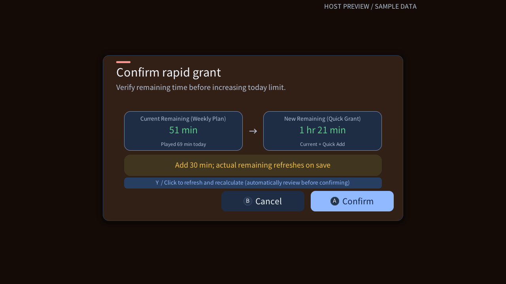

3. **Unlimited Play Today**:
   - Ideal for weekend gatherings, holiday celebrations, or special reward days.
   - Once confirmed, daily playtime limits are removed for today and status displays "Unlimited"; bedtime schedules remain independently active. At 00:00 midnight, this adjustment expires and normal routines resume.

   
4. **Clear Today's Adjustments**:
   - One-click rollback of all temporary adjustments for today (including total limit, quick grants, and unlimited mode), reverting to the underlying schedule (e.g. Friday plan or holiday schedule).
   - If no temporary adjustments exist today, this card is automatically disabled and will not submit redundant requests; if cleared during the current console session, the subtitle indicates "Cleared in this session, using underlying rule".
5. **Skip Tonight's Bedtime**:
   - A single-instance release card for bedtime restrictions. The dynamic subtitle displays the currently active or upcoming bedtime window (e.g. `21:00 to next day 07:00`). If bedtime is currently active, a prominent "Restricted" badge appears in the top-right corner.
   - Skips only "the currently active bedtime session" or "the upcoming session tonight", never modifying or disabling long-term bedtime plans. Bedtime will automatically lock again on the following night.
   - Clicking refreshes status, locks the window instance, prompts for PlayWise Admin PIN verification, and confirms after reviewing the release window.
   - If bedtime schedule is turned off, no skippable session exists, or tonight's session has already been skipped, the card is grayed out with the corresponding reason; expired status triggers a refresh before evaluating availability.
6. **Autonomy Buffer**:
   - Displays the status of today's autonomy bonus (configured by parents in "Time Plans → Autonomy Buffer", offering a once-daily 5, 10, or 15-minute claim).
   - The dynamic subtitle indicates: "Eligible for X min today", "Claimed today, eligible again tomorrow", "Currently disabled, configure in Time Plans", or "Currently not eligible today". When eligible, children can independently claim this buffer from the in-game overlay; the daily 1440-minute cap may result in fewer added minutes or 0, but a successful claim consumes today's eligibility. Claims cannot be made during active bedtime restrictions.
7. **Skip This Eye Care Break**:
   - Available only while the current eye care break is active. Selecting it refreshes status, locks the current break instance, verifies the PlayWise parent PIN again, and asks for confirmation. A successful skip ends only this break; eye care remains enabled and a new cycle begins.
   - The card explains why it cannot submit when eye care is off, no break is active, status is older than 120 seconds, the countdown reaches zero during normal operation, or daily quota or bedtime takes priority. Protection or deactivation retains a recovery entry for the same break. Press `Y` to refresh status.

#### Viewing Today's Rule Details

On the Today's Schedule tab, press controller `+` button or tap "+ View Details" to open the full-screen details sheet to inspect system decision logic:

- **How Today's Limit is Determined**: Evaluated in strict priority order: "Today's Adjustments → Scheduled Date Limits → National Holidays → Weekly Schedule", adopting the first applicable rule. Bedtime and eye care run independently of this quota priority; exhausted daily quota and bedtime restrictions take precedence.
- **Usage & Status**: Displays on-device playtime estimates for today, 7-day usage estimates, status update timestamps, and recent operations. The eye care preview shows approximate minutes until the next break while playing and a minutes-and-seconds countdown during a break. Unknown or expired readings prompt a refresh.

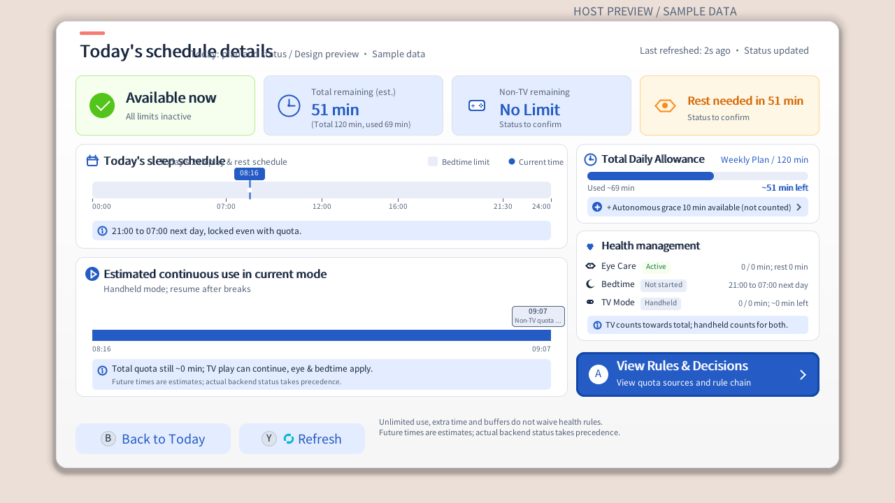
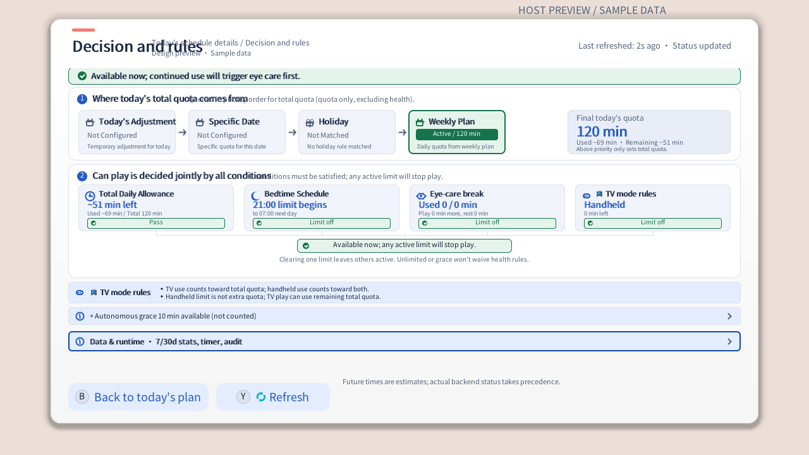

### Long-Term & Date Plans

Weekly schedules are edited day by day; national holidays support official statutory holidays and substitute workdays; scheduled date limits support custom ranges from 1 to 366 days (replacing daily total playtime during the range, with already played time still counting, rather than granting bonus time). Edits form a draft first; review the projected impact on today before saving. If another rule takes priority today, the page explains that today's limit remains unchanged; when saving could immediately restrict gameplay or status is unconfirmed, a deliberate hold confirmation is required. Failed saves preserve drafts.

To import a region calendar, place a UTF-8 JSON file in SD `/switch/playwise/calendar-import/`. In Parent Zone, open Time Plans → Holiday Schedule → Manage Calendars, preview and confirm the import, then select a saved region and hold to apply. Re-importing the active region also requires applying again. The built-in mainland China 2026 calendar remains a separate option. Uncovered years use the weekly plan. Use `B` to return, `Y` to refresh and `X` for brief format help; these buttons also support touch. Help preserves your list selection. See the [custom calendar format, complete example, and invalid example](CUSTOM_HOLIDAY_CALENDAR_FORMAT.md).

Import Files displays brief steps, the save directory and the complete format-document URL. View Holiday Schedule opens the page nearest the current console date, including makeup days; ties prefer upcoming dates. Manual paging remains available. "Skip this break" matches neighboring Today actions in width and uses the same short confirmation title. The status bar and left summary use the current reliable reading for the next-break preview; unavailable readings still show an unknown state.

Bedtime schedules can be configured across weekly, holiday, and scheduled date tiers, supporting overnight windows; each of the three sub-pages saves independently. When switching or exiting with unsaved changes, prompt dialogs allow saving, discarding, or continuing edits. Autonomy buffer is disabled by default and can be configured as a once-daily 5, 10, or 15-minute allowance; it adds to today's playtime without altering bedtime windows.

The "Master Bedtime Switch" controls all bedtime rules across weekly, holiday, and scheduled date tiers. Turning it off and saving suspends all bedtime restrictions while preserving saved time windows for future reactivation. The interface displays the "Currently active" state by default and only presents an "Unsaved (press + to apply)" badge when the switch is toggled; toggling the switch modifies only the draft until saved with `+`. Use D-pad to highlight the master switch and press `A` to toggle, press `-`, or tap. `L/R` flips between sub-pages. After skipping tonight's bedtime, both Today's Schedule and Bedtime tabs display "Skipped tonight" with timestamps. On the Bedtime tab, press `Y` to skip or `X` to restore tonight's session, or tap corresponding buttons; restoring requires verifying PlayWise PIN and reviewing impact in a confirmation dialog. If currently within the bedtime window, a deliberate hold confirmation is required, immediately re-enforcing restrictions upon success. The in-game overlay's "Restore Tonight's Bedtime" action also displays a confirmation sheet, requiring a 1-second hold on `A` when currently inside the window.

<details>
<summary>View Time Plans & Editor Previews</summary>

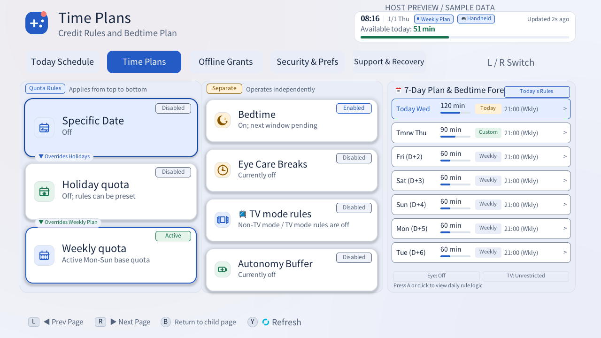
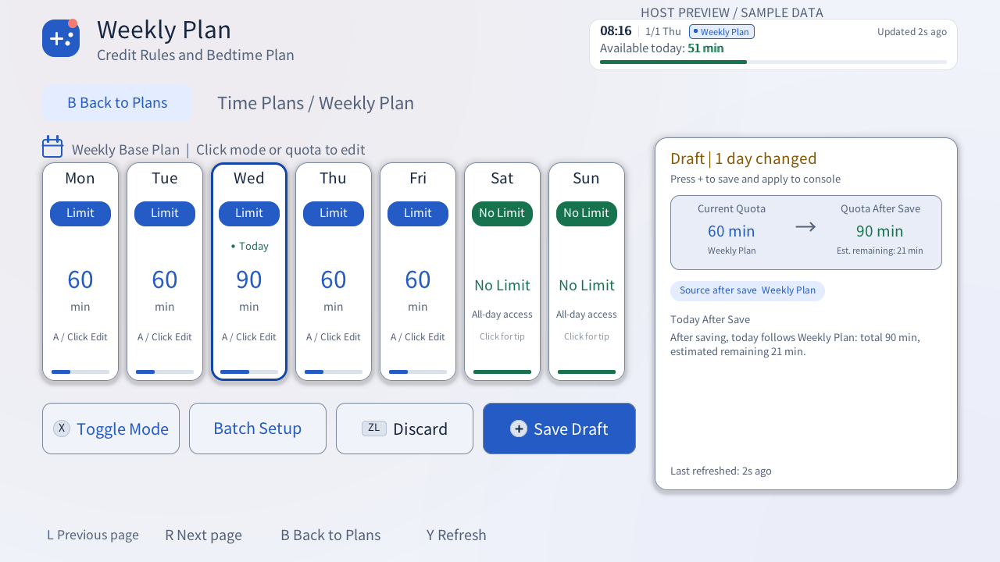
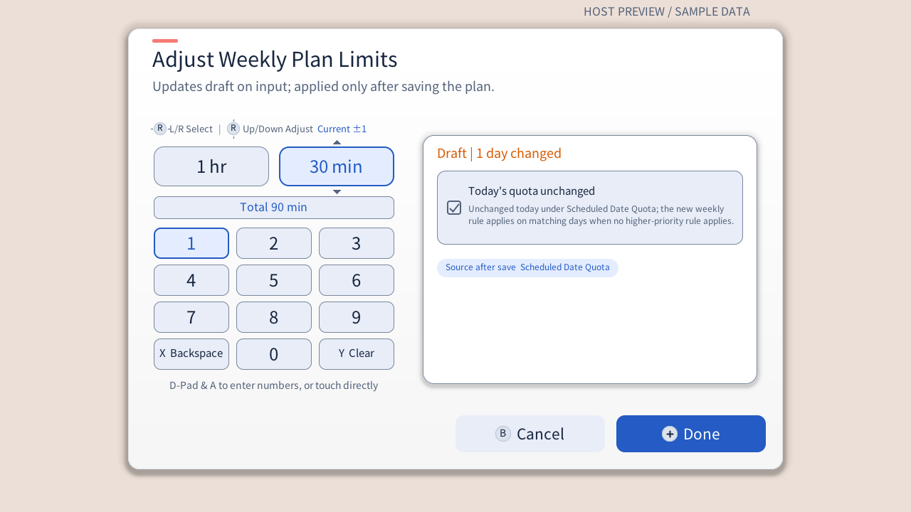
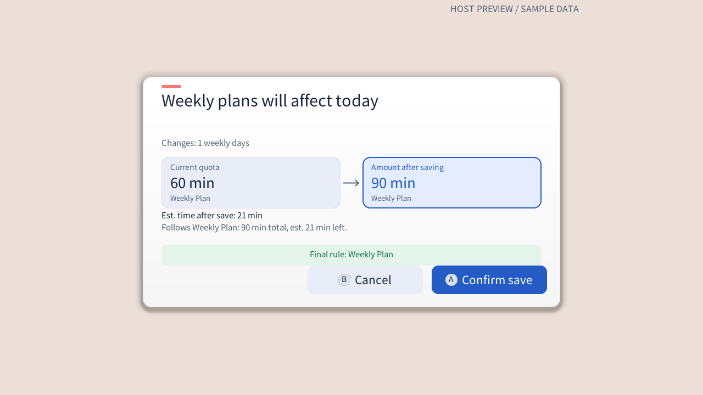
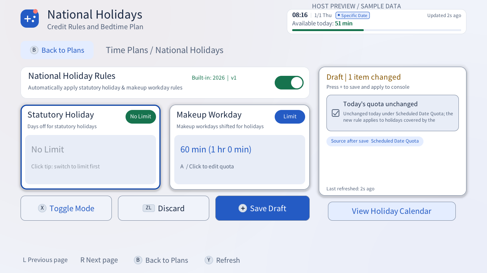
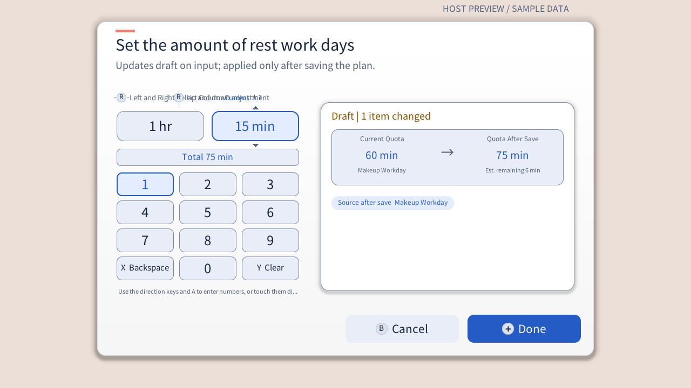
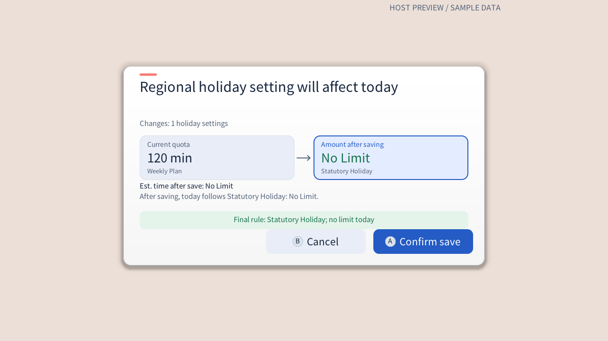
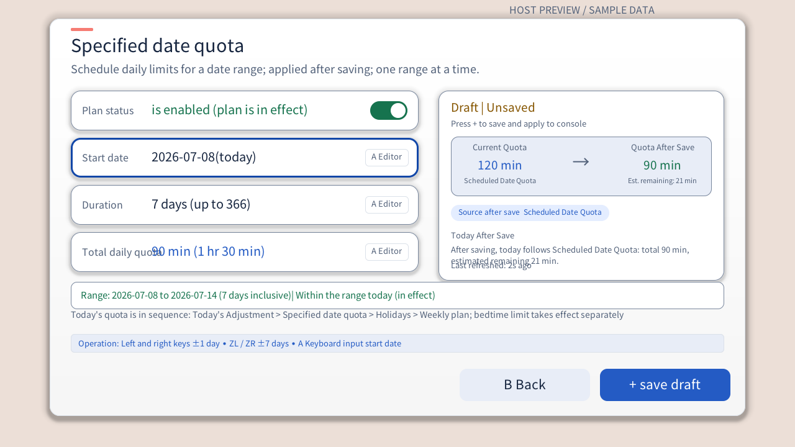

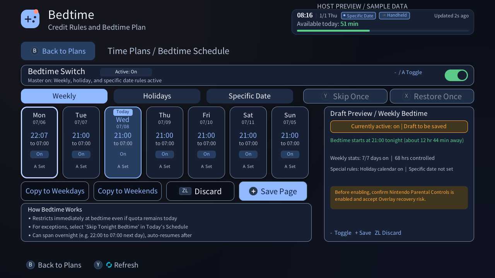
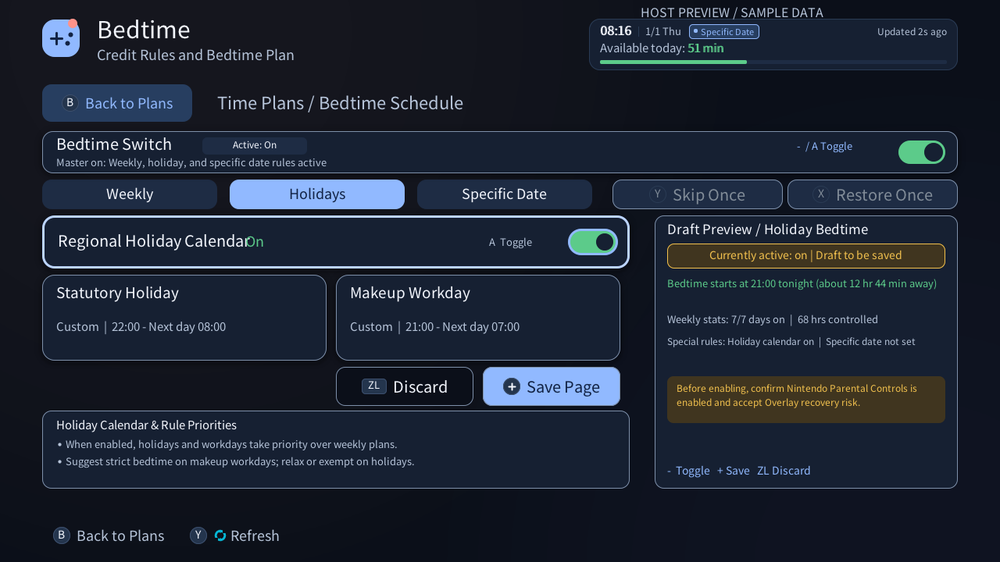
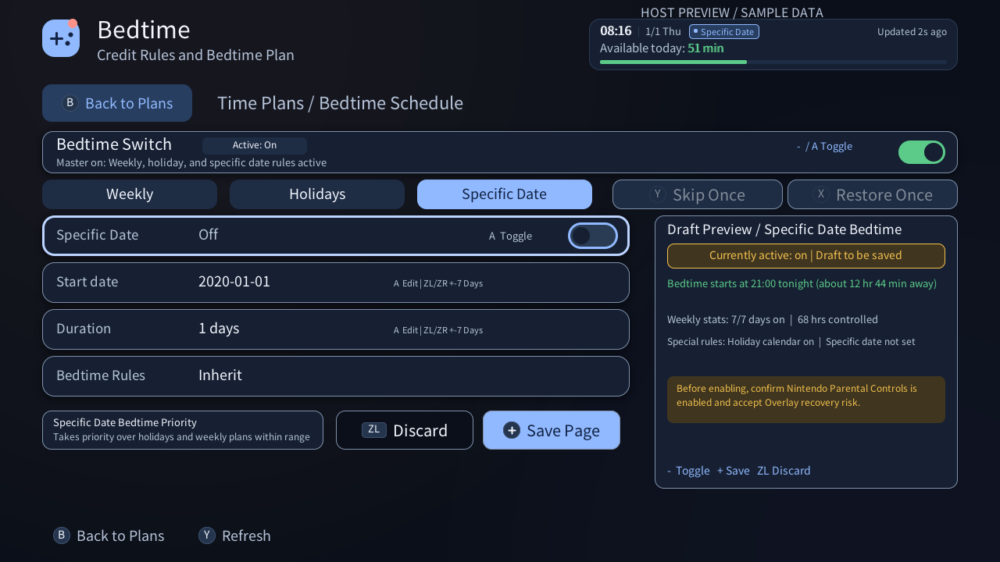
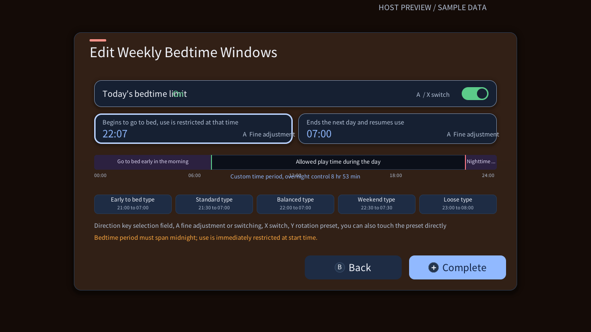
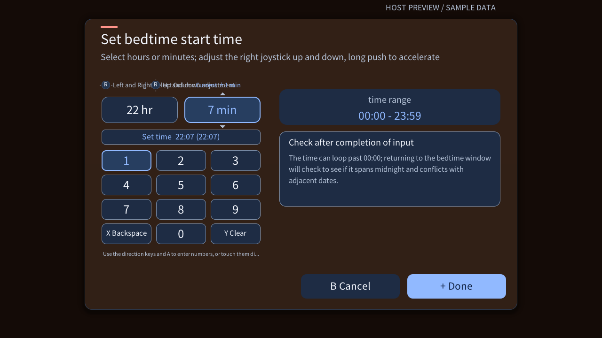
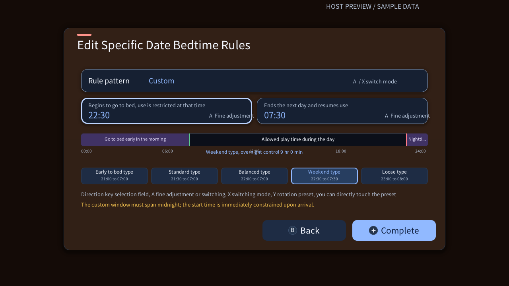
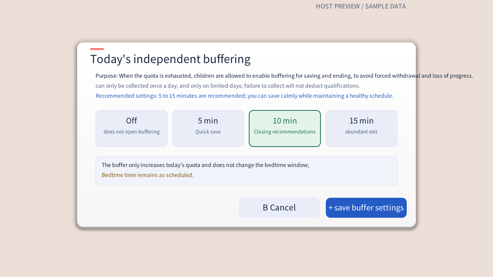

</details>

## Offline Grants

Grant codes are 8-digit numbers determined by parents and valid only for the current day. Generating a code does not immediately add playtime; extra time is applied only when the child successfully redeems it on the console, and each code can be redeemed successfully only once. If daily limits are reached, the actual increase may be less than the code face value. Parents can relay the code via phone call, messaging app, or in person—PlayWise requires no intermediary servers.

### Grant Code Mechanics & Multi-Console Configuration

#### How It Works
1. **Pure Offline HMAC-SHA256 Signatures**: Offline grant codes are calculated using standard HMAC-SHA256 cryptography. When generating a code, the parent device (Switch console or parental phone/PC browser) signs a payload combining the target console's unique device identifier (`device_id`), the local date on the Switch (Day Index, counted from 2020-01-01), the grant minutes (`minutes`), and an anti-replay counter (`nonce`) using the high-entropy shared secret (`grant_secret`), truncating the digest into an 8-digit human-readable number.
2. **Zero-Network On-Device Verification**: When the child enters the 8-digit code on the Switch, the console performs identical cryptographic verification completely offline using its stored secret. If the signature matches, the date corresponds to today, and the nonce has not been consumed in the anti-replay ledger, the extra time is safely applied and the nonce is marked spent.
3. **Privacy & Offline Guarantee**: Code generation and redemption occur entirely locally on both ends without internet access, third-party relay servers, or cloud accounts, eliminating privacy leakage and connectivity failures.

#### Why Each Console Must Export Its Own parent-import.json
- **Unique Secrets & Device Binding**: Every Switch console generates a unique device identifier and a high-entropy random signing secret (`grant_secret`) during initial PlayWise setup.
- **Cross-Console Rejection**: Because grant codes are strictly bound to a specific console's `device_id` and `grant_secret`, **a grant code generated for Console A will fail verification on Console B (displaying code invalid)**.
- **Managing Multiple Consoles**: If your family has two or more Switch consoles, you must export `parent-import.json` separately on each Switch (or scan QR codes individually). The parental web app (including the single-file offline version) supports saving and switching between multiple paired consoles—simply select the appropriate Switch from the top dropdown before generating codes.

### Generating on Switch

1. In Parent Zone, go to "Offline Grants → Generate Grant Code Now", verify PlayWise PIN, select desired duration, and generate.
2. Verify the valid date and duration, then share the 8-digit code with your child. Generating a new code on the same day does not invalidate previously issued codes; changing "Next Grant Duration" does not modify issued codes.
3. If generation fails, follow on-screen hints to inspect configuration, SD card, and system clock. Never assume previous codes are revoked.

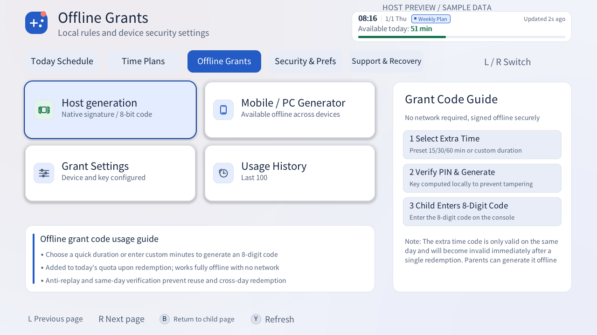
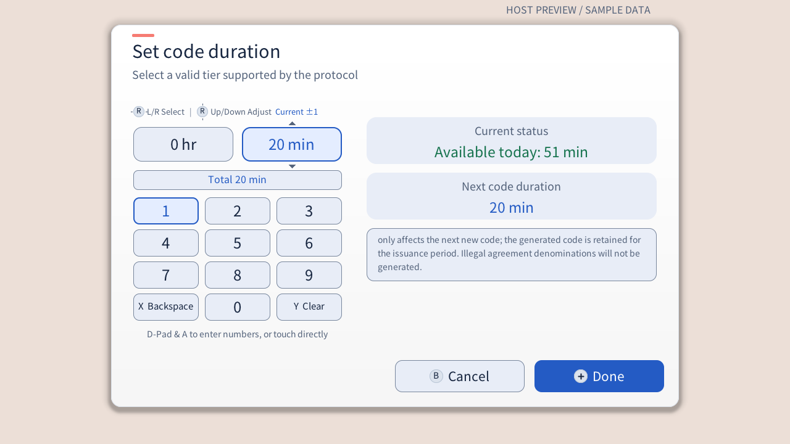
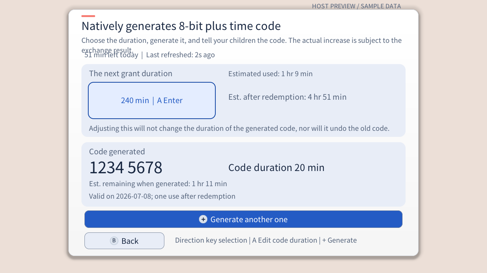

### Generating on Phone or PC

The parental web generator calculates 8-digit codes locally inside your browser, never transmitting device IDs, secrets, or codes to any PlayWise backend. Regardless of pairing method, always select the **Switch console's local date**; if your parental device date differs from the Switch, the date displayed on the Switch takes precedence.

#### Method 1 (Recommended): Online QR Code Pairing

1. Connect your trusted phone or PC to the internet and ensure you can access the [Public Parental Web App](https://selfuppen.github.io/NX-PlayWise/). Hosted on GitHub Pages, this URL may be unreachable in some network environments; you can also deploy `tools/ptc_frontend` to your own trusted HTTPS static host.
2. In Switch Parent Zone, navigate to "Offline Grants → Phone/PC Generator", verify PlayWise PIN, and view the QR code displayed on screen. If using a self-hosted web app, configure its HTTPS URL under "Offline Grants → Generator Settings → Edit QR Code Target URL" first.
3. Scan the QR code with your parental device to open the web page, verify the device ID, and tap "Import This Device"; if another device configuration exists in the browser, confirm the replacement. The QR code contains your grant secret and must only be scanned by trusted parental devices.
4. Select the Switch local date and duration, generate the 8-digit code, and share it via phone, message, or in person. Children redeem codes completely offline on the Switch.


The QR code shown in the image uses a public demo configuration and cannot be used on real home consoles. Scanning simply imports settings into your browser; code calculation is performed entirely client-side. If the webpage is unreachable, use the standalone offline file below or [generate directly on the Switch](#generating-on-switch).

#### Method 2 (Fallback): Standalone Offline Single-File HTML

1. Extract `playwise-offline.html` from the complete delivery bundle (`playwise-complete-<version>.zip`). **`parent-import.json` is not bundled in installation packages and will not appear automatically**. In Switch Parent Zone, open "Offline Grants → Phone/PC Generator", press `A` to "Export Config File" (PIN verification is completed upon entering the page; exporting does not ask for PIN again; entering via "Generator Settings → Export Phone/PC Config" requires PIN), and confirm the on-screen success message and file path.
2. Copy the exported file from SD card `/switch/playwise/parent-import.json`, and transfer it along with `playwise-offline.html` to your trusted phone or PC. If export failed, inspect SD card write permissions and retry. Save files locally on your phone first, then open HTML in a standard system browser (avoid in-app webviews inside chat apps or cloud drives).
3. On the webpage, tap "Import Config File", choose `parent-import.json`, verify device ID, and confirm import. Then pick the Switch date and duration to generate 8-digit codes offline; redeeming on the Switch requires no network.

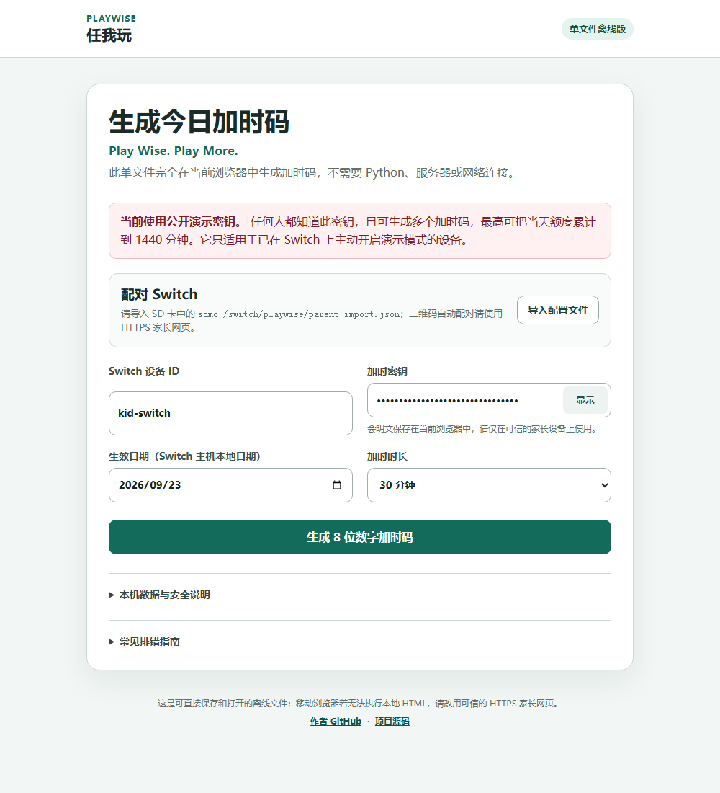

The standalone offline file requires no installed apps, Python, frontend toolchains, or local servers, but cannot serve as a QR code destination URL or be installed as a PWA. If your browser restricts local file persistence, re-import the configuration file next time you open it. Both `parent-import.json` and QR codes contain sensitive cryptographic secrets; never publish them, share them with children, or upload to untrusted sites. If you regenerate or change your grant secret on the Switch, parental devices must be re-paired and codes signed with old secrets will no longer validate.

### Redeeming in Console App (Child Zone)

When unrestricted and Homebrew Menu can still be launched, open PlayWise, enter Child Zone, select "Enter Grant Code", and type the 8-digit code. Compare current and projected playtime before confirming; high-risk operations will require a deliberate hold. The success screen shows actual added minutes and confirmed remaining playtime. If the result is still pending confirmation, wait or reopen to review the transaction rather than submitting repeatedly.

<details>
<summary>View Input, Confirmation, Hold-to-Confirm, and Success Previews</summary>

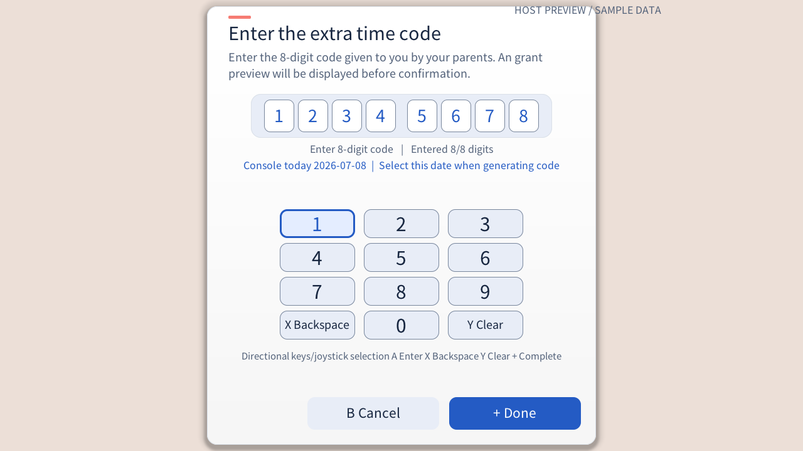
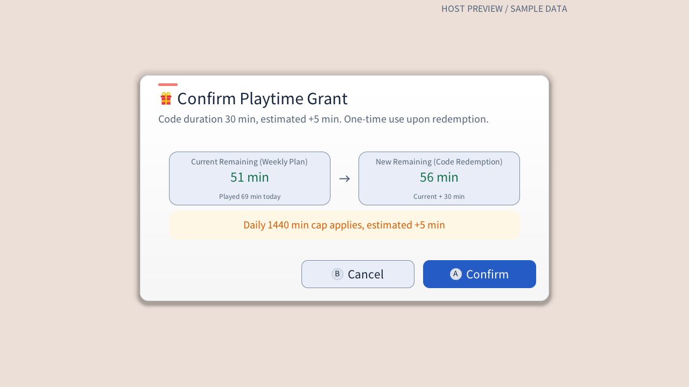
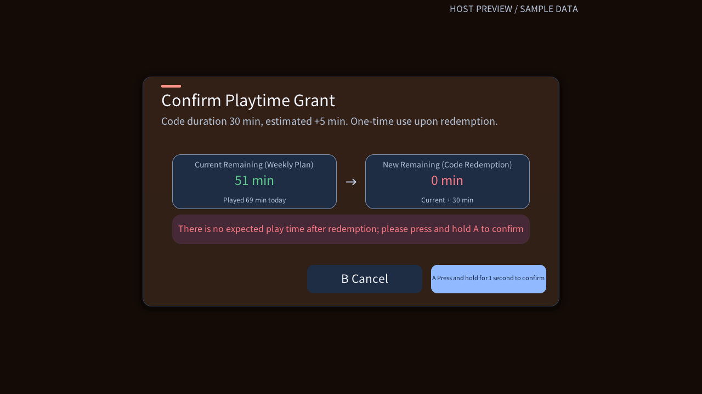
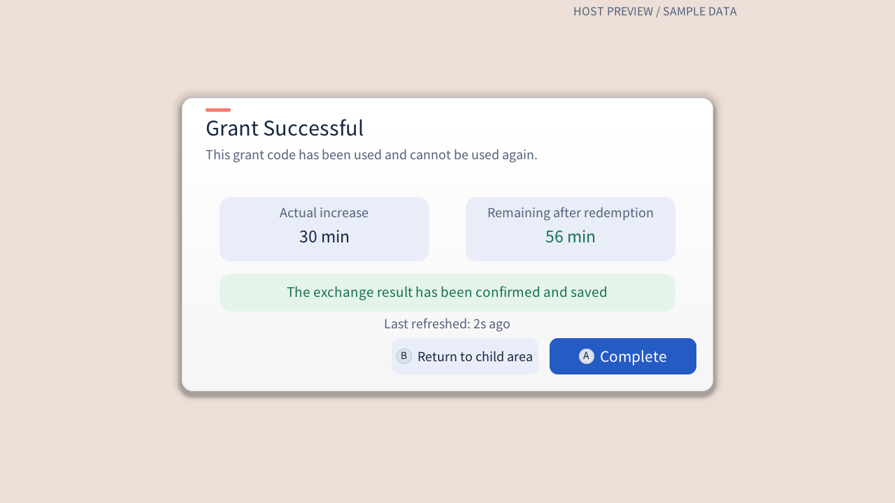

</details>

### Using In-Game Overlay When Restricted

When daily limits expire or bedtime restrictions take effect, Nintendo's native system dialog may prevent ordinary software and the PlayWise console app from opening. Use your configured Tesla/Ultrahand hotkey to bring up the overlay menu, and select **PlayWise** (`playwise.ovl`). When playtime has run out, you can redeem 8-digit codes or claim the autonomy buffer if eligible; if bedtime restrictions are active, ask a parent to skip tonight's bedtime or adjust plans in the overlay first. Full overlay controls and shortcuts are detailed in [In-Game Overlay](#in-game-overlay-tesla-overlay).

## In-Game Overlay (Tesla Overlay)

<details>
<summary>Overlay previews generated from the current code</summary>

| Code entry | Grant confirmation |
| --- | --- |
| 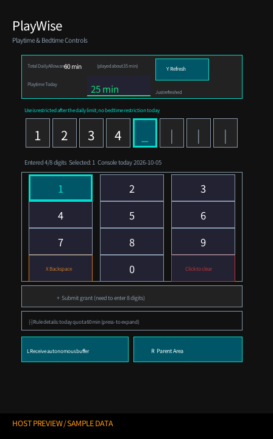 | 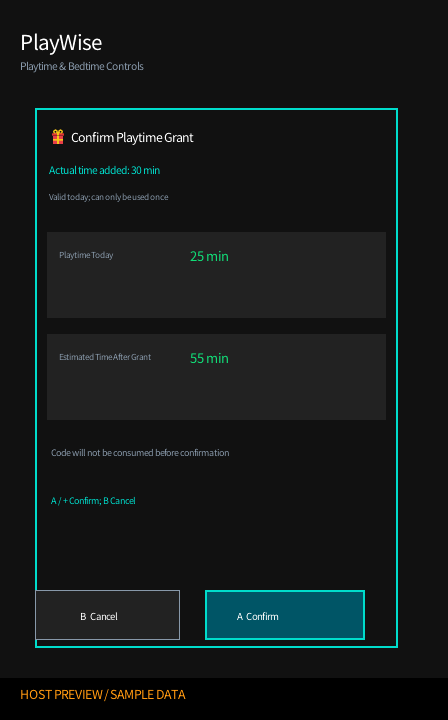 |

| Parent actions | Bedtime recovery |
| --- | --- |
| 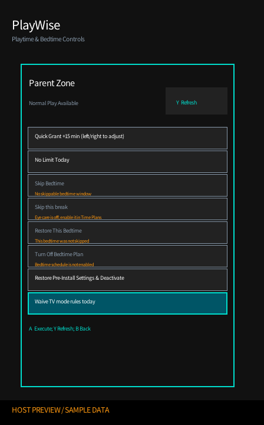 | 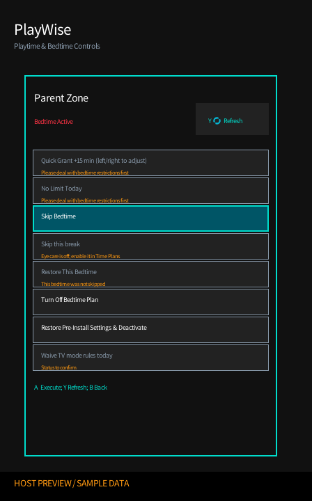 |

</details>

These use the production Overlay drawings with deterministic sample data and a `HOST PREVIEW / SAMPLE DATA` label. Regenerate with `python tools/package_remote.py --with-previews`, `--release`, or `--previews`. Verify shared fonts, controller/touch input and actual restrictions on a Switch.


The in-game overlay resides at `sdmc:/switch/.overlays/playwise.ovl` and requires an independently installed overlay loader such as Tesla Menu or Ultrahand Overlay. During gameplay, it enables status checks, grant code redemption, autonomy buffer claims, and single-instance parental recovery actions.

> [!IMPORTANT]
> **Verify overlay accessibility before relying on restrictions**:
>
> 1. **Seamless In-Game Access**: Press your overlay loader shortcut (Tesla default is typically `L + D-Pad Down + Right Stick Click R3`), then select "PlayWise" to inspect playtime or enter grant codes without closing your game. Test this hotkey before setting strict limits.
> 2. **PlayWise Recovery Interface When Restricted**: Once daily limits expire or bedtime takes effect, Nintendo's native lock screen dialog may prevent games, Homebrew Menu, System Settings, and the PlayWise console app from being opened. PlayWise relies on the overlay for on-device interaction and recovery. Temporarily unlocking via the official PIN on Nintendo's native dialog remains an alternate system-level pathway.

### Child Grant Code Main Page (All States)

Every time the overlay is invoked, it opens directly to the grant code page optimized for handheld play and controller input; this entrance is maintained even when playtime expires or bedtime restrictions apply, displaying active restriction causes:

1. **Top Status Capsule & Limit Bar**:
   - **Usage & Mode**: Left side displays today's estimated playtime and limit mode (e.g. "Used ~45 min today" or "Unlimited play today");
   - **Playtime Remaining**: Central area displays remaining minutes in bold 22px green digits (max 1440 min) or "Unlimited";
   - **Refresh Button & Freshness**: Top-right shows data freshness ("Just now", "X sec ago"; warns "Data may be stale" past 30 sec). Press controller `Y` or tap to refresh manually; displays orange "Refreshing… / Confirming" during transaction submission.
2. **Warning & Break Guidance**:
   - Dynamic prompt displayed below the limit bar (e.g. "Plenty of time left", "Please take a short break", or bedtime reminders).
3. **8-Digit Grant Code Slots**:
   - Eight centered card slots, with the active cursor slot pulsing with a cursor indicator `_` and teal border;
   - Displays entered digit count (e.g. "Entered 4/8 digits"), currently highlighted number, and **console local date** (guarding against cross-timezone or mismatched date issuance).
4. **3×4 Touch / D-Pad Soft Keypad**:
   - Grid layout featuring digits `0`–`9`, fourth row left `X Backspace` (amber border), and fourth row right `Tap to Clear` (red border);
   - **Dual-Mode Control**: Move focus using Left Stick or D-Pad, press `A` to input, and press `X` to backspace; or tap keypad buttons directly on the Switch touchscreen.
5. **Action & Submission Bar**:
   - Highlights and activates once all 8 digits are entered; press controller `+` button or tap to submit;
   - **Background Processing**: While requests are being processed, you can continue editing digits or close the overlay; new submission actions are temporarily disabled. If submission results are pending, do not re-enter the same code.
6. **Two-Phase Safe Redemption & Deliberate Hold Confirmation**:
   - Submitting enters the **Grant Preview Panel** (non-consuming verification), showing grant face value, current remaining time, and projected remaining time;
   - **High-Risk Hold-to-Confirm Mechanism**: If remaining time after redemption is still 0 minutes or remaining time cannot be verified, the interface displays a dark red warning banner, requiring a **deliberate 1-second hold on physical controller `A` button** to confirm. Touch taps are intercepted with a prompt to use physical controller hold, preventing accidental confirmation; ordinary safe grants require only a short press on `A` or `+`; press `B` at any time to cancel without consuming the code;
   - **Resilience Across Interruption**: If interrupted before confirmation, the code is unconsumed and can be re-entered; if the console powers off after submission, reopening the overlay attempts to reconcile the original transaction. Do not re-enter the same code while verification is in progress.
7. **Collapsible Command & Status Bar**:
   - Press controller `-` button or tap status bar to expand or collapse;
   - When expanded, inspect recent command execution, transport routing (IPC or SD card request queue), and detailed backend error codes.
8. **Autonomy & Parent Zone Entry**: Press `L` or tap bottom button to claim available autonomy buffer; press `R` or tap "Parent Zone" to enter PlayWise PIN verification. When bedtime restrictions are active, 8-digit codes can still be entered, but submission remains disabled until a parent skips or turns off bedtime. When unlimited today, displays "Grant code not applicable", preventing accidental reversion to limited play.

### Child Actions When Restricted

When limits expire, the overlay still opens directly to the grant code page. Children can enter and confirm 8-digit codes directly; if autonomy buffer is eligible, press `L` or tap to claim. When bedtime restrictions take effect, codes can be edited, but clear prompts instruct having a parent lift bedtime restrictions first. Once one restriction is lifted, PCTL status is re-queried; if another restriction remains active, the interface truthfully displays the remaining condition.

### Parent Zone in Overlay

On the grant code page, press `R` or tap "Parent Zone", enter your PlayWise PIN, and enter the Action Page. The PIN page uses identical directional mapping as the main app: left/right stick 8 directions map to `1`–`8`, D-pad up/down/left/right map to `1/5/7/3`, `X` enters `0`, `Y` enters `9`; each stick push enters one digit and must return to center before accepting the next. `ZL` backspaces, `+` verifies, and `B` returns. The screen displays static directional hints, masked dots, and digit count without highlighting selected numbers; touch allows backspace, verification, or return without entering digits directly. Failed attempts and cooldowns follow standard PlayWise rules. Navigating to Parent Zone does not discard unsubmitted grant codes; each successful PIN verification authorizes exactly one action.

The Action Page lists the following operations; unavailable actions display explanations without submitting requests:

| Action | Availability & Controls |
| --- | --- |
| Quick Grant | Today is limited, and no unskipped bedtime active; D-Pad Left/Right adjusts in 5-min steps (5–120 min), press `A` to execute |
| Unlimited Play Today | Today is limited, and no unskipped bedtime active; hold controller `A` for 1 second to confirm |
| Skip Tonight's Bedtime | Active or upcoming skippable bedtime window exists; press `A` to execute |
| Restore Tonight's Bedtime | Tonight's window was skipped; hold `A` for 1 second if inside active window, press `A` if upcoming window |
| Turn Off Bedtime Schedule | Bedtime schedule is currently enabled; hold controller `A` for 1 second to confirm |
| Restore Pre-Installation Settings & Disable PlayWise | Hold controller `A` for 1 second to confirm |

When bedtime and daily limits overlap, skip tonight's bedtime or turn off bedtime first, then address daily limits based on refreshed status. If an operation fails, press `Y` to re-verify PIN and retry; if the backend is unreachable, troubleshoot from SD card or external environment.

High-risk grant redemptions and parental actions requiring a 1-second hold on controller `A` display an animated progress bar inside the confirmation button or action card; releasing, cancelling, or switching actions resets the gauge to zero. Touch buttons for dangerous redemptions remind you to use physical controller hold rather than substituting touch input.

### Overlay Button Quick Reference

| Button / Input | Child Grant Code Page | Parent PIN / Action Page |
| --- | --- | --- |
| Left Stick / D-Pad | Move soft keypad focus; sustained push repeats slowly | Direct digit input on PIN page; navigate actions & adjust quick grant minutes on Action page |
| Right Stick | — | 8-directional direct digit input on PIN page |
| `A` | Input highlighted digit | Execute action on Action page; dangerous items require 1-sec hold |
| `B` | Close overlay | Return to grant code page |
| `X` | Backspace one grant code digit | Input `0` on PIN page |
| `Y` | Refresh status; retry upon error | Input `9` on PIN page; re-verify on result page |
| `ZL` | — | Backspace on PIN page |
| `+` | Preview grant code once 8 digits entered | Verify PIN on PIN page |
| `L` / `R` | Claim autonomy buffer / Enter Parent Zone | — |
| `-` | Expand / collapse status details | — |
| Touch | Digits, backspace, clear, refresh, submit, buffer, and Parent Zone entry | Backspace, verify, and return on PIN page; tap action buttons (dangerous actions still require physical controller hold) |

> [!NOTE]
> **Nintendo System Dialog vs. PlayWise Overlay**:
> Software suspension is enforced by Nintendo's native system dialog. The prompt on that dialog to "Enter PIN to temporarily unlock" uses your **official Nintendo Parental Controls PIN**; actions inside the PlayWise overlay use your **PlayWise PIN**. The two authorization mechanisms operate independently without conflict.

Always refer to buttons and prompts in your installed version. This guide does not retain outdated overlay screenshots. If overlay or sysmodule becomes unreachable, PlayWise has no reliable on-device self-recovery path; troubleshoot via SD card or external environment. Removing overlay files does not stop background sysmodule schedules.

## Security & Preferences

"Security & Preferences" safeguards management authority on the console, customizes interaction preferences, and provides audit tracking:

- **Change PlayWise PIN**: Modify the dedicated PIN used to enter Parent Zone and authorize sensitive operations;
- **Theme**: Switch between Follow System, Light, and Dark modes;
- **Interface Language**: Switch between Follow System, Simplified Chinese (简体中文), Traditional Chinese (繁體中文), and English;
- **Parent Zone Entry**: Customize the shortcut held in Child Zone to enter Parent Zone directly (default `-` Minus button);
- **Album & Capture Restrictions**: Restrict children from directly injecting or launching unrestricted homebrew via the Photo Album applet;
- **Family Activity History**: Audit the most recent 200 playtime adjustments, offline grants, and protection events on this console;
- **Offline Grant Redemption History**: View the most recent 100 offline grant redemption records on this console;
- **Offline Grant Generation Settings**: Manage console device ID, signing secret, and pairing QR code target URL;
- **Software Information**: Inspect current installed version, build identifier, and live reload status.

<details>
<summary>View Security & Preferences Previews</summary>

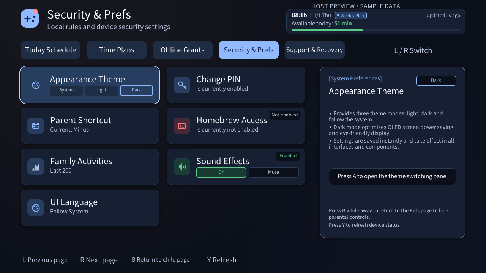
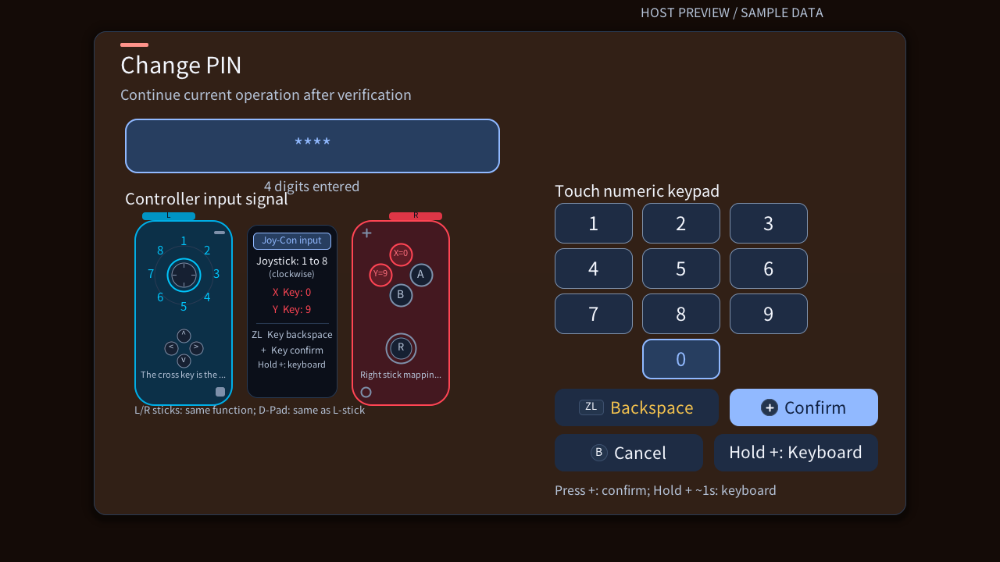
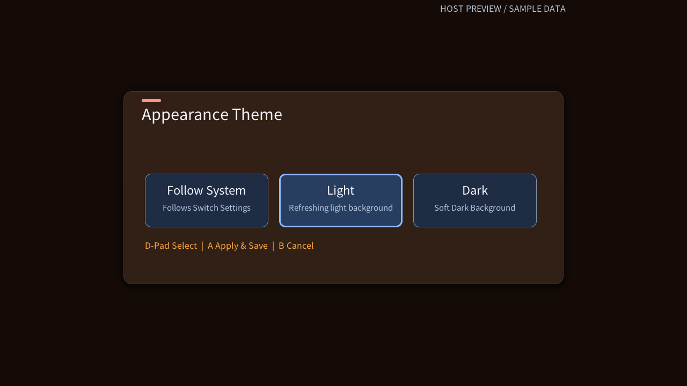
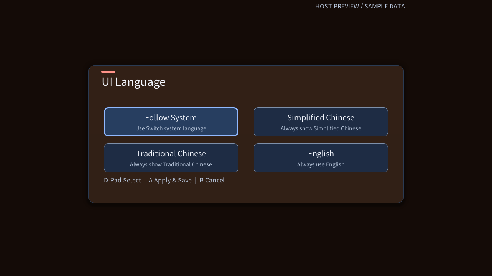
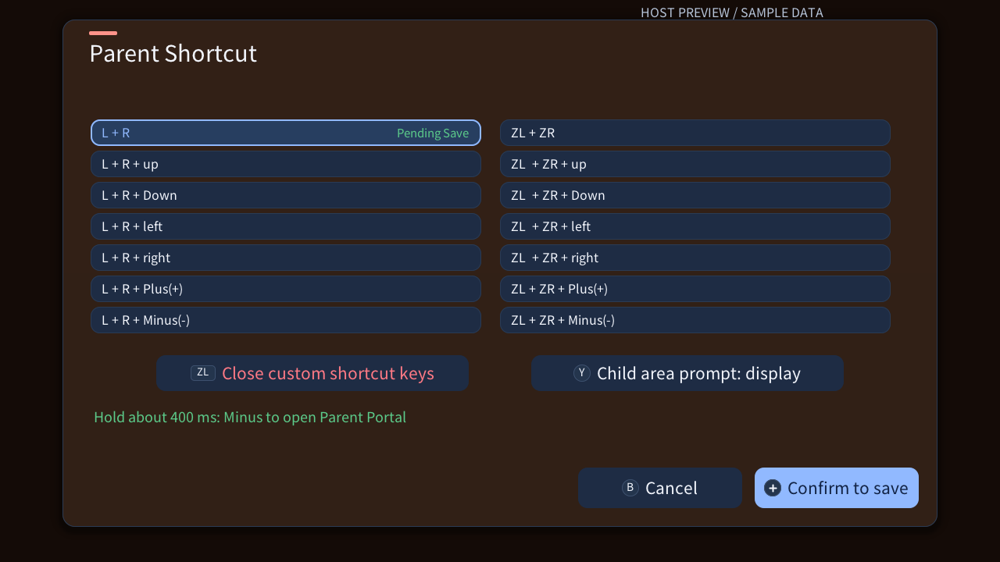
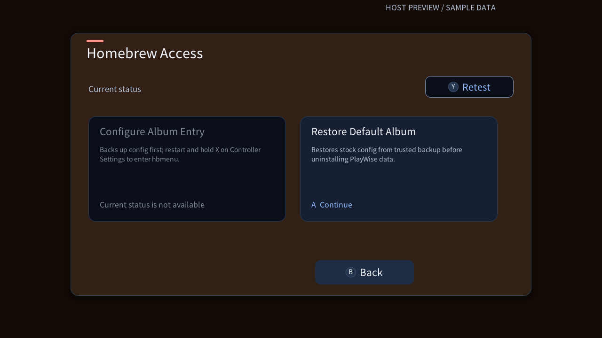
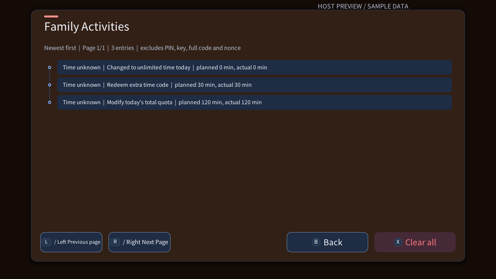
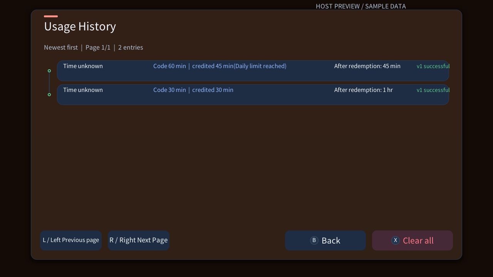
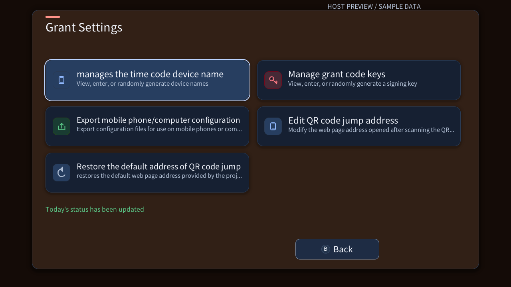
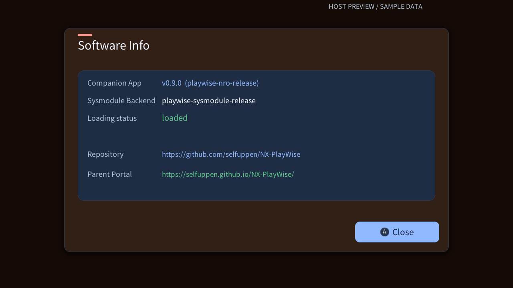

</details>

## Support & Recovery

> [!IMPORTANT]
> **If an error occurs, first check whether Nintendo system Parental Controls is enabled and the Switch clock has been synchronized.** Complete the first two checks below. Enable controls if needed; if clock sync is missing or uncertain, you can use DBI / QuickNTP online, then return to PlayWise, press `Y` to refresh and retry. PlayWise does not automatically detect successful clock sync. For counting or expiry restriction issues, also retest actual counting and blocking with a non-critical game.
> Steps: [Enable Nintendo Parental Controls](#enable-nintendo-parental-controls) · [Synchronize the Switch Clock](#synchronize-the-switch-clock).

Open **Support & recovery / Troubleshooting & FAQ** in the parent area. Navigate down from the bottom action row through recent events, then press A. Use L/R or left/right to change pages and A/B to return, or tap the navigation buttons. Help remains readable with the backend unavailable, emergency disable active, or read-only support access; it does not change controls, sync time or submit requests.

| Check pending | Verification and action |
| --- | --- |
| Nintendo parental controls | On/off/unknown are separate; stale readings are unknown. Close help and press Y. To enable: System Settings / Parental Controls / Parental Controls Settings / If You Do Not Have a Smart Device / Next / Next. Follow system instructions for an existing phone link. Enabled does not prove actual restrictions. |
| Date, time, time zone and sync | PlayWise does not detect successful clock sync. Check System Settings. Online, use DBI Tools / NTP time sync or QuickNTP, then refresh and test with a non-critical game. Sync is not a guaranteed fix. |
| Actual expiry restrictions | Rule out temporary Nintendo unlock. Counting stops while temporarily unlocked; sleep restores restrictions. Verify the 0-minute reading and actual game blocking separately. |
| Environment and overlay | Check model, HOS, Atmosphere and Software info. Recheck controls after environment changes. Test Ultrahand/Tesla access before restrictions. Manual verification differs from full qualification; Host/Eden cannot prove PCTL behavior. |

The four help pages also cover invalid/used/date-mismatched codes, bedtime and eye-care restrictions, backend loading, protection and recovery transactions, and diagnostic exports. Optional clock sync needs network access; offline code generation and redemption remain offline.

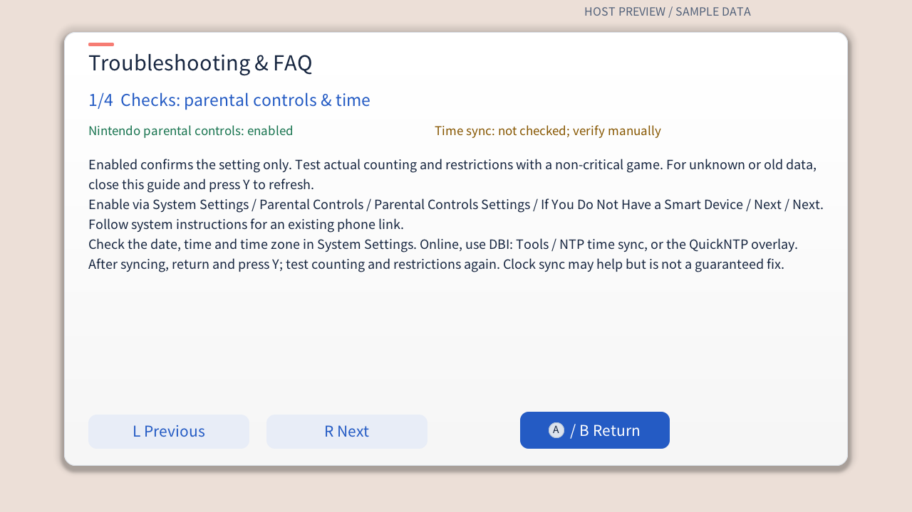

<details>
<summary>In-app FAQ pages</summary>

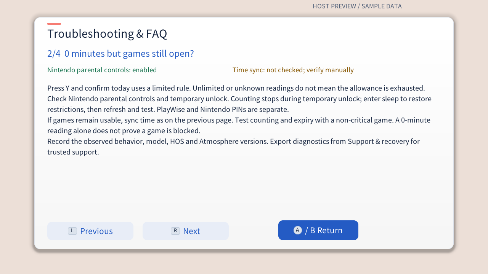
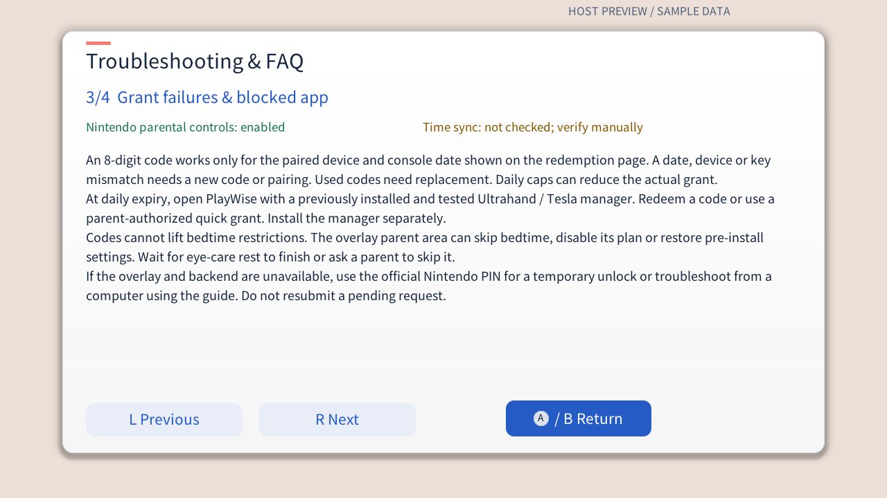
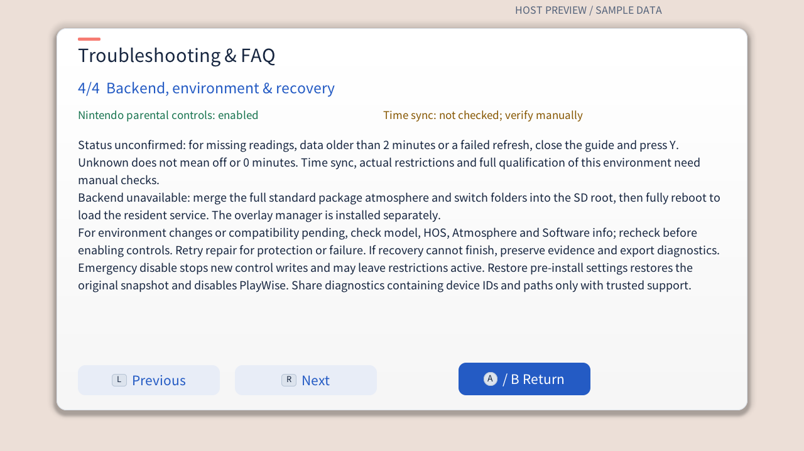

</details>


Parent Zone "Support & Recovery" displays active issues and recommended remedies; emergency disable halts new playtime and schedule writes, but permits viewing status, exporting diagnostics, and restoring backups. After firmware updates, if "System environment changed" appears, follow on-screen instructions to re-detect and resume takeover; successful takeover preserves your PIN, secrets, and rules. When "Syncing" appears, wait for completion before refreshing to verify.

<details>
<summary>View Healthy, Fault, and Event Details Previews</summary>

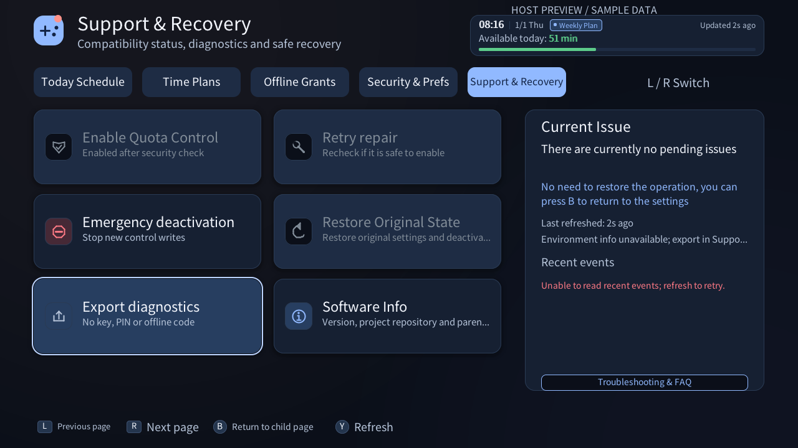
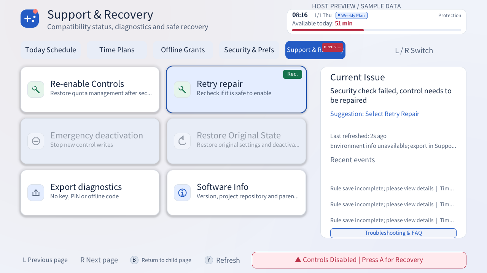
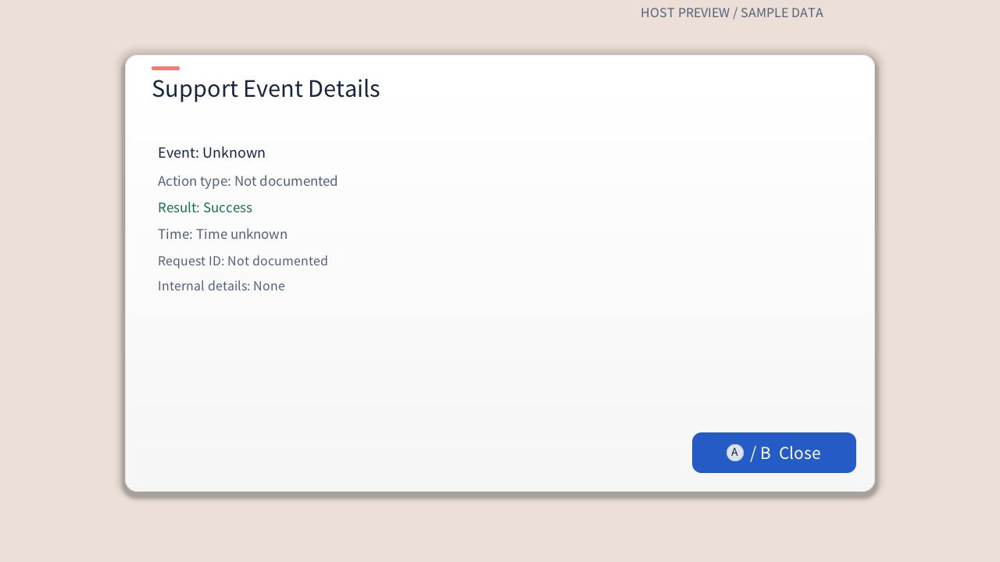

</details>

When reporting issues, export diagnostics from this page. **Start your troubleshooting record with whether system Parental Controls is enabled or temporarily unlocked, and whether the clock has been synchronized (method, success, and results after refreshing and retrying); mark anything you cannot confirm as unknown.** Then note reproduction steps, firmware and Atmosphère versions, PlayWise version and error codes, and submit to [Project Issues](https://github.com/selfuppen/NX-PlayWise/issues) with diagnostics attached. Never publish `credentials.json`, `auth.json`, full ledgers, real grant codes, or parental export files.

## Upgrades

### In-Place Data-Preserving Upgrades

Standard installation packages overwrite only program binaries and default templates, never overwriting PINs, secrets, rules, ledgers, logs, or pre-installation backup states stored under `switch/playwise/`. Before upgrading, backing up SD card data is still recommended; always merge both `atmosphere` and `switch` folders from the new package completely rather than copying individual binaries.

- **Powered-Off Card Reader Upgrade**: Power off Switch, remove SD card, merge and overwrite both folders on your computer, safely eject, and reboot. Follow prompts on first launch to perform safe re-detection.
- **Live Transfer & Load New Version**: Close PlayWise console app and overlay, transfer the standard package completely via DBI/MTP, FTP, or USB, launch the console app, enter Parent Zone, verify current and pending builds, and confirm "Load New Version". Wait for all four stages to complete before reopening the overlay. If cancelled, re-enter from "Support & Recovery → Software Information".

If prompted that installation is incomplete, re-copy files from the **same** standard package. If older versions cannot live-load new builds, target environments mismatch, or startup fails, perform a full console reboot; PlayWise does not forcibly terminate running sysmodules or trigger automatic reboots. Do not initiate "Load New Version" while file transfers are still underway.

On Windows, DBI/MTP data-preserving scripts can be previewed before applying:

```powershell
.\tools\install_package_via_dbi_mtp.ps1 -SourceFolder .\build\packages
.\tools\install_package_via_dbi_mtp.ps1 -SourceFolder .\build\packages -Apply
```

Do not use `-Clean`, `-Full`, or `-CleanAll` flags during standard upgrades. FTP full-clean and Device Lab installations alter existing data and control environments and are reserved strictly for developers following the [Testing Guide](../开发/TESTING_GUIDE.md). Standard users should install only standard release packages and never run both background daemons simultaneously.

## Frequently Asked Questions (FAQ)

> [!IMPORTANT]
> **If an error occurs, first check whether Nintendo system Parental Controls is enabled and the Switch clock has been synchronized.** See [Support & Recovery](#support--recovery) for checks, clock sync methods and troubleshooting record requirements. Refresh status and retry after checking; if the issue persists, record check results and error codes, and export diagnostics.
> Steps: [Enable Nintendo Parental Controls](#enable-nintendo-parental-controls) · [Synchronize the Switch Clock](#synchronize-the-switch-clock).

- **Code displays invalid, date mismatch, or already used**: Verify console local date displayed on Switch, device configuration, and entered numbers. If explicitly reported as already used, have parents generate a fresh code; failed attempts or cancelled previews do not consume codes.
- **Playtime limit still reflects old numbers**: Wait for background synchronization to finish, then press `Y` to refresh. Status older than 120 seconds or missing readings will display unconfirmed; never infer restriction release from outdated balances.
- **Set daily limit shows "Limit Reached" and 0 min remaining, but games still launch**: First check that Nintendo official Parental Controls is enabled and has not been temporarily unlocked via official PIN. If settings are correct, synchronize your Switch system clock via internet NTP: in DBI, choose "Tools → NTP Time Sync", or use [QuickNTP (Tesla time sync tool)](https://github.com/ppkantorski/QuickNTP). After successful clock synchronization, refresh PlayWise status and test with a game with no unsaved progress to confirm restriction behavior. Clock synchronization is a recommended resolution, see [Issue #1](https://github.com/selfuppen/NX-PlayWise/issues/1); if games still open, proceed with troubleshooting and export diagnostics under "Support & Recovery".
- **Official countdown or time restrictions not functioning**: Temporarily pause PlayWise, inspect whether Nintendo official Parental Controls is enabled, and re-verify on a non-critical game. PlayWise does not replace native Parental Controls timing and restriction engines.
- **Parent webpage cannot save configuration**: Open the standalone file in a standard mobile system browser; if the browser restricts local storage, re-import next time. For QR code pairing and desktop installation, use a trusted HTTPS site.

## Documentation & Screenshot Maintenance

Documentation images fall into two categories, with paths relative to repository root:

| Source | Image Paths | Update Method |
| --- | --- | --- |
| Automatically Generated Console and Overlay UI Previews | Selected PNG files under `docs/images/usage-en/{child,parent,setup,grant,redeem,plan,holiday,scheduled,bedtime,autonomy,settings,support,overlay}/` (English) and `docs/images/usage/` (Chinese) listed in `tools/sync_doc_previews.py` | Run `python tools/package_remote.py --previews` to re-render `build/ui-previews/` and synchronize to documentation paths. Append `--clean` for a full clean build. |
| Manually Captured Hardware, Pairing & Web Previews | `docs/images/usage/overlay/ultrahand-entry.jpg`, `docs/images/usage/overlay/playwise-code-entry-legacy.jpg`, `docs/images/usage/parent/pairing-qr-demo.png`, `docs/images/usage/parent/web-code-demo.jpg`, `docs/images/usage/parent-offline-demo.png` | Re-capture, verify, and update against physical devices or browser interfaces; pairing QR codes must use public demo configurations. The command above does not replace these images. |

Automated previews are generated from production C/C++ rendering code, fixed sample states, and the vendored Noto Sans SC font, marked with `HOST PREVIEW / SAMPLE DATA`. They serve layout reading purposes and do not substitute hardware controller, font, and PCTL validation. `--previews` (or `--only previews`) does not run full test suites or build distribution packages; run `python tools/package_remote.py` for standard routine builds, or `python tools/package_remote.py --release` when full release gating is required. See [Testing Guide](../开发/TESTING_GUIDE.md) for details.

See also [Development Environment Guide](../开发/DEVELOPMENT_ENVIRONMENT_GUIDE.md), [Development Guide](../开发/DEVELOPER_GUIDE.md), [Protocol Specification](../设计/PROTOCOL.md), and [PCTL Integration Architecture](../设计/PCTL_ARCHITECTURE.md).
