[文档索引](../README.md)

<div align="center">

  [English](USER_GUIDE.md) | [简体中文](使用指南.md)

</div>

# 使用指南

## 配置备份与导入

在家长区“安全与偏好 → 配置备份与导入”进入独立页。备份当前全部规则、偏好、PIN 与配对资料，以及所有已保存日历，固定保存为 `sdmc:/switch/playwise/backups/config-backup.json`。备份包含加时密钥，请妥善保管，不要公开分享。再次备份验证 PIN 并确认覆盖；写入失败保留旧文件。

导入先显示备份时间与来源设备。十一组可分别勾选，普通组默认选中，家长 PIN 与配对资料默认不选；全选和清空可批量操作。过期今日调整不能选择。未选内容保留本机值，已玩时间、非电视用量、缓冲领取资格和加时码防重放记录均保留。核对合并后的今日额度与限制，验证当前 PIN 并长按导入，即刻生效。

选择家长 PIN 时还需输入备份中的 PIN，成功后退出家长区。选择配对资料时恢复设备名与网址、生成新密钥，手机须重新配对；旧加时码失效。环境资格、首次授权、PCTL 快照、hbmenu 外部配置和日志不迁移，首次开启限制需重新确认本机官方家长控制与浮窗。格式或校验失败不会修改设置；写入或回读失败完整回滚，回滚失败保留恢复材料并进入保护态。

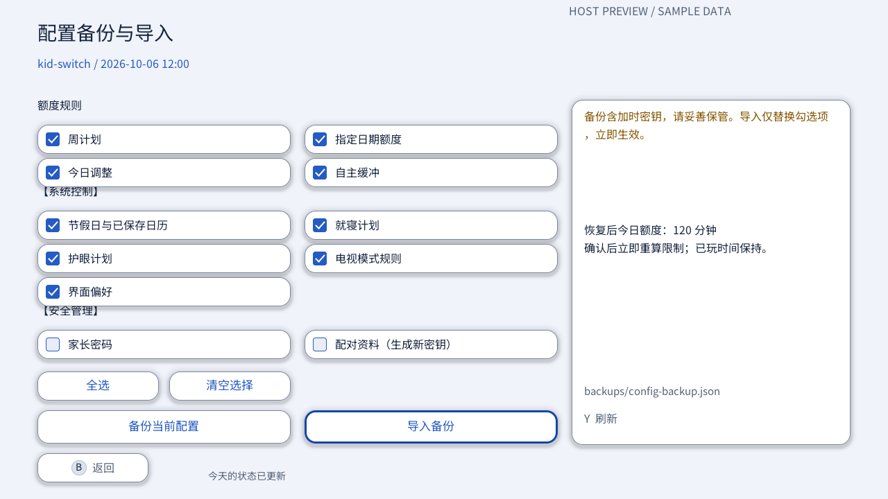

时间计划“单独生效”列按就寝、护眼、电视模式、自主缓冲排列四张紧凑卡。对外只分电视和非电视，后者包含掌机与桌面。Eden 的电视模式规则页另有“模拟电视模式 / 模拟非电视模式”，切换保留当日用量，重启保留模式；仍受总额度、就寝与护眼限制。

## 电视模式规则（设备验证待完成）

**功能初衷**：为了保护儿童与青少年视力健康，防止近距离长时间注视掌机与桌面小屏幕造成视疲劳与视力下降。电视模式规则通过对掌机/桌面小屏幕的使用时长进行专门管控，引导孩子将 Switch 连接底座在电视大屏幕上游玩，营造更健康的用眼距离与环境。

家长区“时间计划 → 电视模式规则”提供统一的“启用电视模式限制”总开关，开启后可进一步配置“仅允许电视模式”或设置“非电视模式每日限额”（0–1440 分钟）：
- **未启用限制**：掌机/桌面与电视均可自由游玩至今日总额度用尽。
- **仅允许电视模式（0 分钟）**：完全禁止掌机/桌面小屏幕游玩，必须连接电视底座才可使用。Switch Lite 不支持电视模式，因此禁止开启仅允许电视模式，但可设置非电视模式每日限额。
- **非电视模式每日限额（>0 分钟，如 30 分钟）**：掌机/桌面小屏每日最多使用设定时长，用满后必须插回底座连接大屏电视，才能继续使用当天的剩余总额度。

首次开启需确认官方家长控制和受限时可用的浮窗；可能立即限制的保存需要长按确认。刷新或保存失败保留未保存草稿，离开时可选择放弃。

电视模式以系统报告为准，掌机与桌面都算非电视模式。非电视模式用量同时消耗每日总额度：总额度 120、非电视模式 30 时，用满 30 分钟后接回底座，才能继续使用总额度的剩余部分。连接底座不会解除总额度耗尽、就寝或护眼限制。孩子页、状态栏、今日详情和浮窗实时显示屏幕模式、掌机小屏估算用量与剩余倒计时；受限时提示连接底座或请家长解除。

在“今日调度”、电视模式规则页或浮窗家长操作中，选择“今日解除电视模式限制”，验证任我玩家长密码并确认后，当天同时豁免仅允许电视模式和非电视模式上限，次日恢复。今日不限时、加时码、自主缓冲均不会自动豁免；今日解除也不增加总额度、不跳过就寝或护眼。非电视模式额度即使高于当天总额度，也只能使用当天总额度的剩余部分：例如总额度 30、非电视模式 180，仍在当天总用量达到 30 分钟时受限。该操作使用一次 PIN 授权，旧日期请求不会作用于新一天。

按 Nintendo 官方本机使用口径估算，HOME 等亮屏使用可能计入，待机不按墙钟扣时。首次启用从当时开始，重启、改额度、切换开关和今日解除不清零累计。不限时日需要统计时使用 1440 分钟计时策略。读数未知时保守限制；已确认电视模式仍可按总额度使用，家长也可今日解除。UI 和 Eden 预览不能代替真机计时、拔插和恢复验证，当前资格为 pending。


| 电视模式规则（视力守护仪表盘） | 孩子端掌机受限提示 |
| --- | --- |
| 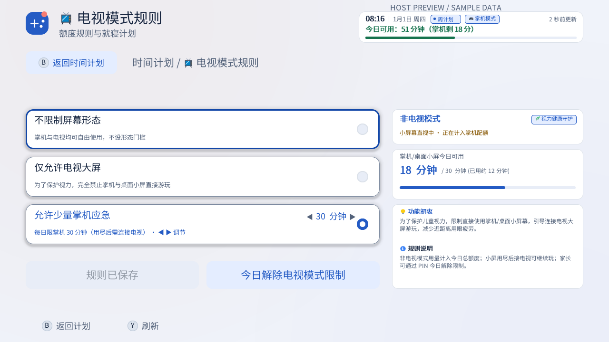 | 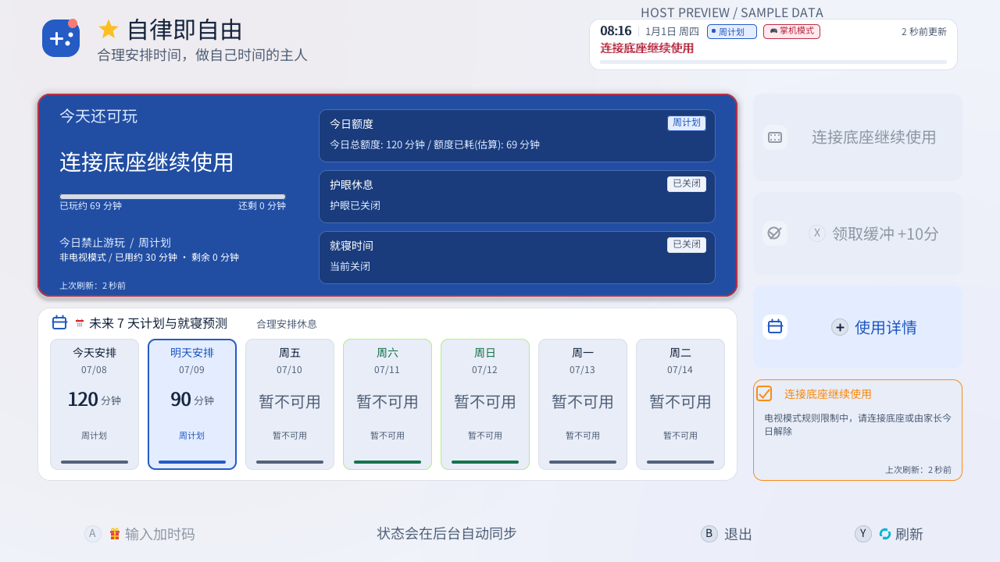 |

| 浮窗掌机受限提示 | 浮窗家长今日解除 |
| --- | --- |
| 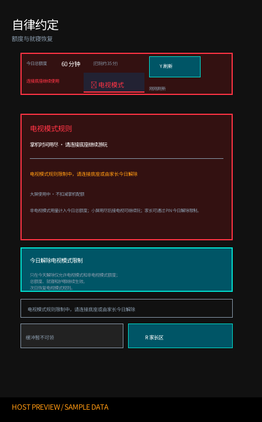 | 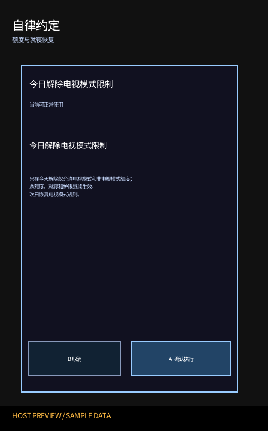 |

## 护眼休息（设备验证待完成）

在家长区“时间计划”打开“护眼”，设置连续使用 1–240 分钟、休息 1–60 分钟；触屏可直接按 ±1 或 ±10 分钟调整，手柄左右键按 1 分钟、ZL/ZR 按 10 分钟调整。默认关闭，预设为使用 40 分钟、休息 10 分钟。时间计划列表的护眼状态徽标显示护眼开关状态。首次开启前需确认 Nintendo 官方家长控制已开启，并确认浮窗可用。状态确认以官方家长控制是否开启为准。

开启后从当前用量开始新周期；缩短使用时长可能立即开始休息，关闭则立即解除护眼限制。HOME 亮屏使用计入使用时间，睡眠不计；睡眠会计入休息时间。孩子区和浮窗显示剩余使用或休息时间；读数缺失时显示未知。休息中，家长可在浮窗或主机家长区“今日调度”验证 PIN 后选择“跳过本次休息”，只跳过当前这一次，随后开始新周期。每日额度用尽或就寝限制生效时，原有限制优先，护眼周期重置。

若原规则为不限时，护眼开启期间主机临时按 1440 分钟限时计数；界面仍说明原规则为不限时及临时上限。关闭护眼后恢复不限时。当前候选仍待真机 A/B 验证 1440 分钟读数、睡眠排除、实际暂停和恢复；正式使用前按[测试指南](../开发/测试指南.md)完成设备检查。

普通待机休息达到设定休息时长，也会开始新周期。例如玩 30 分钟、休息满 10 分钟后再玩 10 分钟，新周期仅累计这 10 分钟；休息不足时继续原周期。后台按分钟观察官方用量，判定可能晚约一分钟；休眠期间无调度，唤醒后可靠用量不变也可确认休息，读数未知时无法确认自然休息。跨午夜保留周期累计与尚未结束的休息，仅每日额度换日。

保护或停用状态下，尚未解除的本次护眼休息仍可由家长验证 PIN 后跳过，包括倒计时已到零的情况；恢复保留停用状态，重新接管仍须到支持与恢复完成家长确认。就寝或真实每日额度限制仍然优先。前一项设置正在等待确认时，新操作会提示刷新状态后重试，不会覆盖正在确认的设置。

本指南面向在已安装自定义固件的 Nintendo Switch 上使用“任我玩 · PlayWise”的家长和孩子。首次安装建议使用完整交付包；家长用手机或电脑生成加时码时，推荐先按下文联网扫码配对。

> [!IMPORTANT]
> PlayWise 依赖 Nintendo 官方家长控制的“主机使用时间”计时与使用限制。HOME、系统设置等亮屏使用也可能消耗额度。请在安装前用没有未保存进度的游戏验证：官方额度会累计，到时限制效果符合预期。PlayWise 不会替你修改官方开关，也不能修复底层计时故障。

> [!WARNING]
> 每日额度耗尽或就寝限制生效后，Nintendo 原生弹窗可能使游戏、Homebrew、HOME、系统设置和 PlayWise 主机应用无法继续使用。PlayWise 侧的主机内操作入口是游戏内浮窗；请在设置低额度前装好并试用浮窗。Nintendo 原生弹窗仍可用官方家长控制密码临时解锁；这与任我玩家长密码是两套不同的授权。

## 安装

### 准备与全新安装

需要一台运行 Atmosphère 和 Homebrew Menu 的 Switch、一张可在电脑上读写的 SD 卡，以及单独安装的 Ultrahand 或其他 Tesla 浮窗管理器。PlayWise 安装包包含 PlayWise 浮窗文件，但不包含浮窗管理器。

1. 先完成上面的 Nintendo 官方家长控制验证，再备份 SD 卡中已有的 PlayWise 数据。
2. 首次使用优先解压 `playwise-complete-<版本>.zip`。它包含标准 Switch 安装包 `playwise-<版本>.zip` 和家长用的 `playwise-offline.html`。
3. 关闭 Switch，取出 SD 卡；解压标准包，确认顶层为 `atmosphere` 和 `switch` 两个目录。将它们合并到 SD 卡根目录，遇到同名程序文件时覆盖。
4. 安全弹出 SD 卡，装回 Switch 并重启。进入 Homebrew Menu 打开“任我玩”，完成下节向导。
5. 用已安装的浮窗管理器确认列表中能找到“任我玩”（文件 `playwise.ovl`），并在仍可进入软件时熟悉打开方式。

标准包不在 `switch/playwise/` 根目录放置家长密码、密钥和运行规则。已有安装应按[升级](#升级)步骤保留这些数据；普通升级不要使用全量清理选项。

### 资格状态

当前候选仅以 Nintendo Switch OLED、HOS 22.5.0、Atmosphère 1.11.2 为资格目标。只有发布 Zip 的 SHA-256 与同目录 `qualification.json` 完全匹配，才能称该原包在记录环境已验证。没有匹配记录或使用其他环境时，应视为未验证。旧截图、主机预览和 Eden 模拟器结果均不是资格证据。

## 首次设置

第一次启动后，按向导完成三步。检查与保存错误只在页面内提示，不阻止继续；完成引导不代表额度管理已启用。中途退出会保留已成功保存的进度，保存失败时本次仍可继续，下次可能需要重设。

1. **环境与准备**：顶部可选择跟随系统、简体中文、繁體中文或 English，默认跟随系统；语言功能说明固定中英双语，选择后立即更新其余文案。核对当前固件与参考环境（OLED、HOS 22.5.0、Atmosphère 1.11.2）、官方家长控制是否开启和浮窗可用性。未开启或无法读取时，可打开“开启家长控制说明”查看系统设置步骤，也可先继续设置。卡片内直接展示主机日期时间与 DBI / QuickNTP 校时指引，不要求联网或校时确认。
2. **家长设置**：全新安装默认任我玩家长密码 `110`，建议立即修改；已有密码保持原值。采用双列卡片布局：左侧管理家长密码安全与状态；右侧提供界面主题、呼出快捷键、护眼休息开关与就寝规则开关。护眼休息与就寝规则默认保持“关闭”，由家长在向导中主动点击开启；开启后分别预设标准护眼节奏（玩 40 分 / 休息 10 分）与就寝时段（工作日 21:00 / 周末 22:00），进入家长区后仍可自由调整。
3. **确认并进入家长区**：看板总览核对环境、额度、密码、护眼与就寝状态。选择“启用并进入家长区”，后台保存安装前设置，安全接管保留今天总额度和剩余时间；也可选择“暂不启用，进入家长区”。确认启用成功后进入“今日调度”；跳过、失败或结果未确认时进入“支持与恢复”，聚焦“导出诊断包”。启用等待期间也可进入支持页，继续核对原请求，不重复提交。

有问题时，在“支持与恢复 → 导出诊断包”保存排障信息，按成功提示复制文件，并在反馈问题时附上。导出不依赖后台连接；缺失或陈旧状态会标明。密码未就绪或认证失败仍可进入只读支持页并导出脱敏诊断，其他家长功能需要有效密码授权。完成引导后，未启用或保护态不会强制重新打开向导，后续在支持页处理。

语言可用左右键切换；上下键选择页面操作，`A` 激活，`+` 继续。第一步核对环境与时间指引；第二步 `X` 或选中按 `A` 修改密码，也可在右列切换主题、快捷键或开关护眼/就寝；第三步 `X` 暂不启用并进入家长区。密码输入仍支持触摸数字键盘或摇杆八方向 `1`–`8`，`X=0`、`Y=9`、`ZL` 退格，短按 `+` 确认、`B` 取消；长按 `+` 约一秒切到系统数字键盘。

<details>
<summary>查看三步主机界面与孩子区预览</summary>


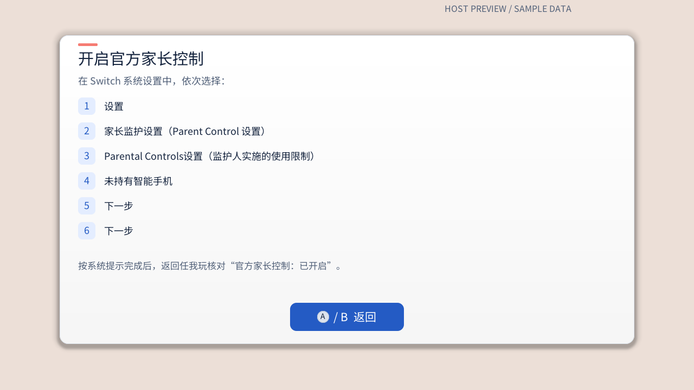


孩子区首页预览：


家长区今日调度预览：

</details>

这些主机图片由当前绘制代码和固定示例数据生成，带 `HOST PREVIEW / SAMPLE DATA` 标识；不是真机截图，也不代表真机手柄、触控、字体或 PCTL 验收。

### 开启官方家长控制

未设置官方家长控制时，可按以下步骤在主机上完成：

1. 从 Switch HOME 打开“设置”，进入“家长监护设置”（Parent Control 设置）→“Parental Controls设置”（监护人实施的使用限制）。
2. 选择“未持有智能手机”，依次选择“下一步”→“下一步”。
3. 按系统提示设置使用限制和 Nintendo 官方家长控制密码，并保存。此密码与任我玩家长密码分别管理，请由家长保管。
4. 返回 PlayWise，关闭说明后按 `Y` 刷新，核对“官方家长控制：已开启”；若仍显示未知，记录状态并到“支持与恢复”导出诊断包。
5. 确认没有通过官方密码临时解除限制，再用没有未保存进度的游戏验证实际扣时和到时限制。仅显示“已开启”不代表限制效果已经验证。

若已经设置官方密码或绑定 Nintendo 家长控制手机 App，请按系统提示使用现有密码或手机 App 核对设置。

首次设置第 1 步的“开启家长控制说明”可通过触摸或方向键选中后按 `A` 打开详情弹窗；按 `A` / `B` 或点按返回关闭，保留当前步骤与选择。查看说明不会修改系统设置，也不会将未知状态视为已开启。

### 同步 Switch 时间

先从 Switch HOME 打开“设置 → 主机 → 日期与时间”，核对日期、时间和时区是否符合主机所在地。菜单名称可能随系统语言不同；校时后仍需确认时区。时间未同步或不确定时，可选择下面一种方式进行联网校时。

**使用 DBI：**

1. 让 Switch 连接可访问 NTP 服务的网络，从 Homebrew Menu 打开已安装的 DBI。
2. 进入“工具 → NTP 时间同步”，执行同步并等待工具提示结果。
3. 成功后回到系统设置核对日期、时间和时区，再回到 PlayWise 按 `Y` 刷新状态并重试原操作。若同步失败，记录错误、检查网络后再试，不要将尝试过同步记为成功。

**使用 QuickNTP 浮窗：**

1. 准备已安装的 [QuickNTP](https://github.com/ppkantorski/QuickNTP) 和 Ultrahand / Tesla 浮窗管理器，让 Switch 连接可访问 NTP 服务的网络。
2. 用浮窗管理器的快捷键打开列表，选择 QuickNTP，按工具提示执行时间同步并等待结果；按钮名称以所安装版本为准。
3. 成功后关闭浮窗，在系统设置中核对日期、时间和时区，再回到 PlayWise 按 `Y` 刷新状态并重试原操作。同步失败时记录工具提示，检查网络后再试。

若排查的是计时或到时限制，请在校时、刷新后用非关键游戏重新验证扣时和限制效果。排障记录中填写校时方式、是否成功及重试结果。PlayWise 不会自动检测校时成功，校时也不能保证修复所有故障；离线发码和兑换本身仍无需联网。

## 日常设置额度

家长区由“今日调度、时间计划、离线加时、安全与偏好、支持与恢复”五个顶级页组成，按手柄 `L/R` 键即可循环切换。页面顶部状态栏显示本机时间、今天还可玩时间和状态更新时间；若状态超过 120 秒未更新，只显示标为“上次确认”的规则类别和确认时间，并提示按 `Y` 刷新，不显示旧剩余分钟数。首次尚未取得状态时同样提示按 `Y` 刷新。

- **今日调度**：进入家长区后的默认首页，用于对今天的游玩额度进行即时、最高优先级的临时干预；
- **时间计划**：编辑周计划、国家节假日、指定日期额度、就寝时间和自主缓冲等长期规则；
- **离线加时**：在 Switch 本机或家长手机/电脑生成 8 位离线加时码，供孩子在受限时兑换；
- **安全与偏好**：修改家长密码、外观主题、家长区入口，并查看本机家庭活动记录；
- **支持与恢复**：独立顶级页，提供启用额度管理、重试修复、紧急停用、恢复安装前设置与诊断导出。

### 今日调度

“今日调度”是家长管理孩子当天游戏时间的总控中心。它的核心设计原则是：

- **最高优先级临时覆盖**：今日调度的临时调整具有最高优先级，优先于指定日期额度、国家法定节假日额度和每周常规计划；
- **单日有效且不破坏长期计划**：所有今日调整仅在当天有效，次日 00:00 自动失效重置，控制规则无缝恢复为原定的常规计划，不会篡改或打乱已设置好的长期时间表。

今日额度与就寝时间分别生效：设为“今日不限时”或增加额度不会跳过就寝限制；清除今日调整后，下级计划会重新生效，剩余时间可能减少。提交前请核对确认页显示的规则来源和预计结果。

今日调度页包含八张直达卡与一个全屏详情面板。右侧前四张归入“今日额度调整（仅今天）”，次日恢复原计划；后四张归入“其他今日操作”：跳过就寝、跳过本次休息、自主缓冲和今日解除电视模式限制。就寝、护眼与电视模式独立限制，符合条件时自主缓冲才追加今日额度。今日解除卡在规则关闭、已经解除或状态待确认时不可执行，按 `Y` 刷新后核对；紧急停用期间仍保留此恢复操作。

1. **设置今日额度（设置今日总额度）**：
   - **状态徽标**：卡片右上角指示今日额度的执行状态，包括“生效中”、“不限时”、“未设置”（由长期计划决定）、“已清除”（刚清除临时调整）、“等待生效”、“状态待确认”、“就寝限制中”或“控制停用”。
   - **下级继承原因**：若今天未设置临时额度，动态副标题会明确说明当前由哪一层规则生效（例如“由每周常规计划决定”、“由国家法定休假决定”或“由指定日期额度决定”）。
   - **调整与安全确认**：按 `A` 键或触摸点击进入编辑器，可选择“限时”并设定总分钟数，或选择“今日不限时”；手柄用 `ZL/ZR` 切换模式。进入限时编辑器时，状态超过 120 秒或未确认会自动刷新；也可点按右侧“刷新最新状态”或按右摇杆 `R3` 手动刷新。按 `+` 保存时会再次读取主机状态：若今天从不限时恢复为限时，先展示确认弹窗；新额度不高于已玩时间时，确认弹窗要求长按 1 秒。若原本已限时且新额度高于已玩时间，则直接提交。刷新失败或已玩时间不可用时保留输入，不提交。今日不限时、快速加时和清除今日调整仍按各自的确认流程操作。

   
   

2. **快速加时**：
   - 专为临时奖赏或给予额外游玩时间而设计。提供 `+15 分钟`、`+30 分钟`、`+60 分钟` 快捷选项，以及自由增减的 `自定义` 分钟（范围 1–120 分钟）。
   - 选中后弹出二次确认面板，清晰对比当前剩余与加时后预计剩余；若遇到每日时间上限截断，会展示实际增加分钟数与琥珀色提示，核对无误后再确认提交。
   - 今天已不限时时，卡片置灰并显示“今日不限时，无需加时”；恢复限时可使用“设置今日额度”。此时手柄确认和触摸都不会发起加时请求。

   

3. **今日不限时**：
   - 适合周末聚会、节日庆贺或孩子表现优异时的单日免限制场景。
   - 确认提交后，今天不设每日游玩时间上限，状态显示为“不限时”；就寝计划仍独立生效。到次日 00:00，该调整失效并恢复常规额度计划。

   

4. **清除今日调整**：
   - 一键撤销上述对今天生效的所有临时调整（包括今日总额度、快速加时与今日不限时），改用原本适用的计划（如周五计划或节假日安排）。
   - 若今天原本就没有临时调整，该卡片自动置灰禁用且不会提交无意义请求；若在当前主机应用会话中刚执行过清除，副标题显示“本次会话已清除，当前使用下级规则”。
5. **跳过本次就寝**：
   - 针对就寝时间限制（Bedtime）的单次放行卡。动态副标题显示当前正在生效或即将到来的就寝起止时间窗口（如 `21:00 至次日 07:00`）。若当前已在就寝限制中，卡片右上角显示“限制中”醒目标识。
   - 仅对“当前生效的这一场”或“今晚即将到来的这一场”就寝窗口执行一次性跳过，绝不修改或停用长期就寝计划，次日就寝窗口仍会自动锁定。
   - 点击后先刷新状态并锁定窗口实例，验证 PlayWise 家长密码，核对放行窗口后确认提交。
   - 就寝计划关闭、当前没有可跳过的时段或本次已跳过时，卡片置灰并显示对应原因，不发起跳过请求；状态过期时先刷新，再判断是否可用。
6. **自主缓冲**：
   - 展示今天自主缓冲福利（由家长在“时间计划 → 自主缓冲”中开启，可配置为每天一次 5、10 或 15 分钟）的可用状态。
   - 动态副标题清晰提示：“今日可领取 X 分钟”、“今日已领取，明天恢复资格”、“当前关闭，可在时间计划中设置”或“今天暂不可领取”。符合领取条件时，孩子可在游戏内浮窗自主领取；每日 1440 分钟上限可能使实际增加少于面额，甚至为 0，成功领取仍会用掉当天资格。就寝限制生效时不能领取。
7. **跳过本次休息**：
   - 仅当前护眼休息仍在进行时可用。点击后刷新状态、锁定本次休息实例，重新验证任我玩家长密码并确认；成功后只结束这一轮休息，护眼规则继续生效并开始新周期。
   - 护眼关闭、未在休息、状态超过 120 秒、正常运行时休息倒计时已到零，或每日额度与就寝限制优先时，卡片显示原因且不会提交跳过请求。保护或停用状态保留同一次休息的恢复入口；可按 `Y` 刷新状态。

#### 查看今日详情

在今日调度页按下手柄 `+` 键或触摸“+ 查看详情”，可打开全屏详情弹层，核对系统运作细节：

- **当天规划与状态**：同时查看总余额、非电视余额、当前连续可用时间和健康规则。今日作息展示真实就寝时段；持续使用推演假设保持当前模式并按规定休息，不自动切换电视或领取缓冲。时刻为估算，实际以后台状态为准。
- **查看决策与规则**：可直接触摸主页右上角的规则胶囊按钮（如 `[周计划 ❯]`）或左下“今日总额度”卡片的“规则 ❯”标签直达二级页；亦可在全屏详情首页右下角按 A 键进入。查看四级额度来源以及总额度、就寝、护眼、电视模式如何共同决定能否使用。展开“数据与运行状态”可查看 7/30 天估算与可靠天数、系统计时器；家长另可查看执行详情。在“时间计划”页亦可通过 7 日预测顶部的“今日决策与规则 ❯”快速调出核对。
- 两页按 Y 刷新；二级页按 B 返回当天规划并恢复焦点，主页面按 B 返回今日调度。ZL/ZR 或触摸拖动滚动展开的数据。儿童详情只读且不显示家长执行资料。
- 电视只计总额度；非电视同时计总额度和非电视限额。非电视限额不是额外额度；接电视可继续使用总余额，护眼与就寝仍生效。今日不限时、加时和自主缓冲不豁免健康规则。

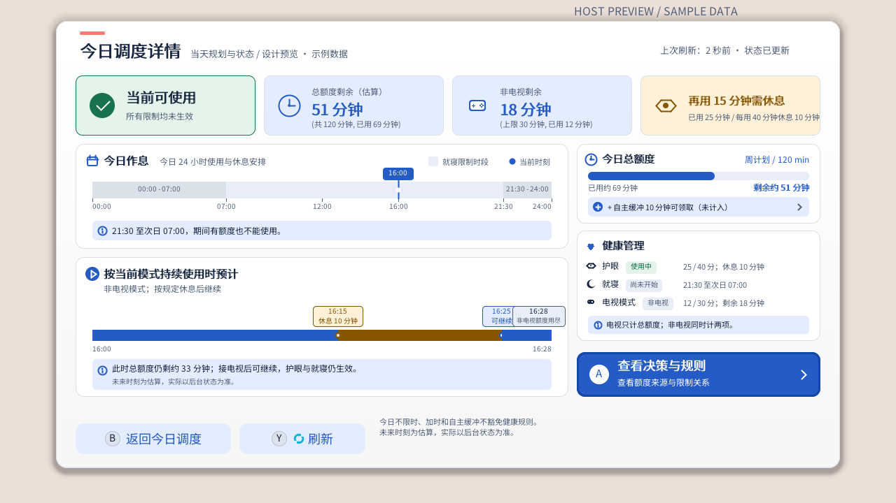

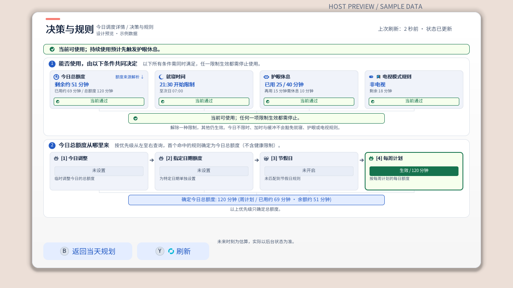

### 长期和日期计划

周计划按星期编辑；国家节假日可设置法定休假与调休工作日；指定日期额度支持 1–366 天区间；它在指定日期替换每天的总额度，已用时间仍计入，并非额外加时。编辑时先形成草稿，保存前核对对今天的影响。若今天优先采用其他规则，页面会说明今天额度不变；保存后可能立即限制使用或状态待确认时，需长按确认。失败会保留草稿。

地区日历可手动导入：把自制 JSON 放入 SD 卡 `/switch/playwise/calendar-import/`，在家长区“时间计划 → 节假日安排 → 管理日历”选择“导入文件”、预览并确认；再到“已保存地区”选择地区、预览并长按确认应用。重新导入当前地区的年份后也要重新应用；内置中国大陆 2026 年可独立选择。未覆盖年份使用每周计划。管理页支持 `B` 返回、`Y` 刷新、`X` 格式说明，按钮也可触摸；`L/R` 切换列表、上下选择、`ZL/ZR` 翻页、`A/+` 确认。格式弹窗提供简要说明，关闭后保留选择。格式、完整示例与错误示例见[自制节假日日历格式](https://github.com/selfuppen/NX-PlayWise/blob/main/docs/自制节假日日历格式.md)。

“导入文件”页会直接显示简要流程、保存目录与完整格式文档网址；详细字段和 JSON 示例见上方文档。打开“查看节假日安排”会自动定位到离主机当前日期最近的假期或调休所在页；假期内优先所在假期，等距优先未来，可继续手动翻页。今日调度的“跳过本次休息”与其他操作等宽，确认页使用同一短标题。状态栏和左侧卡片利用本次可靠读数显示下次休息预览，无须反复手动刷新；读数未知时继续提示待确认。

就寝时间可按每周、节假日和指定日期设置，允许跨夜窗口；三个子页面分别保存。切换或离开有未保存内容时，按提示选择保存、放弃或继续编辑。今日自主缓冲默认关闭，可设为每天一次 5、10 或 15 分钟；它增加今日额度，不改变就寝窗口。

“就寝计划总开关”控制每周、节假日和指定日期的全部就寝规则。关闭并保存后，所有就寝规则暂停，已保存时段保留，重新开启后可继续使用。页面常态仅标明“当前生效”状态，仅在拨动开关后才显示醒目的“未保存（按 + 生效）”标签；切换开关只修改草稿，按 + 保存后才生效。方向键可选中总开关并按 `A` 切换，也可按 `-` 或触摸。`L/R` 切换上一页、下一页。跳过本次就寝限制后，今日调度和就寝页均显示“本次已跳过”及对应时间。就寝页可用 `Y` 跳过、`X` 恢复本次，也可点按对应按钮；恢复前需再次验证任我玩家长密码，并在确认弹窗核对影响。当前仍在该窗口内时须长按确认，成功后立即重新限制使用。游戏内浮窗的“恢复本次就寝”也会先显示确认页；当前仍在窗口内时须在确认页长按 `A` 1 秒。

<details>
<summary>查看时间计划各模块与编辑预览</summary>


</details>

## 离线加时

代码是由家长决定分钟数、当天有效的 8 位数字。生成代码不会立刻增加额度；孩子成功兑换后才能增加，且一枚代码只能成功使用一次。达到每日上限时，实际增加可能少于代码面额。家长可以通过电话、消息或当面告知孩子，PlayWise 不需要传输服务器。

### 离线加时码实现原理与多机配置说明

#### 实现原理
1. **纯离线 HMAC-SHA256 签名**：离线加时码基于标准 HMAC-SHA256 算法。生成代码时，家长端（Switch 本机或家长手机/电脑浏览器）使用该主机专属的高强度密钥（`grant_secret`），结合目标 Switch 的设备名（`device_id`）、当天的本地日期（Day Index，自 2020-01-01 起的天数）、加时分钟数（`minutes`）以及防重放计数器（`nonce`）进行签名计算，截取生成 8 位易读数字码。
2. **零网络依赖本地验证**：孩子在 Switch 上输入 8 位加时码时，主机在完全断网的环境下使用本机保存的密钥和相同算法执行校验。若签名匹配、日期为当天且该 Nonce 尚未在防重复账本中被消耗，系统将安全放行加时并记录防重放。
3. **隐私与离线保证**：整个签发与兑换流程完全在两端本地完成，不需要任何网络连接、中转服务器或云端账号，彻底杜绝隐私泄露与联网故障。

#### 为什么每台机器需要单独导出 parent-import.json
- **专属密钥与设备绑定**：每台 Switch 在首次配置 PlayWise 时，都会在本地独立生成专属的设备名与高强度随机签名密钥（`grant_secret`）。
- **签名防混用机制**：由于加时码严格绑定了特定设备的 `device_id` 与 `grant_secret`，**使用机器 A 的配置生成的加时码在机器 B 上无法通过签名校验（会直接提示代码无效）**。
- **多机管理方式**：如果家中有两台或多台 Switch，必须分别在每台 Switch 上单独导出其专属的 `parent-import.json`（或单独扫码配对）。家长网页端（包括单文件版）支持保存并随时切换管理多台已配对的主机，生成代码前只需在页面顶部切换选择对应的 Switch 设备即可。

### 在 Switch 上生成

1. 家长进入“离线加时 → 立即生成加时码”，验证任我玩家长密码，选择代码时长后生成。
2. 核对代码有效日期和面额，再把 8 位数字告诉孩子。同日生成新代码不会撤销之前签发的代码；修改“下次加时时长”也不会改变已签发代码。
3. 若生成失败，按页面提示检查配置、SD 卡和时间。不要假设旧代码已撤销。


### 在手机或电脑上生成

家长网页在当前浏览器本地计算 8 位码，不向 PlayWise 业务后端提交设备 ID、密钥或代码。无论采用哪种配对方式，生成时都要选择 **Switch 主机的本地日期**；家长设备与 Switch 日期不同时，以 Switch 显示的日期为准。

#### 推荐方案一：联网扫码

1. 让可信的家长手机或电脑接入网络，确认可以访问[公开家长网页](https://selfuppen.github.io/NX-PlayWise/)。该网页托管在 GitHub Pages，部分网络环境可能无法访问；也可以使用自己信任的 HTTPS 静态站点完整部署 `tools/ptc_frontend`。
2. 在 Switch 家长区进入“离线加时 → 手机/电脑生成加时码”，验证任我玩家长密码，查看页面显示的二维码跳转地址。若使用自部署网页，先在“离线加时 → 加时码生成管理 → 编辑二维码跳转地址”填入其 HTTPS 地址，再返回二维码页面。
3. 用家长设备扫码打开网页，核对设备名，并选择“导入此设备”；若浏览器已有别的设备配置，先确认要覆盖。二维码包含加时码密钥，只能由可信的家长设备扫描。
4. 选好 Switch 本地日期与加时分钟数，生成代码，再通过电话、消息或当面把 8 位数字告诉孩子。孩子在 Switch 上兑换时无需联网。


图中的二维码已替换成公开演示配置，不能用于真实家庭设备。扫码只是将设备配置导入家长浏览器；网页生成代码仍在浏览器本地完成。若网页无法访问，使用下方的单文件离线版或[在 Switch 上生成](#在-switch-上生成)。

#### 备用方案二：单文件离线网页

1. 从 Release 页面的完整交付包（`playwise-complete-<版本>.zip`）解压取得 `playwise-offline.html`。`parent-import.json` **不在安装包中，也不会自动出现**。在 Switch 家长区进入“离线加时 → 手机/电脑生成”，按 `A` 选择“导出配置文件”（进入该页面时已完成家长密码验证，导出无需再次输入家长密码；若从“生成设置 → 导出手机/电脑配置”进入则需验证家长密码），确认屏幕显示导出成功及完整路径。
2. 从 Switch 的 SD 卡 `/switch/playwise/parent-import.json` 复制刚导出的文件，并与 HTML 一起传到可信的家长手机或电脑。若屏幕显示失败，文件没有导出，应先检查 SD 卡是否可写并重试。手机先保存文件，再交给系统浏览器打开 HTML；不要使用聊天软件或网盘内置预览器。
3. 在网页中选择“导入配置文件”，选取 `parent-import.json`，核对设备名并选择“导入此设备”。之后选择 Switch 本地日期和分钟数，即可离线生成 8 位码；孩子兑换也无需联网。


单文件版无需安装应用、Python、前端工具或本地服务器，但不能作为二维码跳转地址，也不能安装成 PWA。若浏览器禁止本地文件持久存储，下次打开时需重新导入配置。`parent-import.json` 和二维码都包含生成代码所需的密钥；不要公开、发送给孩子或上传到不可信站点。修改 Switch 上的加时码密钥后，家长设备须重新配对，旧密钥签发的代码不再有效。

### 孩子在主机应用兑换

未受限且还能启动 Homebrew 时，打开“任我玩”进入孩子区，选择“输入加时码”，填入 8 位数字。核对兑换前和预计兑换后时间，再确认；高风险情况会要求长按。成功页显示实际增加和当前可确认的剩余时间。结果仍在确认中时，等待或重新打开查看原结果，不要重复提交。

<details>
<summary>查看输入、确认、长按与成功预览</summary>


</details>

### 受限时使用游戏内浮窗

当每日额度耗尽或进入就寝限制后，系统原生弹窗可能使普通软件与 PlayWise 主机应用无法继续使用。用已安装的 Tesla/Ultrahand 快捷键打开浮窗管理器，选择“任我玩”（`playwise.ovl`）。额度耗尽时可兑换 8 位码，或在符合条件时领取自主缓冲；就寝限制生效时，先请家长在浮窗中跳过本次就寝或关闭计划。完整操作与按键见[游戏内浮窗](#游戏内浮窗-overlay)。

## 游戏内浮窗 (Overlay)

游戏内浮窗位于 `sdmc:/switch/.overlays/playwise.ovl`，需通过另行安装的 Tesla/Ultrahand 等浮窗管理器打开。它在游玩过程中提供状态查看、加时码兑换、符合条件时领取自主缓冲，以及家长单次授权的恢复操作。

> [!IMPORTANT]
> **使用前先确认浮窗可打开**：
>
> 1. **游戏内免切出**：按已安装浮窗管理器设定的快捷键（Tesla 默认组合通常为 `L + 十字键下 + 右摇杆按下 R3`），再选择“任我玩”，即可在不退出游戏的情况下查看状态或输入加时码。安装后请在未受限时先试开一次。
> 2. **受限时的 PlayWise 入口**：每日额度耗尽或就寝时间生效后，Nintendo 原生弹窗可能使游戏、Homebrew Menu、系统设置及 PlayWise 主机应用无法继续使用；PlayWise 侧依赖浮窗进行主机内交互与恢复。Nintendo 原生弹窗上的官方家长控制密码临时解除仍是系统提供的另一条路径。

<details>
<summary>查看随代码生成的浮窗预览</summary>

| 加时码输入 | 兑换确认 |
| --- | --- |
| 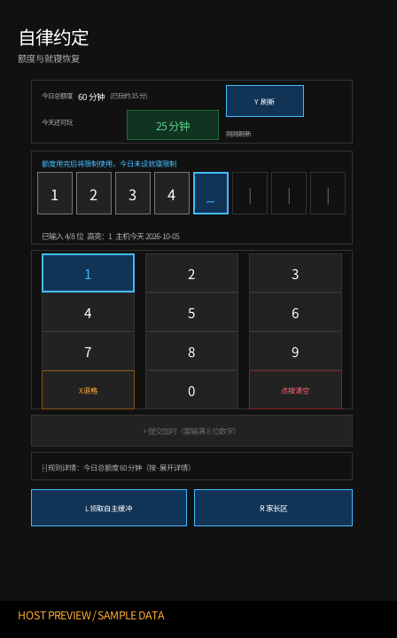 | 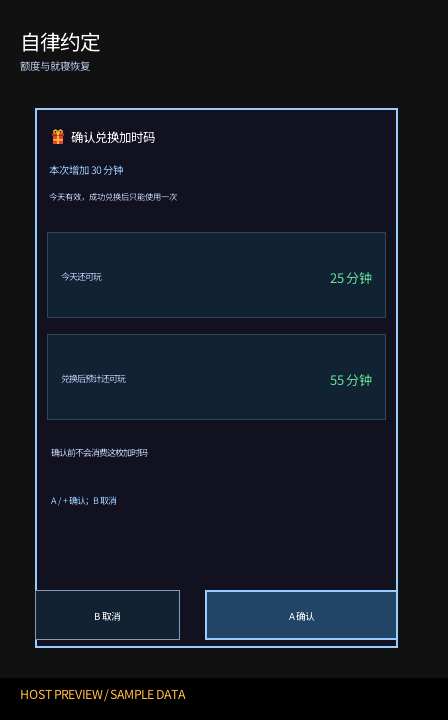 |

| 家长快捷操作 | 就寝限制恢复 |
| --- | --- |
| 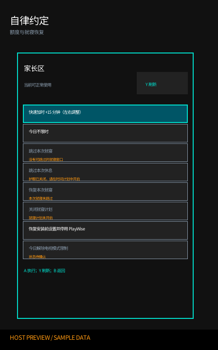 | 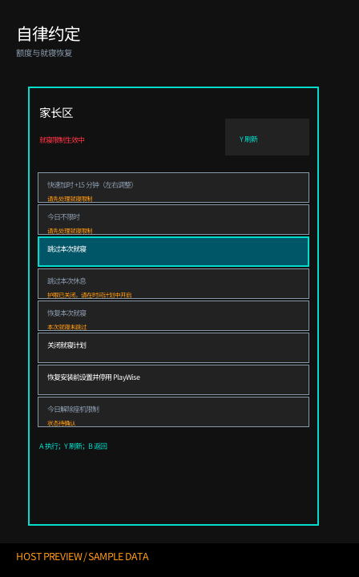 |

</details>

这些图片来自当前浮窗的实际绘制代码和固定示例状态，带 `HOST PREVIEW / SAMPLE DATA` 标识。它们随 `python tools/package_remote.py --with-previews` 或 `--release` 更新，也可单独运行 `--previews`；共享字体、手柄/触控、系统限制效果仍需真机确认。

### 儿童加时码主页面（所有状态）

每次呼出浮窗都先显示专为掌机与手柄优化的加时码页面；每日额度耗尽或就寝限制生效时也保持这个入口，并直接提示当前限制原因：

1. **顶部状态胶囊与额度栏**：
   - **额度与耗时**：左侧展示今日使用估算与额度模式（如“今日已用约 45 分钟”或“今日不限时”）；
   - **今天还可玩**：核心区域以 22px 绿色数字醒目显示当前剩余分钟数（最长显示 1440 分钟）或“不限时”；
   - **刷新按钮与新鲜度**：右上角显示数据新鲜度（“刚刚刷新”、“X 秒前”；超过 30 秒提示“数据可能已过期”）。按手柄 `Y` 键或触摸点击可手动刷新状态；加时提交后显示橙色“正在刷新… / 确认中”。
2. **受限预警与护眼提醒**：
   - 额度下方动态显示当前状态引导（如“剩余时间充裕”、“请注意适度休息”或就寝时间提醒）。
3. **8 位加时码输入卡槽**：
   - 居中排列 8 个数字卡片槽，当前光标槽高亮闪烁，显示光标指示符 `_` 与青绿色边框；
   - 槽位下方实时显示已输入位数（如“已输入 4/8 位”）、当前高亮选中的数字，以及**主机当前的本地日期**（防范跨时区或日期错误签发）。
4. **3×4 触控/手柄数字软键盘**：
   - 布局包含数字 `0`–`9`、第四行左侧的 `X 退格`（琥珀色边框）以及右侧的 `点按清空`（红色边框）；
   - **双模操作**：手柄可通过左摇杆或十字键在网格中移动焦点，按 `A` 键输入，按 `X` 键退格；也可直接在 Switch 触摸屏上点按数字键。
5. **操作与提交栏**：
   - 输满 8 位数字后提交栏高亮激活，按手柄 `+` 键或点击按钮即可提交；
   - **等待处理时**：后台处理请求期间，仍可在本地编辑数字或关闭浮窗；新的请求动作会暂时禁用。提交后的结果未确认时，不要再次输入同一枚代码。
6. **两阶段安全兑换与防误触确认**：
   - 提交后首先进入**加时预览面板**（非消费性验证），展示加时面额、当前还可玩时间与兑换后预计可玩时间；
   - **危险长按确认机制**：若兑换后仍为 0 分钟或无法确认剩余时长，界面会以深红底色高亮警示，此时**必须在实体手柄上长按 `A` 键满 1 秒**才能确认，触摸屏点击将被拦截并提示使用手柄长按，彻底防止误触；普通安全兑换只需短按 `A` 或 `+` 键确认；按 `B` 键可随时取消且绝不消费代码；
   - **中断后的结果核对**：若确认前中断，代码未消费，可重新输入；若提交后退出或断电，下次打开浮窗会尝试继续核对原事务。结果仍在确认中或恢复信息无法读取时，不要重复输入同一枚代码，应先查看状态与诊断。
7. **底部可折叠命令与状态栏**：
   - 按手柄 `-` 键或触摸点击状态栏可随时展开/收起；
   - 展开后可查看最近执行命令、通信传输路由（IPC 进程间通信或 SD 卡请求队列），以及后台返回的详细中文原因与错误码。
8. **缓冲与家长入口**：按 `L` 或点按底部按钮领取当前可用的自主缓冲；按 `R` 或点按“家长区”进入任我玩家长密码验证。就寝限制生效时可以继续编辑 8 位码，但须先由家长跳过或关闭就寝限制，提交按钮才会启用。今日不限时时显示“加时码不可用”，不会把不限时改成限时。

### 受限时的儿童操作

额度耗尽时，浮窗仍从加时码主页面打开。孩子可直接输入并确认 8 位码；若自主缓冲可领取，按 `L` 或点按按钮即可领取。就寝限制生效时，主页面仍可编辑代码，但会明确提示先请家长解除就寝限制，提交与缓冲领取暂不可用。一次限制解除后重新读取 PCTL 状态；若另一种限制仍在生效，界面继续如实提示。

### 家长区

在加时码主页面按 `R` 或点按“家长区”，输入任我玩家长密码后进入动作页。家长密码页使用与主机应用相同的方向映射：左右摇杆八方向对应 `1`–`8`，十字键上下左右对应 `1/5/7/3`，`X` 输入 `0`，`Y` 输入 `9`；每次摇杆推动只输入一位，回到中立位置后才能再次输入。`ZL` 退格，`+` 验证，`B` 返回。屏幕只显示静态方向示意、掩码和已输入位数，不高亮所选数字；触摸可退格、验证或返回，不直接输入数字。输入失败与冷却遵循 PlayWise 的现有规则。往返家长区不会清除尚未提交的加时码，每次家长密码验证成功只授权一个动作。

动作页始终列出以下项目；不可执行时显示原因，不提交请求：

| 动作 | 可用条件与操作 |
| --- | --- |
| 快速加时 | 今日仍是限时，且当前没有未跳过的就寝限制；左右键以 5 分钟调整 5–120 分钟，`A` 执行 |
| 今日不限时 | 今日仍是限时，且当前没有未跳过的就寝限制；长按手柄 `A` 1 秒确认 |
| 跳过本次就寝 | 有当前或下一次可跳过的就寝窗口；`A` 执行 |
| 恢复本次就寝 | 本次窗口已跳过；当前窗口长按 `A` 1 秒确认，未来窗口按 `A` 确认 |
| 关闭就寝计划 | 就寝计划已开启；长按手柄 `A` 1 秒确认 |
| 恢复安装前设置并停用 PlayWise | 长按手柄 `A` 1 秒确认 |

就寝与每日额度限制先后出现时，应先跳过本次就寝或关闭计划，再根据重新读取的状态处理每日额度。操作失败后，按 `Y` 重新验证家长密码才能重试；后台不可用时需从 SD 或外部环境排查。

需要长按手柄 `A` 1 秒的加时码高风险兑换与家长动作，会在确认按钮或当前动作卡内显示进度条；松开、取消或切换动作即清零。危险兑换的触摸按钮只提示改用手柄，不会代替长按确认。

### 浮窗操作按键速查

| 按键 / 手势 | 儿童加时码页 | 家长密码 / 动作页 |
| --- | --- | --- |
| 左摇杆 / 十字键 | 移动数字键盘焦点，持续推动会缓速重复 | 家长密码页直接输入对应数字；动作页选择项目、左右调整快速加时 |
| 右摇杆 | 无 | 家长密码页八方向直接输入对应数字 |
| `A` | 输入高亮数字 | 动作页执行动作，危险项需长按 1 秒 |
| `B` | 关闭浮窗 | 返回加时码页 |
| `X` | 退格一位加时码 | 家长密码页输入 `0` |
| `Y` | 刷新状态，出错时重试 | 家长密码页输入 `9`；结果页重新验证 |
| `ZL` | 无 | 家长密码页退格 |
| `+` | 输满 8 位后预览加时码 | 家长密码页验证 |
| `L` / `R` | 领取可用缓冲 / 进入家长区 | — |
| `-` | 展开或收起状态详情 | — |
| 触摸 | 数字、退格、清空、刷新、提交、缓冲及家长入口 | 家长密码页退格、验证和返回；动作按钮可点按，危险动作仍需手柄长按 |

> [!NOTE]
> **Nintendo 官方弹窗与 PlayWise 浮窗的关系**：
> 到时限制由 Nintendo 系统原生弹窗执行。弹窗上的密码输入使用 **Nintendo 官方家长控制密码**；PlayWise 浮窗使用 **任我玩家长密码**。两套系统各自独立工作，互不冲突。

请以当前浮窗中的按钮和提示为准。本指南不沿用旧版本的浮窗界面图。若浮窗或后台不可用，PlayWise 没有可靠的主机内自救入口，应在 SD/外部环境排查；移除浮窗文件不会停止后台计划。

## 安全与偏好

“安全与偏好”用于保护主机管理权限、定制交互偏好与查看活动审计：

- **修改任我玩家长密码**：修改用于进入家长区与授权敏感操作的独立密码；
- **外观主题**：在跟随系统、浅色与深色模式之间切换；
- **界面语言**：在跟随系统、简体中文、繁體中文与 English 之间切换；
- **家长区入口**：自定义在孩子区直接长按进入家长区的快捷键（默认减号键 `-`）；
- **相册与录屏限制**：限制孩子直接通过相册（Photo Album）注入或运行未受限自制程序；
- **家庭活动记录**：审计本机最近 200 条额度调整、离线加时与保护事件；
- **离线加时码使用记录**：查看本机最近 100 条离线加时兑换记录；
- **离线加时码生成管理**：管理设备名、签名密钥与二维码配对地址；
- **软件信息**：查看当前安装版本、构建标识与在线热重载状态。

<details>
<summary>查看安全与偏好各功能预览</summary>


</details>

## 支持与恢复

> [!IMPORTANT]
> **出现报错，请先确认系统家长控制是否开启、Switch 时间是否已经同步。** 请先完成下表前两项检查；未开启时先完成系统设置，时间未同步或不确定时可联网使用 DBI / QuickNTP 校时，然后回到 PlayWise 按 `Y` 刷新并重试。应用不会自动检测校时是否成功；涉及计时或到时限制的问题，还需用非关键游戏复测实际扣时和限制效果。
> 操作步骤：[开启官方家长控制](#开启官方家长控制) · [同步 Switch 时间](#同步-switch-时间)。

在家长区打开“支持与恢复”，选择右侧下方的“排障与常见问题”。手柄从底排操作卡向下经过最近事件进入说明，`A` 打开；说明中用 `L/R` 或左右切页、`A/B` 返回，也可触摸上一页、下一页和返回。说明可在后台不可用、紧急停用和只读支持模式下查看，不会校时、修改家长控制或提交控制请求。

| 待确认项 | 如何确认与处理 |
| --- | --- |
| 官方家长控制 | 显示开启/未开启/未知，旧读数按未知处理；关闭说明按 `Y` 刷新。未开启时按“设置 / 家长监护设置 / Parental Controls设置 / 未持有智能手机 / 下一步 / 下一步”完成；已绑定手机时按系统提示处理。开启不代表已验证实际限制。 |
| 日期、时间、时区与同步 | 应用未检测是否完成时间同步。核对系统设置，可联网使用 DBI“工具 / NTP 时间同步”或 QuickNTP；成功后刷新并用非关键游戏复测扣时及限制。校时不是保证修复。 |
| 到时实际限制 | 排除官方临时解除后测试；临时解除期间不计时，睡眠后恢复限制。0 分钟读数与实际游戏被阻止需分别确认。 |
| 环境与浮窗 | 核对机型、HOS、Atmosphère 和软件信息；环境变化重新检测接管。提前试开 Ultrahand/Tesla 的任我玩浮窗。人工验机声明与完整资格不同，Host/Eden 不证明 PCTL 效果。 |

说明还覆盖无效/已使用/日期不符的加时码、就寝及护眼限制、后台未加载、保护与恢复事务、诊断导出。需要联网的是可选校时工具；离线发码和兑换仍无需联网。

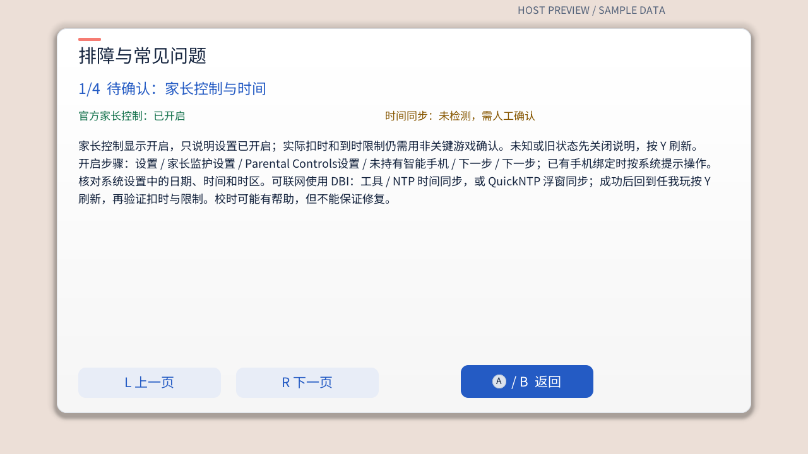

<details>
<summary>查看应用内常见问题各页</summary>

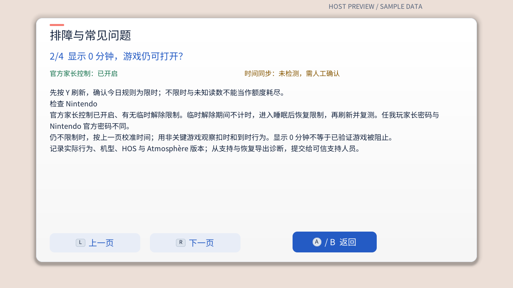
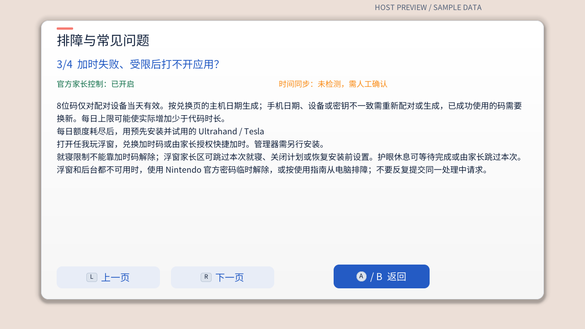
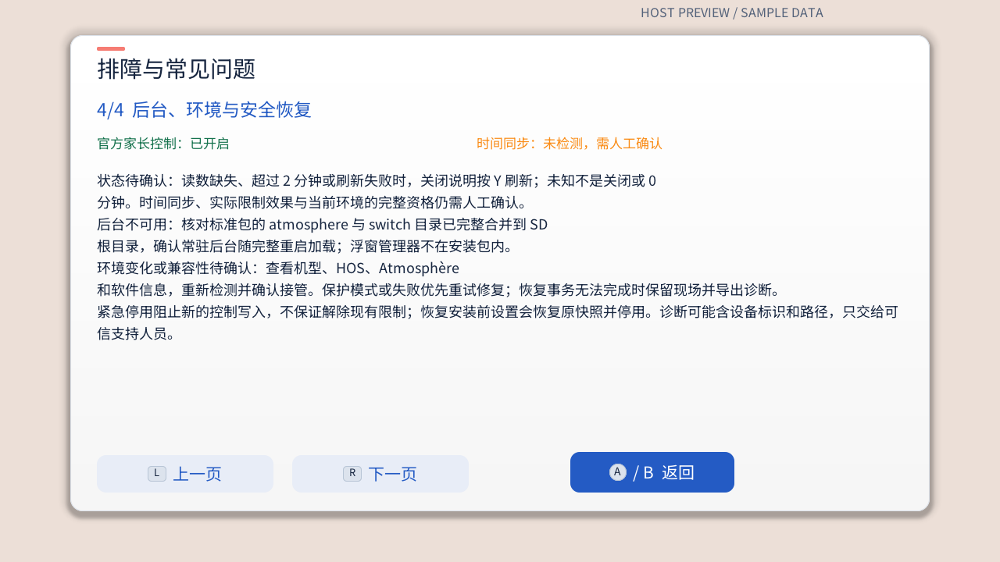

</details>


家长区“支持与恢复”显示当前问题和推荐操作；紧急停用会阻止新的控制写入，但仍允许查看状态、导出诊断和恢复。环境升级后若出现“系统环境已变化”，按页面提示重新检测并接管，成功后保留家长密码、密钥和规则。显示“正在同步”时等待完成，再刷新确认。

<details>
<summary>查看正常、故障与事件详情预览</summary>


</details>

反馈故障时可在此导出诊断包。**排障记录请先写明系统家长控制是否开启、是否临时解除限制，以及时间是否已同步（校时方式、是否成功、校时后刷新和重试的结果）；无法确认时如实标为未知。** 再记录重现步骤、系统与 Atmosphère 版本、PlayWise 版本和界面错误，到[项目 Issues](https://github.com/selfuppen/NX-PlayWise/issues)提交并附上诊断包。不要公开 `credentials.json`、`auth.json`、完整 ledger、真实加时码或家长配置文件。

## 升级

### 保留数据的覆盖升级

标准包只覆盖程序资产和默认模板，不覆盖 `switch/playwise/` 根目录中的家长密码、密钥、规则、账本、日志和安装前设置的备份。升级前仍建议备份数据，并完整覆盖新包的 `atmosphere` 和 `switch` 两个目录，不要只复制某个二进制。

- **关机读卡器升级**：关闭 Switch，取出 SD 卡，在电脑上合并覆盖两个目录，安全弹出并重启。首次打开后按提示完成安全重新检测。
- **开机传输并加载新版**：先关闭 PlayWise 主机应用和浮窗，用 DBI/MTP、FTP 或 USB 完整覆盖标准包，再打开主机应用进入家长区，核对当前与待加载构建，确认“加载新版”。等待四阶段完成后重新打开浮窗。取消后可从“支持与恢复 → 软件信息”重新进入。

如提示安装不完整，重新覆盖**同一个**标准包。旧版本无法直接加载新版、目标不匹配或启动失败时，按提示完整重启；程序不会强制终止旧后台或自动重启主机。传输未完成时不要启动加载新版的流程。

Windows 的 DBI/MTP 保留数据脚本可先预览再执行：

```powershell
.\tools\install_package_via_dbi_mtp.ps1 -SourceFolder .\build\packages
.\tools\install_package_via_dbi_mtp.ps1 -SourceFolder .\build\packages -Apply
```

普通升级不要对安装脚本使用 `-Clean`、`-Full` 或 `-CleanAll`。FTP 全量清理和 Device Lab 安装会影响现有数据或控制环境，只供明确需要的维护者按[测试指南](../开发/测试指南.md)操作。普通用户只安装标准包，不同时启用两个后台。

## 常见问题

> [!IMPORTANT]
> **出现报错，请先确认系统家长控制是否开启、Switch 时间是否已经同步。** 具体检查、校时方法和排障记录要求见[支持与恢复](#支持与恢复)。检查后刷新状态并重试；仍有问题时，记录检查结果和错误码并导出诊断包。
> 操作步骤：[开启官方家长控制](#开启官方家长控制) · [同步 Switch 时间](#同步-switch-时间)。

- **代码提示无效、日期不符或已使用**：核对 Switch 显示的本地日期、设备配置和输入数字。明确提示已使用时请家长新生成一枚；失败或预览取消不应消耗代码。
- **额度仍显示旧值**：等待同步结束后按 `Y` 刷新。超过 120 秒的状态或缺少读数会显示待确认，不应根据旧余额推断限制是否解除。
- **设置今日总额度后显示“已到限制”、还可玩 0 分钟，但游戏仍能打开**：先检查 Nintendo 官方家长控制已开启，并确认没有通过官方家长控制密码临时解除限制。若家长控制状态正常，可尝试联网校准 Switch 时间：在 DBI 中选择“工具 → NTP 时间同步”，或使用 [QuickNTP（Tesla 时间同步工具）](https://github.com/ppkantorski/QuickNTP)。同步成功后回到 PlayWise 刷新状态，并用没有未保存进度的游戏重新验证限制效果。校时只是一个可能的解决方法，参见[Issue #1](https://github.com/selfuppen/NX-PlayWise/issues/1)；若仍可打开游戏，按下一条继续排查，必要时从“支持与恢复”导出诊断。
- **官方倒计时或到时限制不工作**：先暂停 PlayWise 设置，检查 Nintendo 官方家长控制是否开启，在非关键游戏上重新验证。PlayWise 不能替代官方家长控制的计时和限制使用功能。
- **家长网页无法保存配置**：从系统浏览器打开单文件版；若浏览器限制本地文件存储，下次重新导入。需要扫码配对或桌面安装时改用可信 HTTPS 页面。

## 文档与截图维护

文档图片分为以下两类，路径均相对于仓库根目录：

| 来源 | 文档图片路径 | 更新方式 |
| --- | --- | --- |
| 自动生成的主机应用与浮窗 UI 预览 | `docs/images/usage/{child,parent,setup,grant,redeem,plan,holiday,scheduled,bedtime,autonomy,settings,support,overlay}/` 中列于 `tools/sync_doc_previews.py` 的 PNG（主机应用与浮窗） | `python tools/package_remote.py --previews` 重新绘制 `build/ui-previews/`，并将清单中的图片同步到文档路径。若需全量清理可追加 `--clean`。 |
| 手动采集或制作的真机、配对与网页示意 | `docs/images/usage/overlay/ultrahand-entry.jpg`、`docs/images/usage/overlay/playwise-code-entry-legacy.jpg`、`docs/images/usage/parent/pairing-qr-demo.png`、`docs/images/usage/parent/web-code-demo.jpg`、`docs/images/usage/parent-offline-demo.png` | 按实际设备或浏览器界面重新采集、核对并更新；配对二维码只能使用公开演示配置。上述命令不会替换这些图片。 |

自动预览由生产 C/C++ 绘制代码、固定示例状态和仓库固定的 Noto Sans SC 字体生成，带 `HOST PREVIEW / SAMPLE DATA` 标识，只用于阅读布局，不替代真机输入、字体和 PCTL 验证。`--previews`（或 `--only previews`）不运行完整测试，也不生成分发包或 Eden 应用；日常开发构建安装包直接运行 `python tools/package_remote.py`，需要完整发布门禁时运行 `python tools/package_remote.py --release`。详见[测试指南](../开发/测试指南.md)。

另见[开发环境指南](../开发/开发环境指南.md)、[开发指南](../开发/开发指南.md)、[协议](../设计/协议.md)和[PCTL 集成架构](../设计/PCTL集成架构.md)。
