# 使用指南

本指南面向在已安装自定义固件的 Nintendo Switch 上使用“任我玩 · PlayWise”的家长和孩子。首次安装建议使用完整交付包；家长用手机或电脑生成加时码时，推荐先按下文联网扫码配对。

> [!IMPORTANT]
> PlayWise 依赖 Nintendo 官方家长控制的“主机使用时间”计时和“时间到了暂停软件”。HOME、系统设置等亮屏使用也可能消耗额度。请在安装前用没有未保存进度的游戏验证：官方额度会累计，开启暂停开关后到时确实阻断软件。PlayWise 不会替你修改官方开关，也不能修复底层计时故障。

> [!WARNING]
> 每日额度耗尽或就寝限制生效后，游戏、Homebrew、HOME、系统设置和 PlayWise 主机应用可能被 Nintendo 原生弹窗阻断。PlayWise 侧的主机内操作入口是游戏内浮窗；请在设置低额度前装好并试用浮窗。Nintendo 原生弹窗仍可用官方 PIN 临时解锁；这与 PlayWise PIN 是两套不同的授权。

## 安装

### 准备与全新安装

需要一台运行 Atmosphère 和 Homebrew Menu 的 Switch、一张可在电脑上读写的 SD 卡，以及单独安装的 Ultrahand 或其他 Tesla 浮窗管理器。PlayWise 安装包包含 PlayWise 浮窗文件，但不包含浮窗管理器。

1. 先完成上面的 Nintendo 官方家长控制验证，再备份 SD 卡中已有的 PlayWise 数据。
2. 首次使用优先解压 `playwise-complete-<版本>.zip`。它包含标准 Switch 安装包 `playwise-<版本>.zip` 和家长用的 `playwise-offline.html`。
3. 关闭 Switch，取出 SD 卡；解压标准包，确认顶层为 `atmosphere` 和 `switch` 两个目录。将它们合并到 SD 卡根目录，遇到同名程序文件时覆盖。
4. 安全弹出 SD 卡，装回 Switch 并重启。进入 Homebrew Menu 打开“任我玩”，完成下节向导。
5. 用已安装的浮窗管理器确认列表中能找到“任我玩”（文件 `playwise.ovl`），并在仍可进入软件时熟悉打开方式。

标准包不在 `switch/playwise/` 根目录放置 PIN、密钥和运行规则。已有安装应按[升级](#升级)步骤保留这些数据；普通升级不要使用全量清理选项。

### 资格状态

当前候选仅以 Nintendo Switch OLED、HOS 22.5.0、Atmosphère 1.11.2 为资格目标。只有发布 Zip 的 SHA-256 与同目录 `qualification.json` 完全匹配，才能称该原包在记录环境已验证。没有匹配记录或使用其他环境时，应视为未验证。旧截图、主机预览和 Eden 模拟器结果均不是资格证据。

## 首次设置

第一次启动后，按向导完成五步。中途退出会保留进度，下次打开继续。界面若提示环境待确认或保护状态，先阅读页面原因；不要通过手工删除数据绕过检查。

1. **家长区入口**：`-` 键入口始终可用，按下后松开即可进入；也可选预设组合。任意组合录制仍在真机验证中，不是当前向导的可用入口。
2. **PlayWise PIN**：全新安装默认 `110`，建议立即修改。它只保护 PlayWise，不是 Nintendo 官方 PIN。输入时可使用触摸数字键盘或摇杆方向：八个方向为 `1`–`8`，`X` 为 `0`，`Y` 为 `9`，`ZL` 退格，短按 `+` 确认，`B` 取消；长按 `+` 约一秒可临时切到系统数字键盘。
3. **主题**：选择跟随系统、浅色或深色；只影响主机应用，浮窗保持自己的外观。
4. **确认接管**：核对环境和当前额度。PlayWise 保存安装前快照，在检测期间额度没有变化时保留当前总额度与剩余时间。
5. **进入区域**：进入家长区继续设规则，或进入孩子区查看今天安排。

<details>
<summary>查看五步主机界面预览</summary>

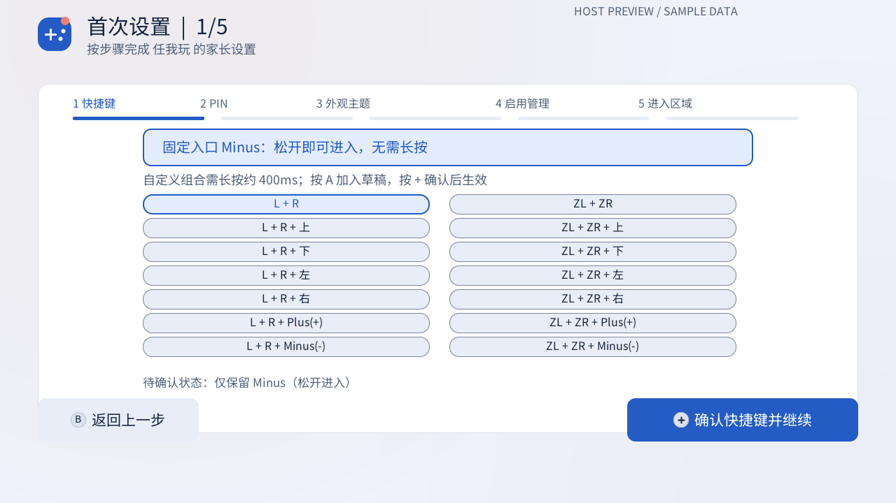
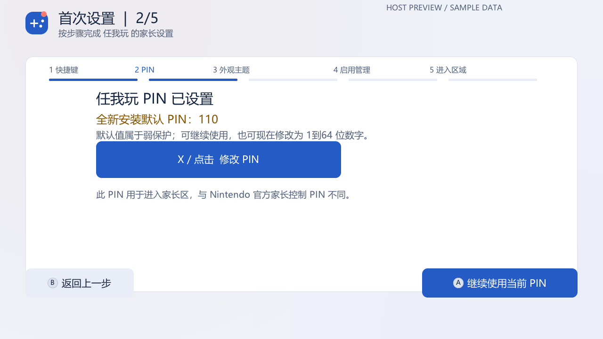
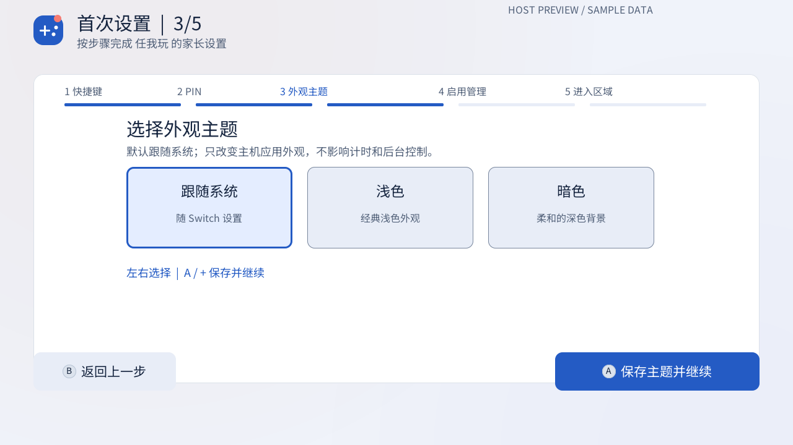
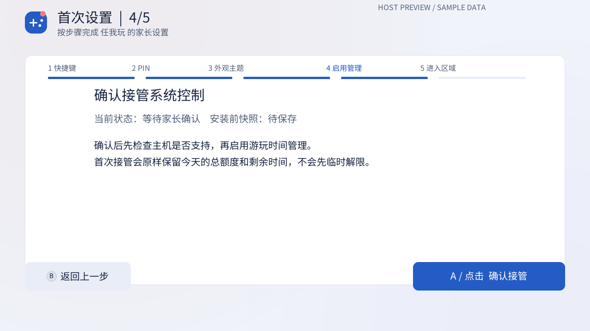
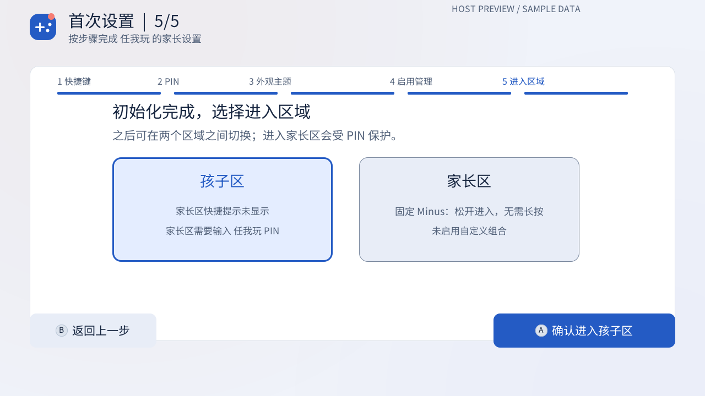

</details>

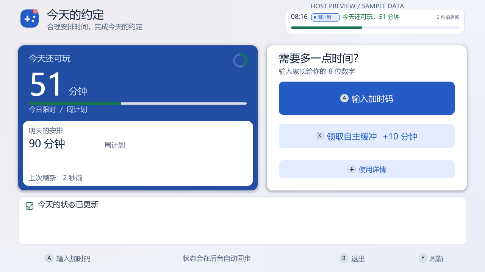

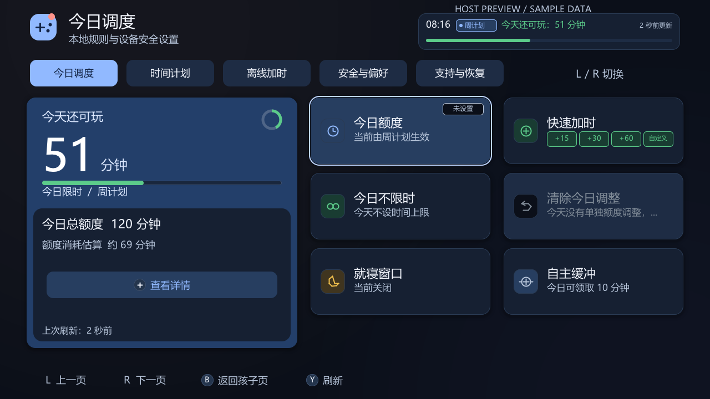

这些主机图片由当前绘制代码和固定示例数据生成，带 `HOST PREVIEW / SAMPLE DATA` 标识；不是真机截图，也不代表真机手柄、触控、字体或 PCTL 验收。

## 日常设置额度

家长区有“今日调度、时间计划、离线加时、安全与偏好、支持与恢复”五个顶级页，`L/R` 可切换。页面顶部显示本机时间、今天还可玩和状态更新时间；状态过期或缺失时显示待确认，不把未知当作零。

- **今日调度**：设置今日总额度、先预览再确认快速加时 `+15 / +30 / +60` 或自定义分钟、设为今日不限时、清除今日调整、跳过本次就寝，以及查看自主缓冲。清除今日调整只移除今天的临时规则；下级计划可能继续生效。
- **时间计划**：编辑周计划、国家节假日、临时日期额度计划、就寝时间和自主缓冲。今日额度调整优先于临时日期计划、国家节假日和周计划；就寝时间与额度规则并行生效。
- **安全与偏好**：修改 PIN、主题、家长区入口，并查看本机家庭活动记录。`支持与恢复` 是独立顶级页。
- **查看详情**：家长可在“今日决策”和“使用与状态”间切换，核对生效规则、估算用时和后台状态。7/30 天数字只表示已知日期的本机额度消耗估算；缺失日不补零，按游戏明细暂不可用。

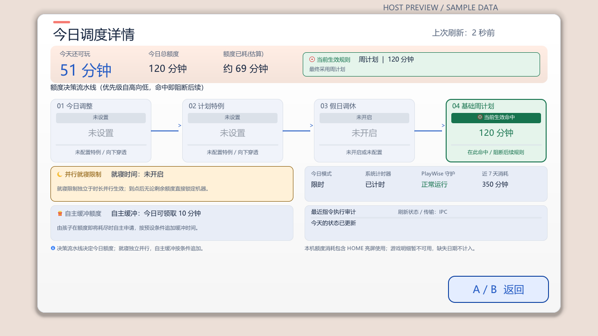

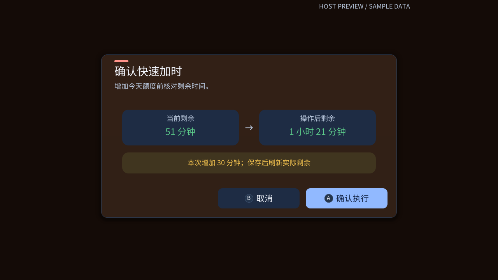

### 长期和日期计划

周计划按星期编辑；国家节假日可设置法定休假与调休工作日；临时日期额度计划支持 1–366 天区间。编辑时先形成草稿，保存前核对对今天的影响。若今天被更高优先级规则覆盖，页面会说明今天额度不变；可能立即耗尽或状态待确认时，需长按确认。失败会保留草稿。

就寝时间可按每周、节假日和指定日期设置，允许跨夜窗口；三个子页面分别保存。切换或离开有未保存内容时，按提示选择保存、放弃或继续编辑。今日自主缓冲默认关闭，可设为每天一次 5、10 或 15 分钟；它增加今日额度，不改变就寝窗口。

<details>
<summary>查看时间计划预览</summary>

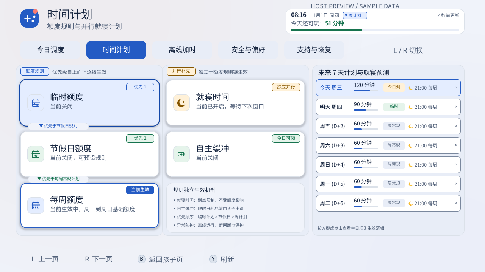
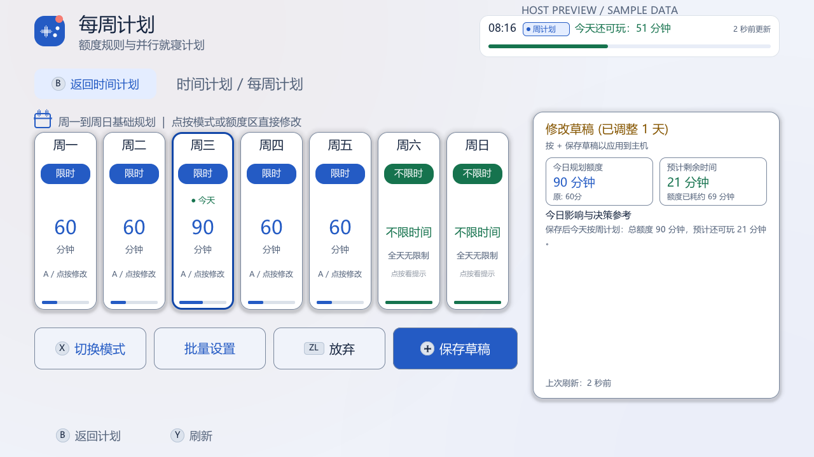
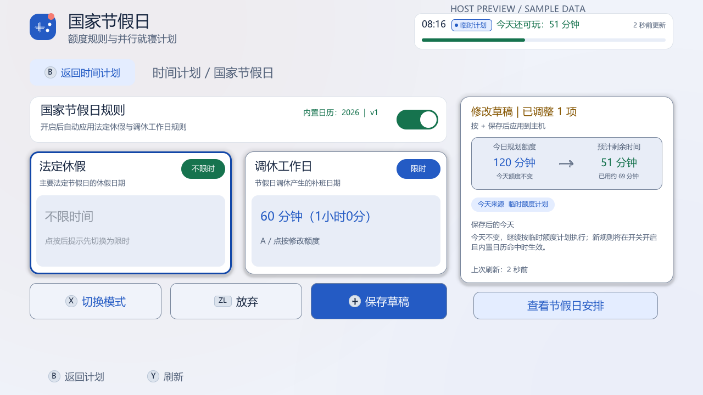
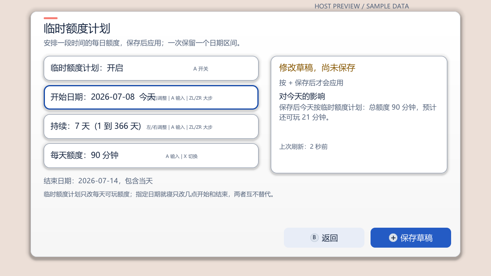
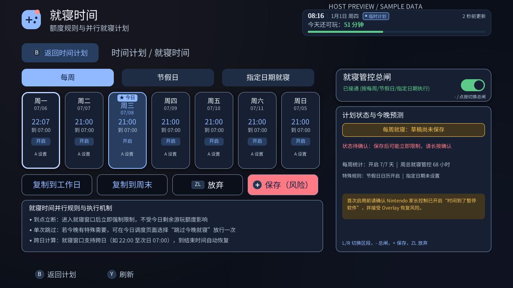
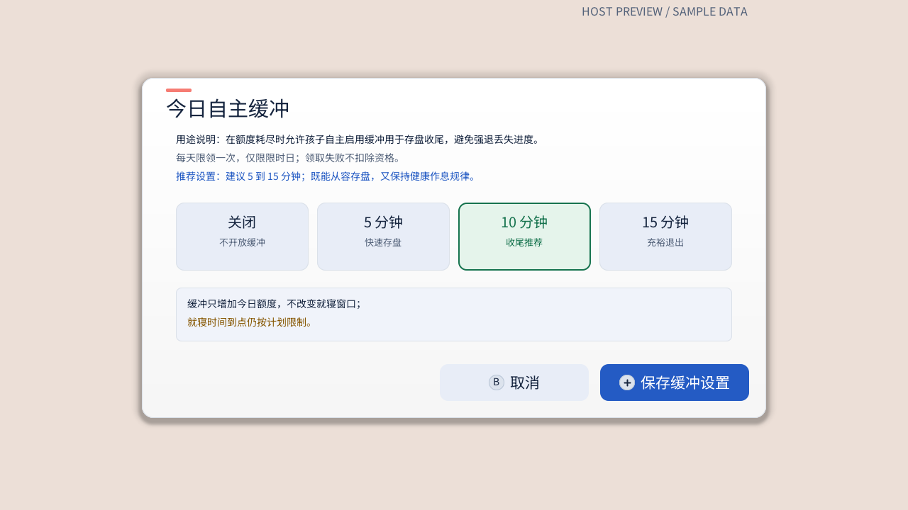

</details>

## 离线加时

代码是由家长决定分钟数、当天有效的 8 位数字。生成代码不会立刻增加额度；孩子成功兑换后才能增加，且一枚代码只能成功使用一次。达到每日上限时，实际增加可能少于代码面额。家长可以通过电话、消息或当面告知孩子，PlayWise 不需要传输服务器。

### 在 Switch 上生成

1. 家长进入“离线加时 → 立即生成加时码”，验证 PlayWise PIN，选择代码时长后生成。
2. 核对代码有效日期和面额，再把 8 位数字告诉孩子。同日生成新代码不会撤销之前签发的代码；修改“下次加时时长”也不会改变已签发代码。
3. 若生成失败，按页面提示检查配置、SD 卡和时间。不要假设旧代码已撤销。

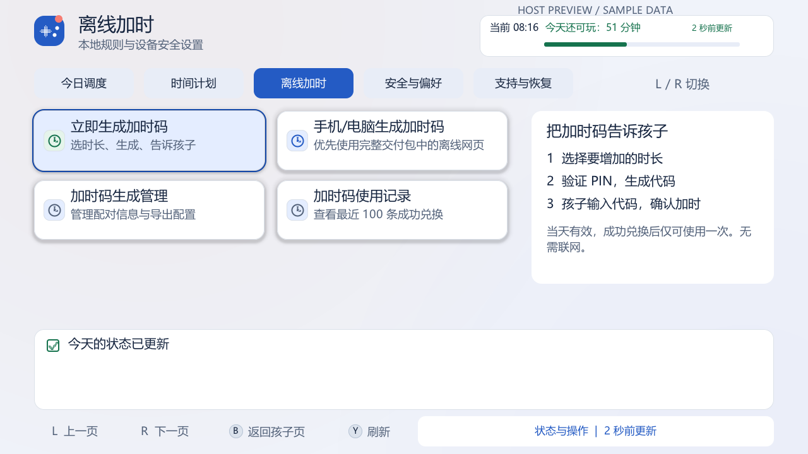

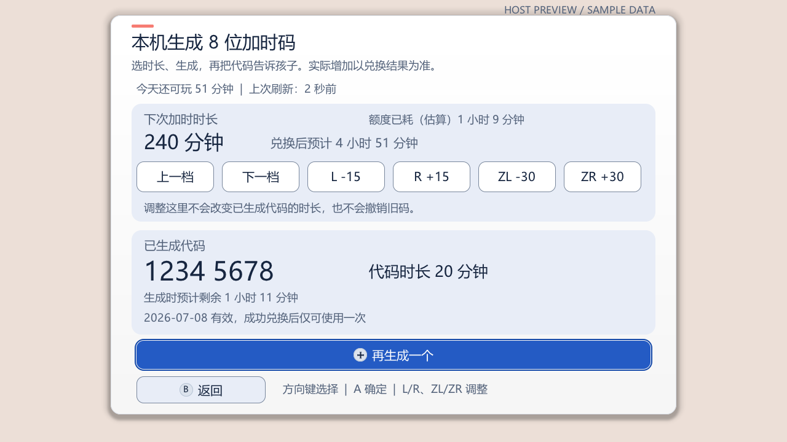

### 在手机或电脑上生成

家长网页在当前浏览器本地计算 8 位码，不向 PlayWise 业务后端提交设备 ID、密钥或代码。无论采用哪种配对方式，生成时都要选择 **Switch 主机的本地日期**；家长设备与 Switch 日期不同时，以 Switch 显示的日期为准。

#### 推荐方案一：联网扫码

1. 让可信的家长手机或电脑接入网络，确认可以访问[公开家长网页](https://selfuppen.github.io/NX-PlayWise/)。该网页托管在 GitHub Pages，部分网络环境可能无法访问；也可以使用自己信任的 HTTPS 静态站点完整部署 `tools/ptc_frontend`。
2. 在 Switch 家长区进入“离线加时 → 手机/电脑生成加时码”，验证 PlayWise PIN，查看页面显示的二维码跳转地址。若使用自部署网页，先在“离线加时 → 加时码生成管理 → 编辑二维码跳转地址”填入其 HTTPS 地址，再返回二维码页面。
3. 用家长设备扫码打开网页，核对设备名，并选择“导入此设备”；若浏览器已有别的设备配置，先确认要覆盖。二维码包含加时码密钥，只能由可信的家长设备扫描。
4. 选好 Switch 本地日期与加时分钟数，生成代码，再通过电话、消息或当面把 8 位数字告诉孩子。孩子在 Switch 上兑换时无需联网。

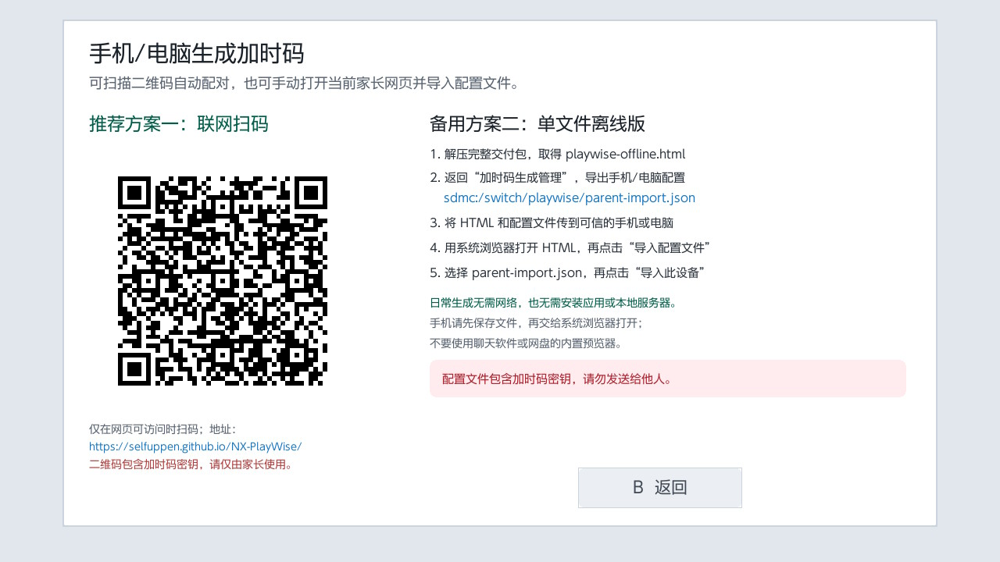

图中的二维码已替换成公开演示配置，不能用于真实家庭设备。扫码只是将设备配置导入家长浏览器；网页生成代码仍在浏览器本地完成。若网页无法访问，使用下方的单文件离线版或[在 Switch 上生成](#在-switch-上生成)。

#### 备用方案二：单文件离线网页

1. 从Release 页面的完整交付包(`playwise-complete-<版本>.zip`)，解压后取得 `playwise-offline.html`。在 Switch 家长区进入“离线加时 → 加时码生成管理 → 导出手机/电脑配置”，验证 PlayWise PIN，导出 `sdmc:/switch/playwise/parent-import.json`。
2. 把 HTML 和配置文件传到可信的家长手机或电脑。手机先保存文件，再交给系统浏览器打开 HTML；不要使用聊天软件或网盘内置预览器。
3. 在网页中选择“导入配置文件”，选取 `parent-import.json`，核对设备名并选择“导入此设备”。之后选择 Switch 本地日期和分钟数，即可离线生成 8 位码；孩子兑换也无需联网。

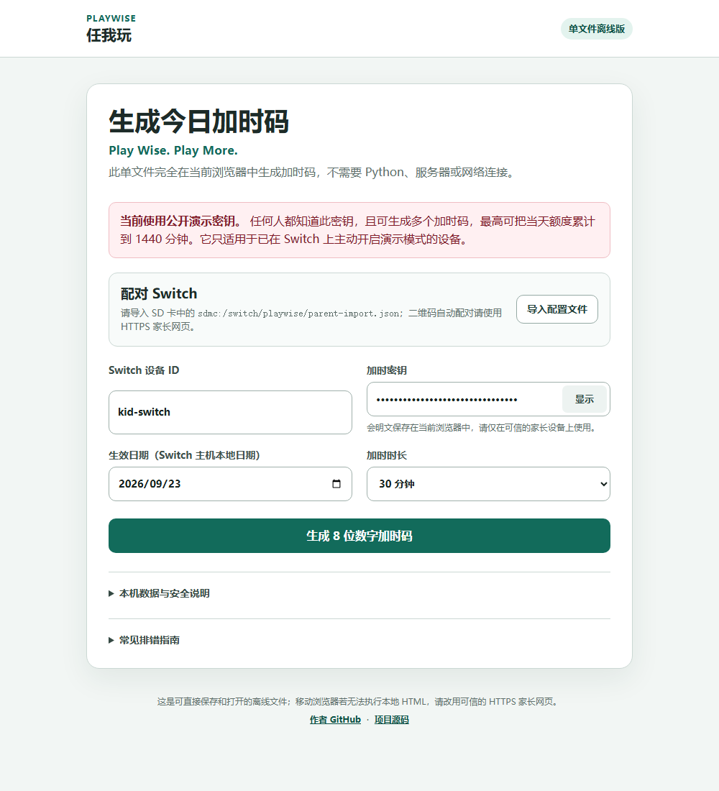

单文件版无需安装应用、Python、前端工具或本地服务器，但不能作为二维码跳转地址，也不能安装成 PWA。若浏览器禁止本地文件持久存储，下次打开时需重新导入配置。`parent-import.json` 和二维码都包含生成代码所需的密钥；不要公开、发送给孩子或上传到不可信站点。修改 Switch 上的加时码密钥后，家长设备须重新配对，旧密钥签发的代码不再有效。

### 孩子在主机应用兑换

未受限且还能启动 Homebrew 时，打开“任我玩”进入孩子区，选择“输入加时码”，填入 8 位数字。核对兑换前和预计兑换后时间，再确认；高风险情况会要求长按。成功页显示实际增加和当前可确认的剩余时间。结果仍在确认中时，等待或重新打开查看原结果，不要重复提交。

<details>
<summary>查看输入、确认和成功预览</summary>

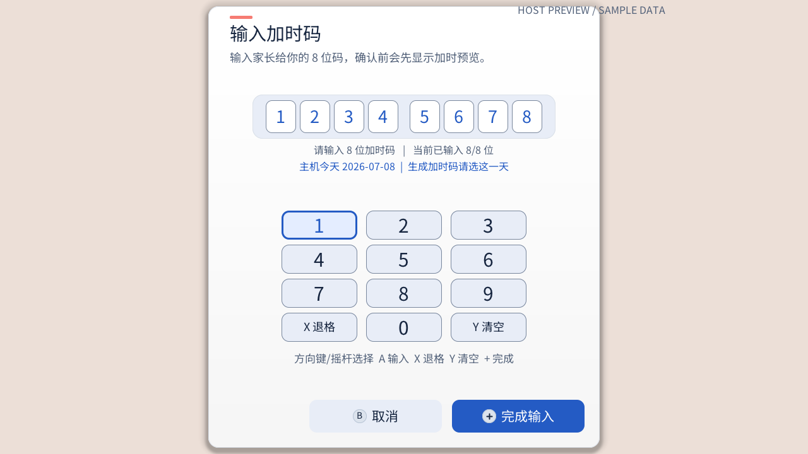
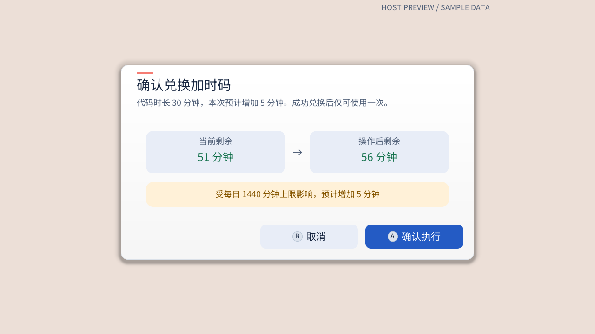
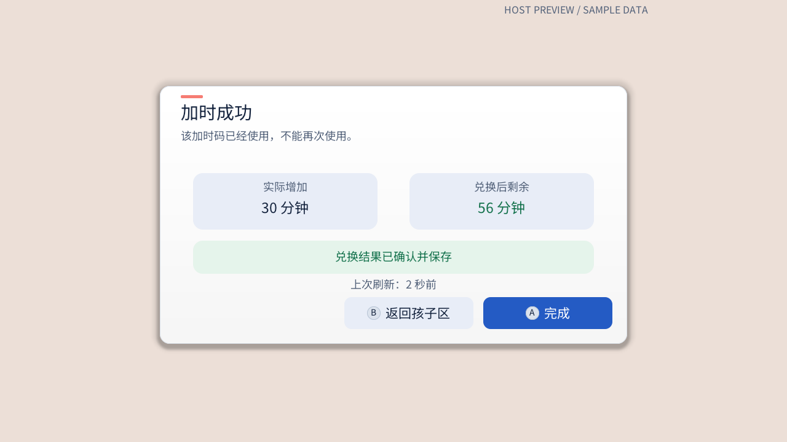

</details>

### 受限时使用游戏内浮窗

在安装时设好的 Ultrahand/Tesla 快捷键打开浮窗管理器，选择“任我玩”（`playwise.ovl`）。每日额度耗尽时可输入代码，先看预计结果再确认；也可由家长通过 PlayWise PIN 单次授权增加分钟或设为今日不限时。就寝限制可由家长跳过本次、关闭计划或恢复安装前快照。浮窗不提供完整长期计划编辑。

请以当前浮窗中的按钮和提示为准。没有当前候选的真机浮窗截图，本指南不沿用旧版本的浮窗界面图。若浮窗或后台不可用，PlayWise 没有可靠的主机内自救入口，应在 SD/外部环境排查；移除浮窗文件不会停止后台计划。

## 支持与恢复

家长区“支持与恢复”显示当前问题和推荐操作；紧急停用会阻止新的控制写入，但仍允许查看状态、导出诊断和恢复。环境升级后若出现“系统环境已变化”，按页面提示重新检测并接管，成功后保留 PIN、密钥和规则。显示“正在同步”时等待完成，再刷新确认。

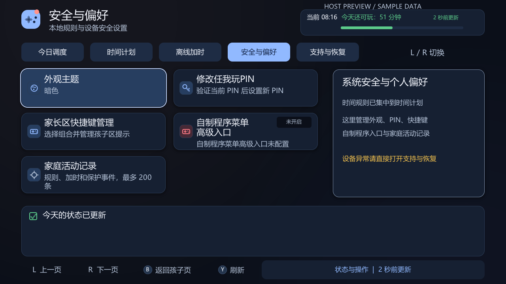

<details>
<summary>查看正常与故障状态预览</summary>

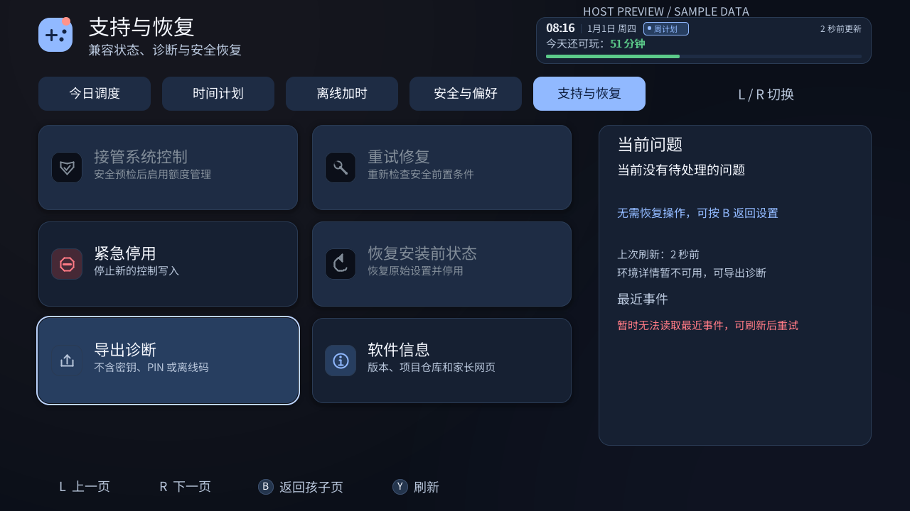
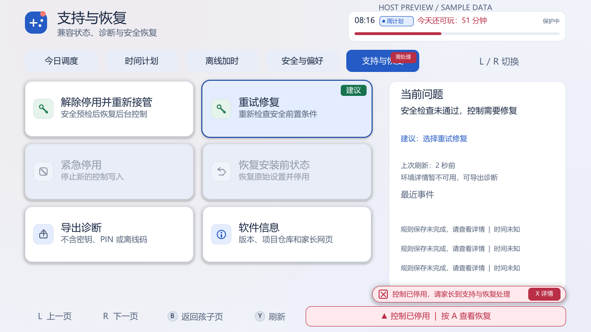

</details>

反馈故障时可在此导出诊断包，记录重现步骤、系统与 Atmosphère 版本、PlayWise 版本和界面错误，再到[项目 Issues](https://github.com/selfuppen/NX-PlayWise/issues)提交。不要公开 `credentials.json`、`auth.json`、完整 ledger、真实加时码或家长配置文件。

## 升级

### 保留数据的覆盖升级

标准包只覆盖程序资产和默认模板，不覆盖 `switch/playwise/` 根目录中的 PIN、密钥、规则、账本、日志和安装前快照。升级前仍建议备份数据，并完整覆盖新包的 `atmosphere` 和 `switch` 两个目录，不要只复制某个二进制。

- **关机读卡器升级**：关闭 Switch，取出 SD 卡，在电脑上合并覆盖两个目录，安全弹出并重启。首次打开后按提示完成安全重新检测。
- **开机传输并热加载**：先关闭 PlayWise 主机应用和浮窗，用 DBI/MTP、FTP 或 USB 完整覆盖标准包，再打开主机应用进入家长区，核对当前与待加载构建，确认“加载新版”。等四阶段完成、新后台身份与 IPC 重连确认后重新打开浮窗。取消后可从“支持与恢复 → 软件信息”重新进入。

如提示安装不完整，重新覆盖**同一个**标准包。旧后台不支持安全交接、目标身份不匹配或启动失败时，按提示完整重启；程序不会强制终止旧后台或自动重启主机。传输未完成时不要启动热加载。

Windows 的 DBI/MTP 保留数据脚本可先预览再执行：

```powershell
.\tools\install_package_via_dbi_mtp.ps1 -SourceFolder .\build\packages
.\tools\install_package_via_dbi_mtp.ps1 -SourceFolder .\build\packages -Apply
```

普通升级不要对安装脚本使用 `-Clean`、`-Full` 或 `-CleanAll`。FTP 全量清理和 Device Lab 安装会影响现有数据或控制环境，只供明确需要的维护者按[测试指南](测试指南.md)操作。普通用户只安装标准包，不同时启用两个后台。

## 常见问题

- **代码提示无效、日期不符或已使用**：核对 Switch 显示的本地日期、设备配置和输入数字。明确提示已使用时请家长新生成一枚；失败或预览取消不应消耗代码。
- **额度仍显示旧值**：等待同步结束后按 `Y` 刷新。超过 120 秒的状态或缺少读数会显示待确认，不应根据旧余额推断限制是否解除。
- **官方倒计时或到时暂停不工作**：先暂停 PlayWise 设置，检查 Nintendo 官方家长控制及“时间到了暂停软件”，在非关键游戏上重新验证。PlayWise 不能替代官方 PCTL 的计时和阻断。
- **家长网页无法保存配置**：从系统浏览器打开单文件版；若浏览器限制本地文件存储，下次重新导入。需要扫码配对或桌面安装时改用可信 HTTPS 页面。

## 文档与截图维护

主机预览由生产 C 绘制代码、固定示例状态和仓库固定的 Noto Sans SC 字体生成。每次运行 `python tools/package_remote.py` 都会在生成 release manifest 之前更新本指南选用的预览图；只更新图片可运行 `python tools/package_remote.py --previews`。这些图用于阅读布局，不替代真机输入、字体和 PCTL 验证。详见[测试指南](测试指南.md)。

另见[开发环境指南](开发环境指南.md)、[开发指南](开发指南.md)、[协议](协议.md)和[PCTL 集成架构](PCTL集成架构.md)。
