# 使用指南

本指南介绍如何安装和使用 **任我玩 · PlayWise**。当前资格目标仅为 Nintendo Switch OLED、HOS 22.5.0 和 Atmosphère 1.11.2；只有发布 Zip 的 SHA-256 与随包 `qualification.json` 完全匹配时才称为已验证，其余构建和环境均显示“未验证”。PlayWise 利用系统家长控制功能完成游玩额度管理、系统计时和到期提醒。

PlayWise 采用 Nintendo 官方的“主机使用时间”口径，而不是“仅游戏前台时间”：HOME、系统设置等亮屏使用也可能消耗额度。到时只显示通知还是暂停软件，由官方“时间到了暂停软件”设置决定；PlayWise 不修改该开关，也不承诺游戏一定退出。参见[任天堂计时说明](https://support.nintendo.com/jp/switch/parentalcontrols/app/setting_change.html)和[Nintendo 暂停设置说明](https://en-americas-support.nintendo.com/app/answers/detail/a_id/22447)。

## 核心功能：离线加时

PlayWise 的加时码生成和兑换不依赖网络或业务后端。在没有 Wi-Fi、Switch 无法联网或家长与孩子不在同一处时，也可以按以下方式临时增加游玩时间：

1. 家长选择需要增加的分钟数，生成当天有效的 8 位加时码。代码可以在 Switch 家长区生成，也可以在事先完成配对并准备好单文件离线版、本地页面或离线缓存的手机、电脑上生成。
2. 家长通过电话、短信或当面告知等方式，把这 8 位代码交给孩子；代码本身不需要通过 PlayWise 服务器传输。
3. 孩子在主机应用或游戏内浮窗中输入代码，核对兑换后的预计时间并确认。
4. Switch 在本机验证代码；兑换成功后立即获得相应的游玩时间。代码成功兑换后只能使用一次，并且仅在签发当天有效。

安装配置后，日常生成、传递和兑换加时码均可在无网络环境中进行。

### 小孩操作：
浮窗兑换加时码 - 已经被限制时，利用Tesla插件兑换加时码：
   
   
小孩区 - 没到时间时，兑换加时码：
   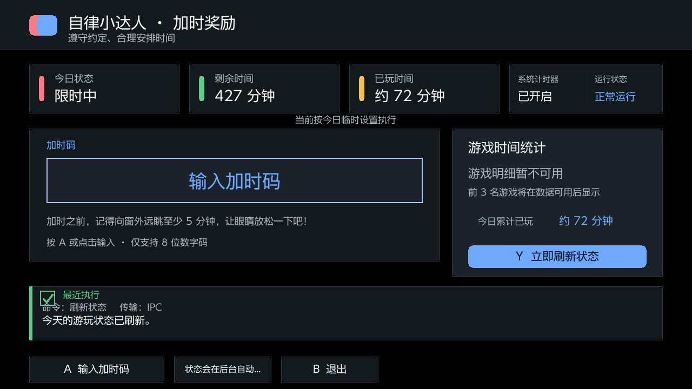
### 家长操作   
家长生成加时码网页-存储在本地的html文件，无需联网，手机电脑都支持：
   

家长区-应用里的控制设置：
   

## 主要功能一览

验证 PlayWise PIN 进入家长区后，可以使用：

- **今日总额度**：临时调整今天全天的总额度、增加时间、设为不限时，或恢复周计划；这里输入的是包含今日额度消耗的全天总额度，不是“从现在起还能玩”的分钟数。界面中的“额度已耗（估算）”来自“配置总额度 − 系统剩余时间”，用于安全计算修改后的余额，并不等同于任天堂的真实游戏运行统计。打开“设置今日总额度”时，消耗估算可靠则默认使用当前可靠总额度与消耗估算中的较大值，不可用则沿用可靠的当前限时额度或回退到 60 分钟；这个 60 分钟只是编辑初始值，不能保证修改后仍可玩 60 分钟。今日不限时、消耗估算未知或新额度可能已经耗尽时，应用会说明可能立即进入时间限制，并要求长按确认；若设置后受限，可回到今日总额度页选择“今日不限时”或“临时加时”，孩子也可兑换有效加时码。“设置今日总额度”和“临时加时”共用同一紧凑编辑器：左侧是数字键盘和快捷增减，右侧分别输入小时、分钟并实时显示总分钟数，同时展示额度已耗（估算）、今天还可玩和修改后预计还可玩；触摸可直接选择字段，手柄 Minus 切换字段。今日总额度可选 1–1440 分钟，临时加时默认 15 分钟、可选 1–120 分钟；
  Nintendo 系统提供的“临时解除限制”不会把 PlayWise 今日规则改成不限时，重新锁屏后原限制会继续生效。PlayWise 会继续显示原“今日规则”和“额度剩余”，并把临时解除作为独立提示；若希望今天持续不限时，应使用本页的“今日不限时”。
  

- **周计划**：星期一到星期日横向排列；可直接点按卡片的模式标签切换限时/不限时，点按额度区修改时长，点按头部只选择日期；`X` 切模式、`A` 改额度。底部“批量设置”先选择工作日或周末，再预览来源规则、目标当前值分组以及会改变/相同跳过数量，按“应用到草稿”后才复制，最后仍需回到周计划统一保存；`Y` 随时刷新。额度编辑沿用小时、分钟双字段及总分钟展示；编辑其他星期时会明确提示今天不受影响；
  

  <details>
  <summary>展开看截图</summary>

  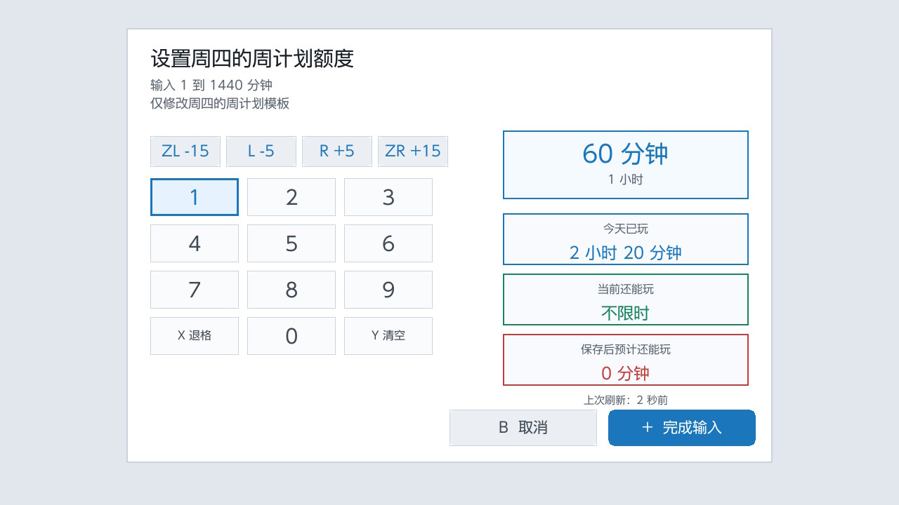

  </details>
- **国家节假日**：顶部总开关控制是否启用年度日历；法定休假与调休工作日使用两张并排规则卡，点右上模式标签可直接切换限时/不限时，点主体额度区以小时、分钟双字段修改时长并查看总分钟。额度编辑框右侧显示规则类型、启用状态，以及今天命中的节日；若今天不匹配，则显示下一次对应的放假或调休安排。底部可切换最后选中规则的模式、放弃草稿或保存；右侧状态栏同时说明“今日临时设置 → 国家节假日 → 周计划”的固定优先级，并可分页查看内置年份安排。总开关关闭时仍可提前编辑并保存预设，但预设不会影响今天；日历未覆盖时自动回退周计划并提示更新；
  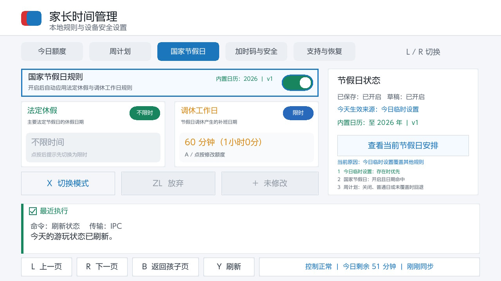

- **临时日期计划**：在“设置 → 高级设置”中为考试周、寒暑假或旅行配置一个 1–366 天的连续区间，可选择限时额度或不限时。开始日与结束日都包含在计划中；优先级为“今日临时设置 → 日期计划 → 国家节假日 → 周计划”。家长区右侧显示未来 7 天预览，孩子区只显示今天和明天及其规则来源。
- **今日自主缓冲**：家长可在高级设置中选择关闭、5、10 或 15 分钟，默认关闭。开启后，孩子仅在限时日每天领取一次，可按 `X` 或触摸“领取今日缓冲”；成功后显示“今日已使用缓冲”。PCTL 或存储失败不会占用当天资格，达到 1440 分钟上限时即使实际增加为 0 也视为当天已领取。
- **家庭活动记录**：高级设置中可查看最近 200 条规则修改、加时码兑换、自主缓冲和保护事件，最新记录优先、每页 8 条。记录不包含 PIN、密钥、完整代码或 nonce；清空需要家长 PIN 和长按确认。
- **7/30 天额度消耗估算**：家长和孩子可看到本机已知日期的趋势与可靠天数。缺失日期保持未知，不补齐、不猜测；该统计表示“本机使用”，不代表某个孩子或 Nintendo 用户。按游戏明细在只读 `pdm:qry` 真机证据完成前继续显示“游戏明细暂不可用”。

家长区五个顶级页面为“今日总额度、周计划、国家节假日、加时码、设置”。顶级页面底栏保留上一页、下一页、返回孩子页和刷新按钮；右侧全局状态栏延伸到主内容右边框，提供完整的当前状态摘要。
- **加时码**：只提供“立即生成加时码”“手机/电脑生成加时码”和“加时码生成管理”三个入口；
  
  <details>
  <summary>展开看截图</summary>

  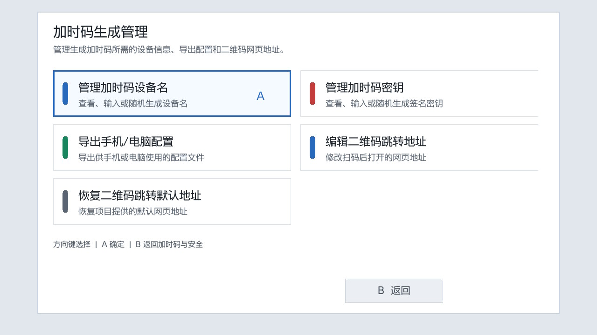

  </details>
  <details>
  <summary>展开看截图</summary>

  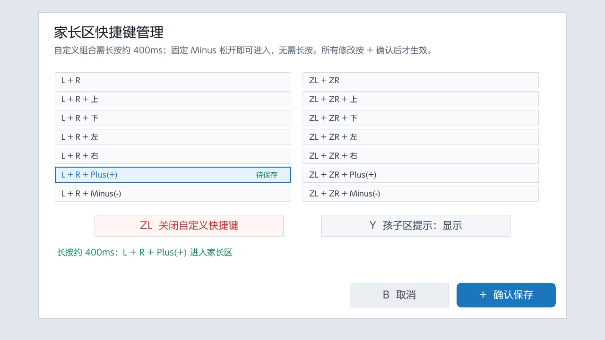

  </details>
  <details>
  <summary>展开看截图</summary>

  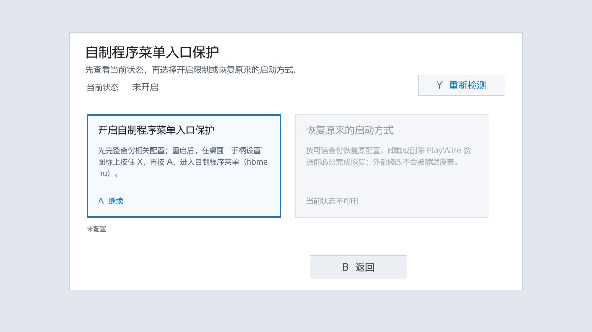

  </details>
  <details>
  <summary>展开看截图</summary>

  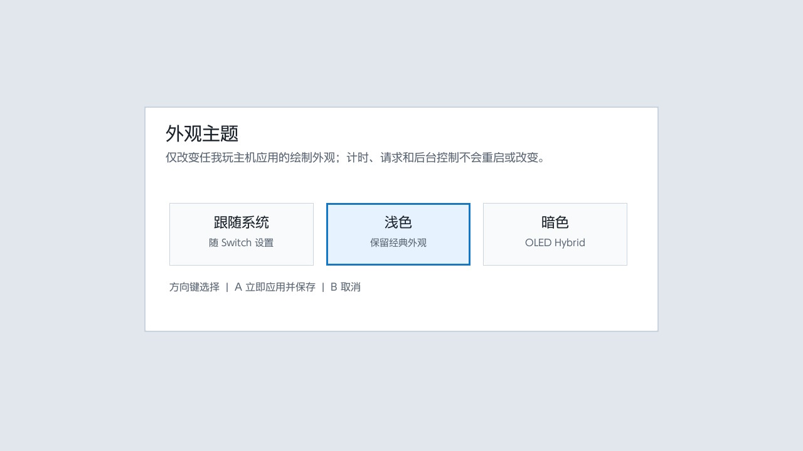

  </details>
- **设置**：集中提供外观主题、修改 PIN、家长区快捷键、“高级设置”和“支持与恢复”入口。外观主题可选跟随系统、浅色或 OLED Hybrid 暗色，选择后立即生效并保存；暗色只改变主机应用绘制，不改变游戏内浮窗、计时或后台控制。
- **设置 → 高级设置**：页面顶部显示“设置 / 高级设置”和“二级页面”层级提示，可按 `B` 或触摸“返回设置”回到设置页；其中依次提供“自制程序菜单高级入口”“临时日期计划”“今日自主缓冲”和“家庭活动记录”。高级入口只改变 hbmenu 启动方式，不是系统防篡改能力。
- **设置 → 支持与恢复**：作为完整二级页面处理接管、保护模式、紧急停用、诊断导出和恢复操作。页面顶部显示“设置 / 支持与恢复”和“二级页面”层级提示，可按 `B` 或触摸“返回设置”回到设置页；存在紧急停用、恢复事务或保护故障时，“设置”和该入口会显示“需处理”，家长区也会直接引导到这里，二级页内不会用 `L/R` 切换顶级页面。

> [!WARNING]
> 配置自制程序菜单高级入口后，不得手工删除或覆盖原配置旁的 `.playwise.bak`、`.playwise.state` 和 `.playwise.conflict` 恢复材料。桌面“手柄设置”图标只是启动载体；该功能只改变 hbmenu 启动方式，不提供防篡改保护。

> 如果安装 PlayWise 前已有整合包或用户配置提供了完全相同的入口，页面会显示“外部配置”。这表示入口已经可用，但 PlayWise 从未修改该配置，也没有能够恢复原启动方式的备份；程序不会把现有配置伪装成安装前备份。需要恢复时应使用原整合包或原配置的可信备份。
  <details>
  <summary>展开看截图</summary>

  

  </details>
  <details>
  <summary>展开看截图</summary>

  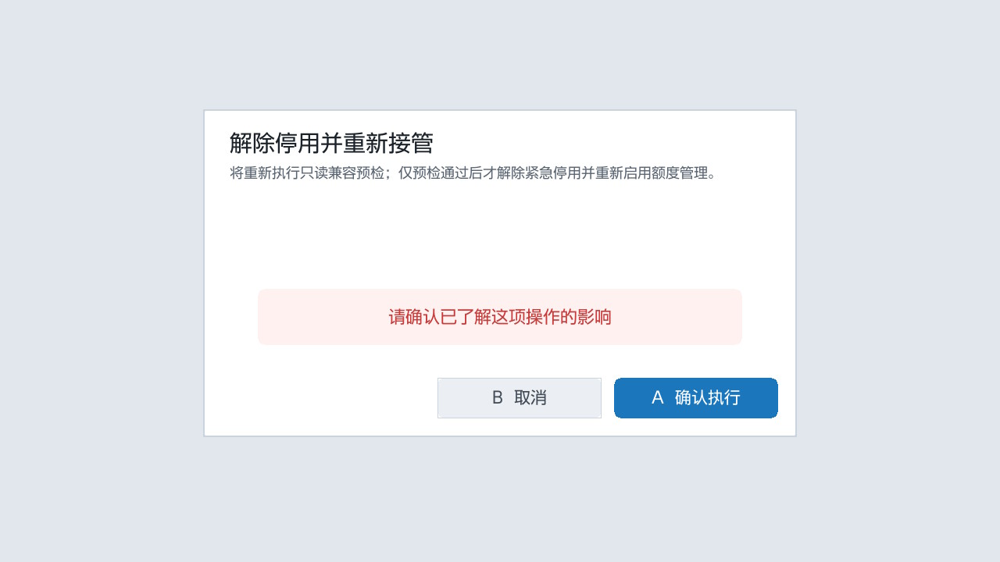

  </details>
  <details>
  <summary>展开看截图</summary>

  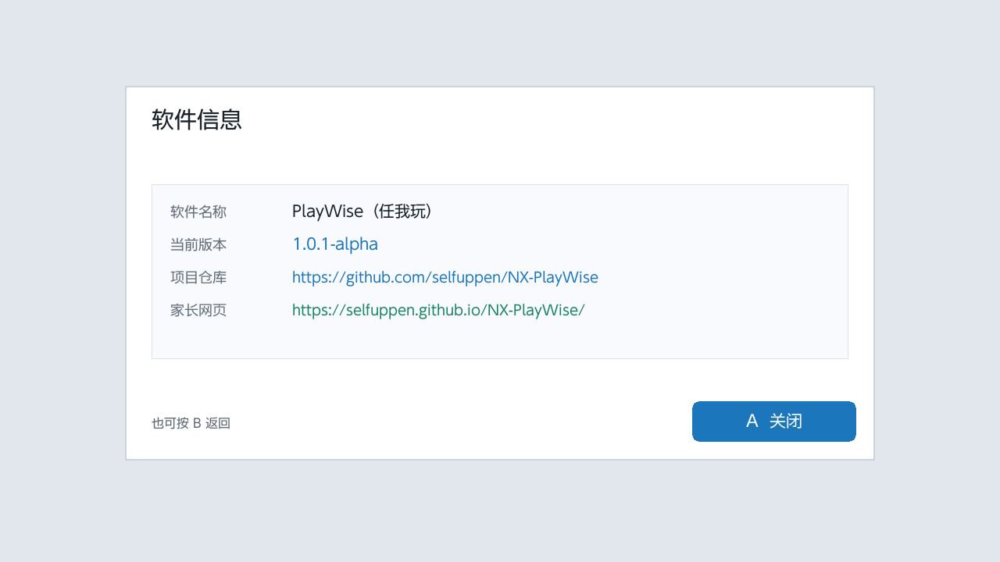

  </details>
  <details>
  <summary>展开看截图</summary>

  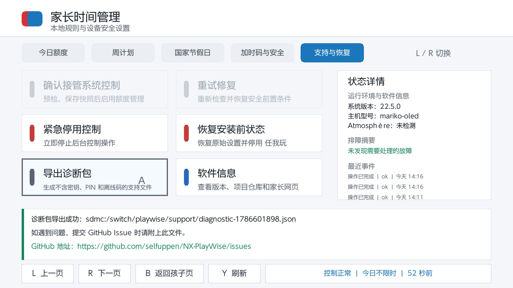

  </details>

修改后若显示“正在同步”，请等待系统完成应用，再刷新页面确认状态。

> [!NOTE]
> 当前标准版不提供 bedtime、按游戏硬性黑白名单、云端遥控或单账号独立额度。Bedtime 和今日/七日 Top 3 必须先完成真机证据矩阵；现阶段不会用“设置 0 分钟”冒充可靠禁玩，也不会调用私有 PCTL `1952` 宣称精确游戏时间。

## 安装与升级

### 安装前准备

> [!IMPORTANT]
> **先验证 Nintendo 官方家长控制，再安装和接管 PlayWise。** 开启官方家长控制后，先确认 HOME 等亮屏使用会累计、待机不应被误计，再用无未保存进度的游戏分别验证：关闭“时间到了暂停软件”时仅通知且软件可继续，开启时提示可见且软件实际暂停/挂起。PlayWise 依赖官方 PCTL 服务，不能替代或修复底层能力，也不会替家长修改该官方开关。

你需要：

- 一台已安装 Atmosphère 和 Homebrew Menu 的 Nintendo Switch；
- 与当前版本匹配的 PlayWise 完整交付包（首次使用推荐）或标准安装包；
- 一张可在电脑上读写的 Switch SD 卡；
- 当家长控制已经限制启动程序使用时，需要打开 任我玩 游戏内浮窗；为此必须单独安装 [Ultrahand Overlay](https://github.com/ppkantorski/Ultrahand-Overlay) 或其他 Tesla 浮窗管理工具。
  


PlayWise 安装包不会安装或修改游戏内浮窗管理器。可参考(推荐使用)[大气层包安装与使用说明](https://docs.qq.com/doc/DVW9PVE5sU0FEd0tP)准备相关环境。本人是在用整合包测试的，强烈推荐。

### 全新安装

1. 完全关闭 Switch，并取出 SD 卡。
2. 首次使用优先解压 `playwise-complete-<版本>.zip` 完整交付包。它包含 `playwise-<版本>.zip` 标准安装包和 `playwise-offline.html` 家长端离线网页；仅需安装 Switch 端时也可直接取得标准安装包。
3. 解压标准安装包。解压目录顶层应包含 `atmosphere` 和 `switch` 两个文件夹。
4. 把这两个文件夹复制到 SD 卡根目录；系统询问时选择合并文件夹并替换同名程序文件。
5. 安全弹出 SD 卡，插回 Switch 并重启机器。
6. 进入 Homebrew Menu(相册)，打开“任我玩”。
   

### 升级现有安装

新版安装包支持直接覆盖升级。安装包不会携带根目录中的 PIN、密钥、规则或运行状态文件，因此可以沿用全新安装相同的合并方式：

1. 关闭 Switch，取出 SD 卡并连接电脑。
2. 解压新版标准安装包，确认顶层是 `atmosphere` 和 `switch`。
3. 把这两个文件夹复制到 SD 卡根目录；系统询问时选择合并文件夹并替换同名文件。
4. 不要先删除或清空原有的 `switch/playwise` 目录；其中的配置、PIN、加时码密钥、规则、状态、日志、账本和恢复材料会被原样保留。
5. 完成后安全弹出 SD 卡，再插回 Switch 并重启机器。
6. 新版程序首次启动会进入现有的安全重新检测流程。家长确认“重新检测并接管”后恢复控制，不需要重新填写 PIN、密钥或规则。

对外发布时只使用 `build/qualified/` 中带匹配 `qualification.json` 的完整包或标准包。Windows 开发者仍可选用仓库中的 `tools/install_package_to_sd.ps1` 执行相同的保留数据升级。普通升级不要使用 `-Clean`、`-Full` 或 `-CleanAll`；这些选项会删除应用数据。自制程序菜单高级入口的恢复材料位于原配置旁，普通覆盖升级和安装脚本都不会处理这些 `.playwise.*` 文件。

你可以直接将包含多个版本包的外层目录（例如 `build/packages`）传递给 `-SourceFolder`，脚本会自动根据是否附加了 `-Lab` 开关定位对应子目录。`-Lab`、`-Both` 和 `-CleanAll` 只供维护者真机实验，不用于普通安装或升级。

Device Lab 准备必须先运行 `.\tools\prepare_device_lab_sd.ps1 -SourceFolder .\build\packages -Drive E -WipeAll` 预演，再在核对目标盘、双包 commit 和备份目录后追加 `-Apply`。脚本会先备份 PlayWise 相关目录，再清理并安装标准版与 Lab；最终只允许标准版保留 `boot2.flag`。普通用户不得安装 Device Lab 包，也不得同时启用两个 sysmodule。


# 功能详情
## 软件入口说明

PlayWise 提供两个入口。括号内是开发和排错时可能看到的技术名称：

| 入口 | 适用场景 | 主要功能 |
| --- | --- | --- |
| 主机应用（Companion NRO） | 日常使用的完整入口 | 从 Homebrew Menu 打开；可进入小孩区兑换加时码，或输入 PIN 进入家长区设置额度、管理周计划及生成加时码。 |
| 游戏内浮窗（Overlay） | 已被限制启动其他程序或正在游戏时的快速入口 | 不退出当前游戏即可尝试输入加时码，不提供完整的家长管理功能。 |

平时优先从 Homebrew Menu 打开主机应用；无法启动其他程序或不方便退出游戏时，再通过游戏内浮窗快速兑换加时码。

## 首次设置

第一次打开“任我玩”时，按照向导完成五步设置：

1. **设置家长区快捷键**：固定的 `Minus -` 入口始终可用，按下后松开即可进入，无需长按；也可以从 14 个预设中增加自定义按键组合，自定义组合需要连续长按约 400ms 才会触发。任意组合录制功能仍在真机验证中，因此当前引导页和设置页不显示录制入口。
   <details>
   <summary>展开看截图</summary>

   

   </details>
2. **确认 PlayWise PIN**：全新安装会自动创建默认 PIN `110`，用于保护本应用的家长区和安全设置，它不是 Nintendo 官方家长控制 PIN。`110` 属于弱保护，可直接继续，也可点“修改 PIN”立即更换。PIN 输入弹层默认使用摇杆方式：上、右上、右、右下、下、左下、左、左上依次代表 `1` 到 `8`，`X` 代表 `0`，`Y` 代表 `9`；左右摇杆和十字键均可输入，触摸数字键盘也可直接点按。输入内容始终只显示为圆点，`ZL` 退格，短按 `+` 确认，`B` 取消；长按 `+` 约 1 秒可临时切换回原来的系统数字键盘，本次输入结束后下次仍默认使用摇杆方式。

   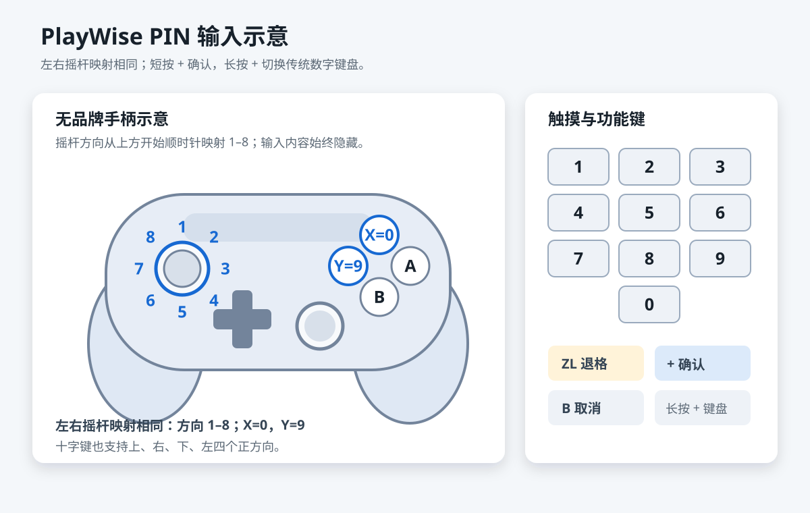
   <details>
   <summary>展开看截图</summary>

   

   </details>
3. **选择外观主题**：默认跟随系统，也可选择浅色或 OLED Hybrid 暗色；只改变主机应用外观。
   <details>
   <summary>展开看截图</summary>

   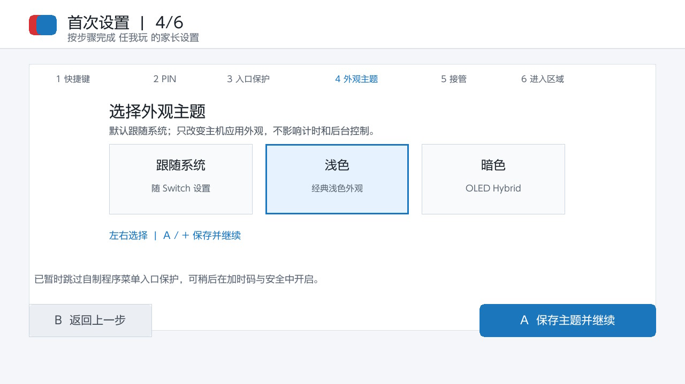

   </details>
4. **确认接管系统控制**：PlayWise 会先检查当前环境并保存安装前快照；确认今日额度在检测期间没有变化后，直接保留当前总额度和剩余时间完成接管，不会先临时解除限制。
   <details>
   <summary>展开看截图</summary>

   

   </details>
5. **选择进入区域**：进入家长区继续配置额度，或进入孩子区查看和兑换加时码。
   <details>
   <summary>展开看截图</summary>

   

   </details>

设置中途退出不会从头开始，下次打开会继续未完成的步骤。若提示“兼容性待确认”，请阅读页面说明并由家长确认；若提示“保护模式”，请到“支持与恢复”按页面推荐操作处理。

家长区：
   

<details>
<summary>展开看截图</summary>

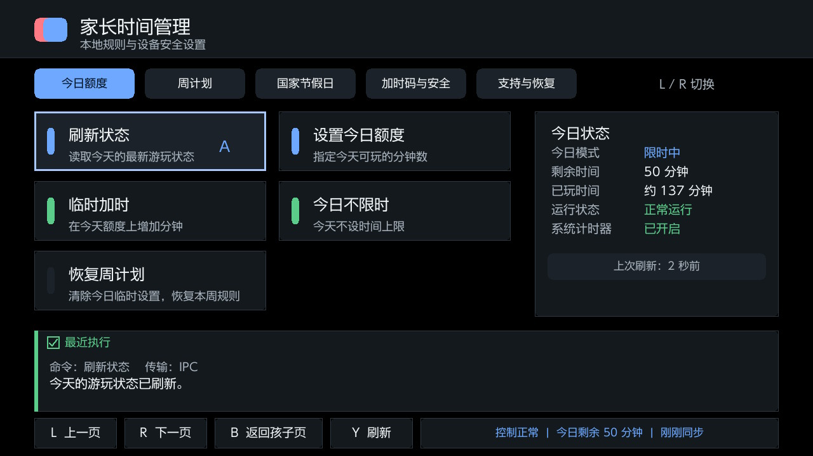

</details>

小孩区：
   

小孩区按 `B` 或触摸底部退出按钮退出。

## 生成和兑换加时码

这套流程的核心用途是：家长决定加时分钟数并把代码告诉孩子，孩子在自己的 Switch 上离线兑换。Switch 无需连接 Wi-Fi，也不会向业务后端提交代码。

### 生成加时码

#### 直接在 Switch 生成

1. 进入“家长区 → 加时码 → 立即生成加时码”。
2. 选择需要增加的分钟数并生成 8 位码。
   <details>
   <summary>展开看截图</summary>

   

   </details>
3. 把代码交给孩子，在主机应用或 任我玩 游戏内浮窗中输入。
4. 核对兑换后的预计时间，确认后完成兑换。

生成代码不会立刻修改额度；代码只在成功兑换后使用一次。同一天生成的新代码不会自动撤销之前生成的代码。

#### 使用手机或电脑生成

手机或电脑端的代码计算在本地完成。默认推荐使用联网扫码快捷生成；若要断网使用或避免依赖 GitHub Pages，请提前导出配置并使用完整交付包中的 `playwise-offline.html` 单文件离线版。

##### 推荐：联网扫码快捷生成

1. 在 Switch 打开“家长区 → 加时码 → 手机/电脑生成加时码”。
2. 验证 PIN 后，用可信的家长设备扫描二维码。
   <details>
   <summary>展开看截图</summary>

   

   </details>
3. 在网页确认设备，选择 UTC+8(北京时间/东八区) 生效日期和分钟数，生成 8 位码。
4. 在主机应用或游戏内浮窗中输入并确认兑换。

此方式依赖二维码当前指向的 GitHub Pages 或可信自部署 HTTPS 页面可访问，适合需要快速自动配对时使用。

##### 可选：使用单文件离线版导入配置生成

1. 从 `playwise-complete-<版本>.zip` 完整交付包中取得 `playwise-offline.html`。
2. 在 Switch 打开“家长区 → 加时码 → 加时码生成管理”，选择“导出手机/电脑配置”，得到 `sdmc:/switch/playwise/parent-import.json`。
3. 将 HTML 和配置文件传到可信的家长设备。手机上应先保存文件，再从文件管理器交给系统浏览器打开；不要使用聊天软件或网盘的内置预览器。
4. 在离线网页中选择“导入配置文件”，选择 `parent-import.json`，再选择“导入此设备”。
5. 选择 UTC+8(北京时间/东八区) 生效日期和分钟数，生成 8 位码。

准备完成后，日常生成无需访问互联网，也无需安装应用、Python、前端工具或本地服务器。二维码和配置文件都包含生成加时码的权限，请勿分享给他人。

### 兑换(使用)加时码

#### 在游戏内浮窗中兑换

##### 通过 Ultrahand 打开游戏内浮窗

1. 当家长控制已经限制启动程序使用，或其他需要快速加时的界面，使用你在 Atmosphère/Ultrahand 中设置的快捷键打开 Ultrahand。
2. 进入 **Overlay（浮窗）** 列表，选择 任我玩（文件名为 `playwise.ovl`）。
   <details>
   <summary>展开看截图</summary>

   

   </details>
3. 按 `A` 加载游戏内浮窗；看到顶部标题“自律约定 / 兑换加时奖励”后，即可开始输入加时码。
4. 使用 `B` 可关闭 任我玩 游戏内浮窗，返回游戏。

##### 在游戏内浮窗中输入和兑换加时码

1. 用方向键或左摇杆移动数字高亮，按 `A` 输入当前数字；也可以直接点按屏幕上的数字键。
2. 重复输入 8 位数字，顶部输入槽会显示已输入的位数。
3. 输错时按 `X` 删除最后一位；按 `Y` 清空后重新输入。
4. 输入满 8 位后，按 `+` 或点按“提交加时奖励”。
5. 先检查预览中的“兑换前”和“兑换后预计还可玩”，再按 `A` 或 `+` 确认。若兑换后将没有可玩时间、状态未知或会从不限时变为限时，在主机应用中必须长按手柄 `A` 或持续按住触摸确认按钮约 1 秒，按钮会显示进度；游戏内 Overlay 仍必须长按手柄 `A`。
6. 看到“加时成功”后，按 `A`、`B` 或 `+`，也可以点按页面关闭结果；若取消、预览失败或提交失败，代码不会被消费，可以重新输入。

`Y` 在未输入代码时用于刷新状态；`-`、`L` 或 `R` 可展开/收起状态详情。游戏内浮窗会先显示预览，确认后才正式兑换，不要在“结果确认中”时重复提交同一枚代码。
游戏内浮窗加时码输入步骤示意：
<details>
<summary>展开看截图</summary>


</details>

游戏内浮窗兑换加时码结果确认和成功示意：
<details>
<summary>展开看截图</summary>


</details>

<details>
<summary>展开看截图</summary>


</details>

#### 在主机应用中兑换

1. 打开任我玩，进入小孩区

<details>
<summary>展开看截图</summary>


</details>

2. 点击“输入加时码”

<details>
<summary>展开看截图</summary>


</details>

3. 输入 8 位兑换码

<details>
<summary>展开看截图</summary>


</details>

4. 提交兑换码

<details>
<summary>展开看截图</summary>


</details>

5. 确认兑换成功

<details>
<summary>展开看截图</summary>


</details>

## 家长网页

对于没有开发经验的普通用户，**强烈推荐直接使用单文件离线版**。你可以通过以下两种等效方式获取它：
1. **完整交付包**：从 `playwise-complete-<版本>.zip` 完整交付包中解压出 `playwise-offline.html` 文件。
2. **源码仓库**：如果下载了项目源码，该文件位于仓库的 `tools/ptc_frontend/playwise-offline.html`。

这两种方式提供的单文件完全相同，内含完整的页面、样式和算法，不依赖任何网络、Python 或本地服务器。获取后只需在电脑或手机上直接使用浏览器打开即可。

网络可访问并需要扫码自动配对时，可选用公开演示网页：[https://selfuppen.github.io/NX-PlayWise/](https://selfuppen.github.io/NX-PlayWise/) 。

<details>
<summary>展开看截图</summary>


</details>

页面优先使用浏览器 Web Crypto 在本地生成加时码，不会把设备 ID、密钥、日期或代码提交给业务后端。单文件离线版在 Web Crypto 不可用时使用内置的兼容实现，生成结果仍通过同一固定向量自检。配对信息会保存在当前浏览器的本地存储中，因此只应在可信的家长设备上使用。

### 中国大陆访问说明

公开演示网页托管在 GitHub Pages，中国大陆网络环境下可能无法访问或加载不稳定。PlayWise 因此主推单文件离线版；取得该文件后，生成加时码不再依赖访问 GitHub Pages。公开页面只作为网络可访问时的扫码和桌面安装便捷方式。

### 直接运行单文件离线版 (推荐)

获取到 `playwise-offline.html` 单文件后：

1. 在电脑上双击该文件并选择 Chrome、Edge、Firefox 或 Safari 打开；在手机上先保存文件，再从文件管理器选择系统浏览器打开，不要使用聊天软件或网盘的内置预览器。部分 iPhone/iPad 文件预览器不会执行本地网页，此时应改用 HTTPS 家长网页。
2. 从 Switch 导出 `sdmc:/switch/playwise/parent-import.json`，复制到家长设备；在离线页面中选择“导入配置文件”，再选择“导入此设备”。
3. 选择 UTC+8(北京时间/东八区) 日期和分钟数，生成 8 位码。

单文件版不能作为 Switch 二维码的固定跳转地址，也不能安装到手机或电脑桌面；二维码自动配对和桌面安装仍需 HTTPS 页面。浏览器若禁止本地文件使用持久存储，页面会显示兼容提示，并在关闭后忘记配置和已签发记录；下次应重新导入，若 Switch 提示“加时码已使用”则重新生成。

### 在电脑上预览完整家长网页 (进阶)

> [!TIP]
> 没有开发经验的用户日常使用时，只需使用上方的单文件离线版即可。以下步骤仅供需要测试二维码配对或部署功能的高级用户参考。

需要测试二维码配对、离线缓存或安装到桌面等网页功能时，可从[项目仓库](https://github.com/selfuppen/NX-PlayWise)下载源码并在仓库根目录启动本地预览服务。此方式仅用于完整家长网页，普通离线生成优先使用上述单文件。

Windows：

```powershell
py .\tools\ptc_frontend_server.py
```

<details>
<summary>展开看截图</summary>


</details>
如果没有 `py` 命令，可把它换成 `python`。

macOS 或 Linux：

```sh
python3 tools/ptc_frontend_server.py
```

保持终端窗口运行，并在同一台电脑的浏览器打开：

```text
http://127.0.0.1:8765/
```

<details>
<summary>展开看截图</summary>


</details>

从 Switch 导出 `sdmc:/switch/playwise/parent-import.json`，复制到电脑；在本地页面中选择“导入配置文件”，再选择“导入此设备”。

<details>
<summary>展开看截图</summary>


</details>

选择日期和分钟数，即可生成 8 位码。

不要直接双击模块化家长网页的 `index.html`；直接打开只适用于已生成的 `playwise-offline.html`。从公开网页切换到本地地址后，需要重新导入设备，因为两个地址的浏览器存储互不相通。

### 部署给手机扫码使用

`localhost` 只代表当前设备：手机扫描指向 `localhost` 的二维码时，会访问手机自身，而不是电脑。普通的局域网 HTTP 地址通常也不满足浏览器的 Web Crypto 安全要求。

如需手机直接扫码配对：

1. 把仓库中的 `tools/ptc_frontend` **完整目录内容**上传到你信任的 HTTPS 静态站点。它是纯静态家长网页（采用 PWA 技术），无需 `npm`、无需构建、无需后端，可部署在域名根目录或子路径。
2. 用手机打开部署后的根地址，确认页面能正常加载。
3. 在 Switch 进入“加时码 → 加时码生成管理 → 编辑二维码跳转地址”。
4. 填写部署后的完整 HTTPS 根地址，建议以 `/` 结尾。
5. 返回“手机/电脑生成加时码”，重新显示二维码并扫码配对。

自定义站点可以读取二维码中的设备名和加时码密钥，只能使用自己信任的部署地址。Switch 只检查地址格式，不会验证网页是否为完整、兼容的 PlayWise 家长网页。

## 常见问题

- **找不到“任我玩”**：检查 SD 卡上是否存在 `switch/playwise/pctc.nro`，并确认从 Homebrew Menu 打开。
- **找不到游戏内浮窗**：确认已安装 Ultrahand Overlay，并检查 `switch/.overlays/playwise.ovl` 是否存在。
- **加时码无效或已使用**：核对配对设备、UTC+8(北京时间/东八区) 日期和密钥；修改密钥后，需要重新配对并生成新代码。
- **一直显示“正在同步”或错误码 `306`**：先在“系统设置 → 家长控制”中开启家长控制，返回 PlayWise 后重新检测。
- **接管时显示错误码 `504`**：请完整重启主机后再试；若仍有问题，请到项目 Issue 页反馈。感谢反馈。
- **显示“保护模式”或“控制已停用”**：进入“家长区 → 设置 → 支持与恢复”，执行页面显示的推荐操作；不要直接编辑或删除数据文件绕过检查。
- **升级系统后提示“系统环境已变化”**：这是系统版本或运行环境指纹变化触发的安全暂停。由家长选择“重新检测并接管”；只读预检通过后会保留现有 PIN、加时码密钥、规则和安装快照并恢复控制，无需完全重装。检测失败时保留停用状态，并按页面错误提示排查。
- **Nintendo 官方家长控制本身不倒计时或到时不限制软件**：PlayWise 依赖这两项官方能力，无法绕过底层故障继续接管。以下是维护者的个人排障经历和网友反馈，不能证明时间同步与恢复之间存在因果关系，也不保证对其他主机或系统环境有效：
  1. 曾尝试降级到 HOS 19.x、20.x、21.x 和 22.0，官方家长控制仍不生效；随后重新升级到 HOS 22.5.0，也没有立即恢复。
  2. 在 HOS 22.5.0 下偶然使用大气层整合包中的时间同步功能后，官方家长控制恢复了游戏内倒计时和到时限制。
  3. 另有网友反馈，在 DBI 中执行“工具 → NTP 时间同步”后，官方家长控制也恢复生效（[[Bug] 【反馈码306】22.5.0系统时间用完但系统不执行限制](https://github.com/selfuppen/NX-PlayWise/issues/1#issuecomment-5426738504)）。
  4. 维护者的当前资格目标为 Nintendo Switch OLED、HOS 22.5.0 和 Atmosphère 1.11.2；是否通过仍以匹配候选哈希的 `qualification.json` 为准。这不代表时间同步工具属于资格验证要求或 PlayWise 依赖。

  遇到类似现象时，可把时间同步作为一项经验性排障尝试，例如 DBI 的“工具 → NTP 时间同步”、[QuickNTP（Tesla 时间同步工具）](https://github.com/ppkantorski/QuickNTP)或[大气层整合包安装与使用说明](https://docs.qq.com/doc/DVW9PVE5sU0FEd0tP)中的相关功能。这些外部工具和项目均不属于 PlayWise，操作前请自行了解来源和风险。同步完成后，应先重新验证 Nintendo 官方家长控制能够倒计时并在到时限制软件，再返回 PlayWise 选择“重新检测”。

- **通信机制和对 SD 卡的保护减少损耗的设计**：
  PlayWise 通过以下机制避免了高频读写，对 SD 卡的消耗非常小，几乎没有额外的物理磨损，无需担心。
  1. **IPC 内存通信**：前端应用（如浮窗）和后台服务的交互（如状态刷新、加时请求）均通过主机内存 (IPC) 直接传输。只要界面显示“传输：IPC”，就不会产生用于传输数据的 SD 卡读写。
  2. **原生计时支持**：日常游戏时的每分钟倒计时管理由任天堂官方底层的 PCTL 系统服务在内存中接管，PlayWise 后台不需要像部分自制软件那样为了防重启而高频（如每秒或每分钟）向 SD 卡写入剩余时间。
  3. **数据缓存与按需持久化**：后台会在启动时将规则和配置加载到内存缓存中，日常的底层轻量轮询检查会被文件系统缓存 (FS Cache) 拦截。只有在发生**实质性状态改变**（如加时成功消耗 Nonce、修改了基础规则、游玩时间耗尽导致状态切换）时，才会按需向 SD 卡进行一次写入。

## 问题反馈与提交流程

当你在使用 PlayWise 遇到无法自行解决的问题，或者遇到程序崩溃、状态异常时，可以通过 GitHub Issue 向我们反馈。为了更快地定位和解决问题，请按照以下简要步骤操作：

### 操作步骤

1. **重现问题**：尽量确认问题是否可以稳定重现，并回忆触发问题的具体操作。
2. **导出诊断包**：
   - 进入任我玩“家长区”。
   - 依次进入“设置” → “支持与恢复”。
   - 点击“导出诊断包”，程序会在 SD 卡的 `switch/playwise/` 目录下生成一个诊断包压缩文件。
   - *注：诊断包内包含脱敏的运行日志和状态数据，不会包含你的 PIN、加时码密钥或完整的离线码等敏感信息。*
3. **提交 Issue**：
   - 访问项目 Issue 页面：[https://github.com/selfuppen/NX-PlayWise/issues](https://github.com/selfuppen/NX-PlayWise/issues)
   - 点击“New issue”创建一个新的问题反馈。
   - 复制并按照下方的“Issue 提交模板”填写问题详情。
   - 将导出的诊断包文件作为附件拖入或上传到 Issue 中。

### Issue 提交模板

提交 Issue 时，请复制以下模板并填写对应信息：

```text
**问题描述**
请简要描述你遇到的问题是什么。例如：在xxx界面点击xxx后，程序提示xxx错误。

**重现步骤**
请提供重现该问题的具体操作步骤：
1. 打开...
2. 点击...
3. 发生...

**预期行为**
你预期程序应该如何运行？

**实际行为**
程序实际发生了什么？（如果有报错代码，请务必提供）

**环境信息**
- Switch 固件版本：（例如 18.1.0 / 22.5.0）
- 大气层 (Atmosphère) 版本：（例如 1.8.0）
- PlayWise 版本：（例如 1.0.0）
- 是否使用整合包或其他特殊插件？

**附加上下文**
在这里添加其他你认为对排查问题有帮助的信息，或者附上截图（如果有）。

**诊断包**
[请在此处上传您导出的诊断包文件]
```

## 相关文档

- [开发指南](开发指南.md)
- [开发环境指南](开发环境指南.md)
- [协议](协议.md)
- [测试指南](测试指南.md)
