# 使用指南

本指南介绍如何安装和使用 **任我玩 · PlayWise**。当前公开版本为 `0.1.4`，已在 Nintendo Switch OLED、HOS 22.5.0 和 Atmosphère 1.11.2 环境完成资格验证；它利用系统家长控制功能完成游玩额度管理、系统计时和到期提醒。

## 核心功能：离线加时

PlayWise 的加时码生成和兑换不依赖网络或业务后端。在没有 Wi-Fi、Switch 无法联网或家长与孩子不在同一处时，也可以按以下方式临时增加游玩时间：

1. 家长选择需要增加的分钟数，生成当天有效的 8 位加时码。代码可以在 Switch 家长区生成，也可以在事先完成配对并准备好单文件离线版、本地页面或离线缓存的手机、电脑上生成。
2. 家长通过电话、短信或当面告知等方式，把这 8 位代码交给孩子；代码本身不需要通过 PlayWise 服务器传输。
3. 孩子在主机应用或游戏内浮窗中输入代码，核对兑换后的预计时间并确认。
4. Switch 在本机验证代码；兑换成功后立即获得相应的游玩时间。代码成功兑换后只能使用一次，并且仅在签发当天有效。

首次安装、手机或电脑配对以及离线页面需要提前准备；准备完成后，日常生成、传递和兑换加时码均可在无网络环境中进行。

## 安装前准备

你需要：

- 一台已安装 Atmosphère 和 Homebrew Menu 的 Nintendo Switch；
- 与当前版本匹配的 PlayWise 完整交付包（首次使用推荐）或标准安装包；
- 一张可在电脑上读写的 Switch SD 卡；
- 当家长控制已经限制启动程序使用时，需要打开 任我玩 游戏内浮窗；为此必须单独安装 [Ultrahand Overlay](https://github.com/ppkantorski/Ultrahand-Overlay) 或其他 Tesla 浮窗管理工具。
  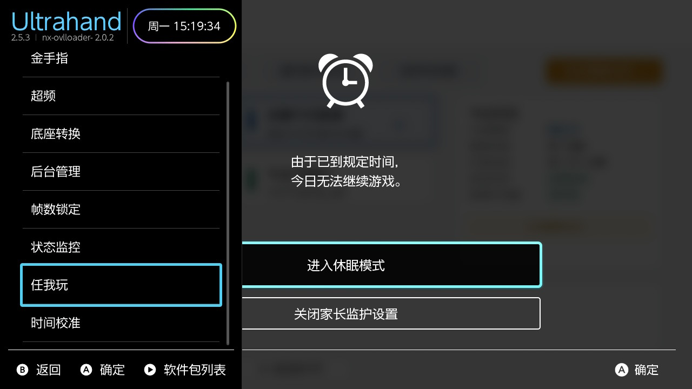

PlayWise 安装包不会安装或修改游戏内浮窗管理器。可参考(推荐使用)[大气层包安装与使用说明](https://docs.qq.com/doc/DVW9PVE5sU0FEd0tP)准备相关环境。本人是在用整合包测试的，强烈推荐。

## 全新安装

1. 完全关闭 Switch，并取出 SD 卡。
2. 首次使用优先解压 `playwise-complete-<版本>.zip` 完整交付包。它包含 `playwise-<版本>.zip` 标准安装包和 `playwise-offline.html` 家长端离线网页；仅需安装 Switch 端时也可直接取得标准安装包。
3. 解压标准安装包。解压目录顶层应包含 `atmosphere` 和 `switch` 两个文件夹。
4. 把这两个文件夹复制到 SD 卡根目录；系统询问时选择合并文件夹。
5. 安全弹出 SD 卡，插回 Switch 并重启机器。
6. 进入 Homebrew Menu(相册)，打开“任我玩”。
   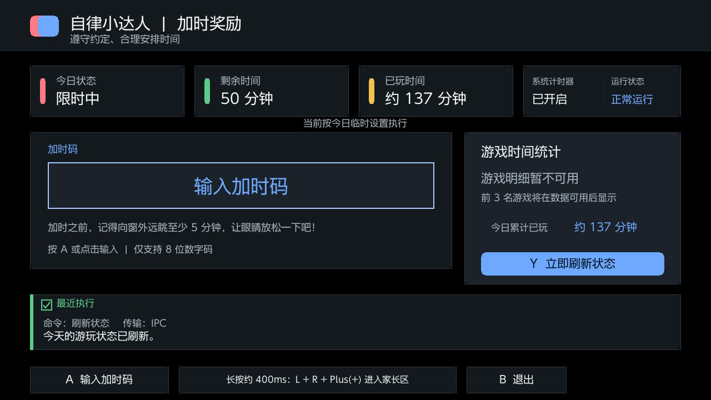

## 软件入口说明

PlayWise 提供两个入口。括号内是开发和排错时可能看到的技术名称：

| 入口 | 适用场景 | 主要功能 |
| --- | --- | --- |
| 主机应用（Companion NRO） | 日常使用的完整入口 | 从 Homebrew Menu 打开；可进入小孩区兑换加时码，或输入 PIN 进入家长区设置额度、管理周计划及生成加时码。 |
| 游戏内浮窗（Overlay） | 已被限制启动其他程序或正在游戏时的快速入口 | 不退出当前游戏即可尝试输入加时码，不提供完整的家长管理功能。 |

平时优先从 Homebrew Menu 打开主机应用；无法启动其他程序或不方便退出游戏时，再通过游戏内浮窗快速兑换加时码。

## 升级现有安装

升级时不要直接覆盖已有的 `switch/playwise` 数据目录，否则可能丢失 PIN、密钥、规则或状态。Windows 用户应使用与安装包版本匹配的 `tools/install_package_to_sd.ps1`：

1. 关闭 Switch，取出 SD 卡并连接电脑。
2. 解压新版安装包。
3. 在 PowerShell 中进入安装脚本所在的仓库目录，把 `<解压目录>` 和 `E:` 换成实际路径及 SD 卡盘符：

```powershell
powershell -ExecutionPolicy Bypass -File .\tools\install_package_to_sd.ps1 -SourceFolder <解压目录> -Drive E: -Apply
```

4. 按提示核对目标路径，并输入显示的 SD 卡盘符确认。
5. 完成后安全弹出 SD 卡，再插回 Switch 并重启机器。

普通升级不要使用 `-Clean` 或 `-Full`，这两个选项会清空 PlayWise 数据。macOS 或 Linux 目前没有等价的安全升级脚本；请先完整备份 SD 卡中的 `switch/playwise`，再手动升级。

## 首次设置

第一次打开“任我玩”时，按照向导完成四步设置：

1. **设置家长区快捷键**：固定的 `Minus -` 入口始终可用，也可以增加自定义按键组合。
   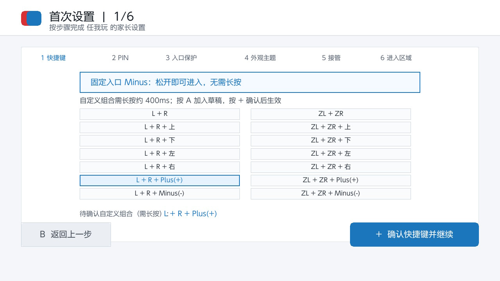
2. **设置 PlayWise PIN**：用于保护本应用的家长区和安全设置，它不是 Nintendo 官方家长控制 PIN。
   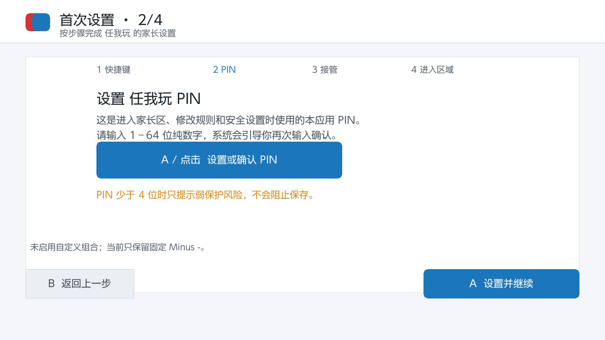
3. **确认接管系统控制**：PlayWise 会先检查当前环境，通过后才应用设置。
   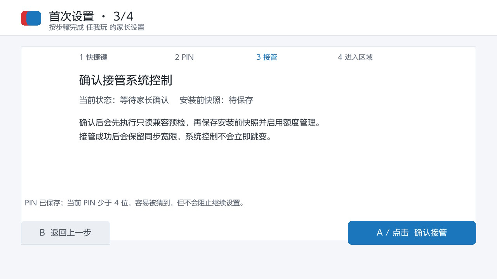
4. **选择进入区域**：进入家长区继续配置额度，或进入孩子区查看和兑换加时码。
   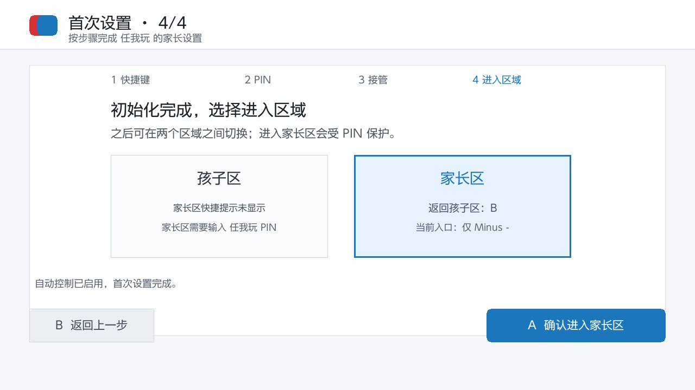

设置中途退出不会从头开始，下次打开会继续未完成的步骤。若提示“兼容性待确认”，请阅读页面说明并由家长确认；若提示“保护模式”，请到“支持与恢复”按页面推荐操作处理。

家长区：

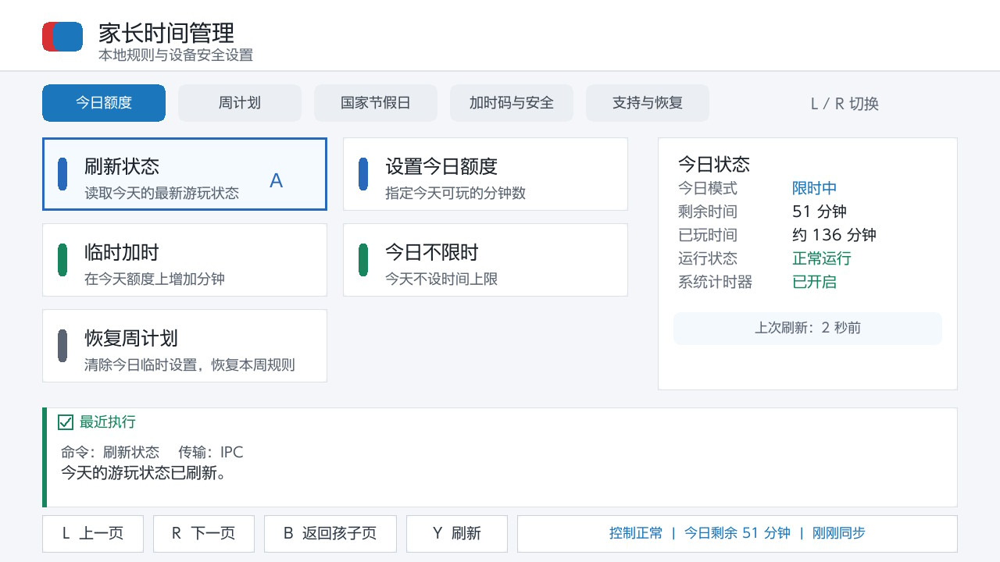

小孩区：


## 主要功能一览

验证 PlayWise PIN 进入家长区后，可以使用：

- **今日额度**：临时调整今天的总额度、增加分钟、设为不限时，或恢复周计划；
  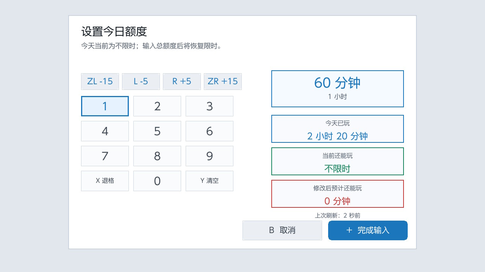
- **周计划**：分别设置星期一到星期日的限时或不限时规则；
  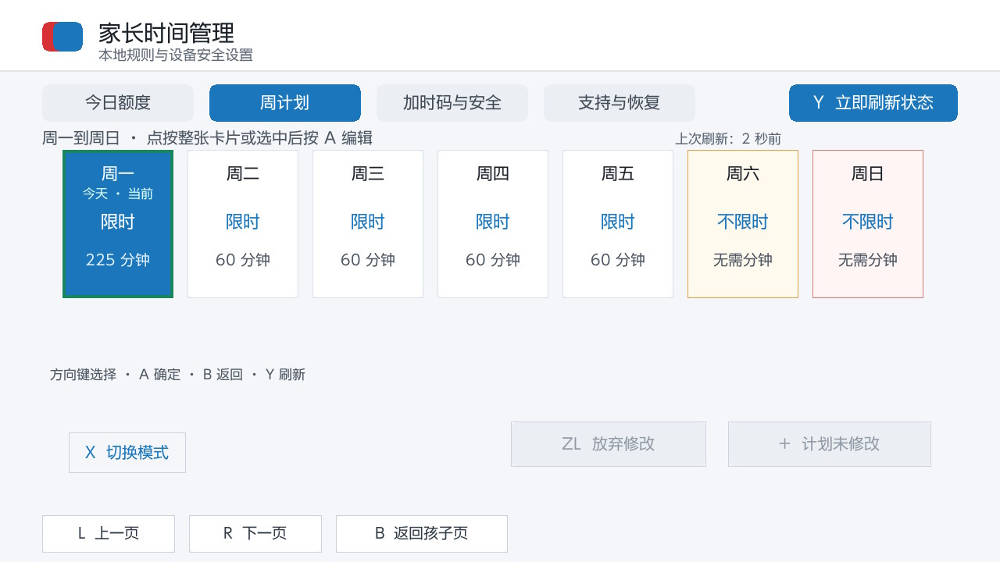
- **加时码与安全**：生成加时码、配对家长端、修改 PIN 和管理家长区快捷键；
  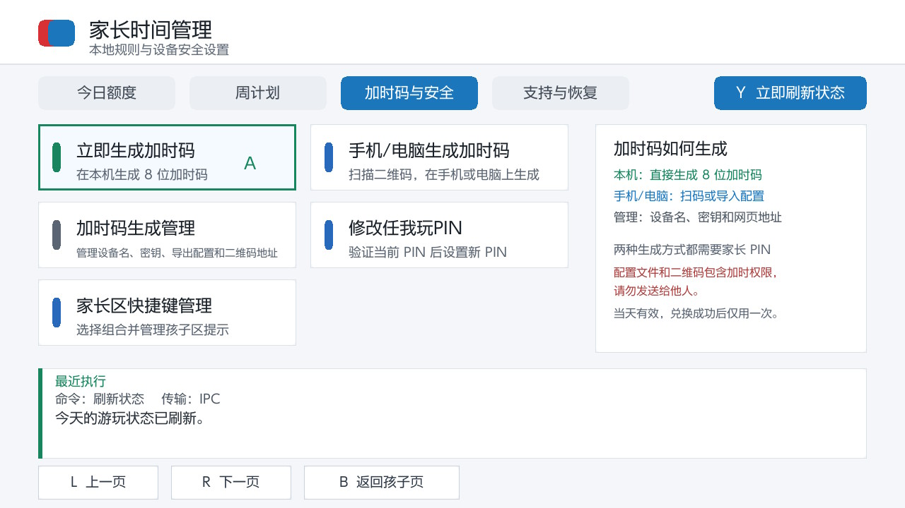
- **支持与恢复**：处理保护模式、紧急停用、诊断导出和恢复操作。
  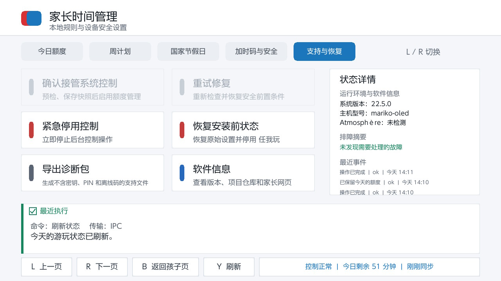

修改后若显示“正在同步”，请等待系统完成应用，再刷新页面确认状态。

## 生成和兑换加时码

这套流程的核心用途是：家长决定加时分钟数并把代码告诉孩子，孩子在自己的 Switch 上离线兑换。Switch 无需连接 Wi-Fi，也不会向业务后端提交代码。

### 生成加时码

#### 直接在 Switch 生成

1. 进入“家长区 → 加时码与安全 → 立即生成加时码”。
2. 选择需要增加的分钟数并生成 8 位码。
   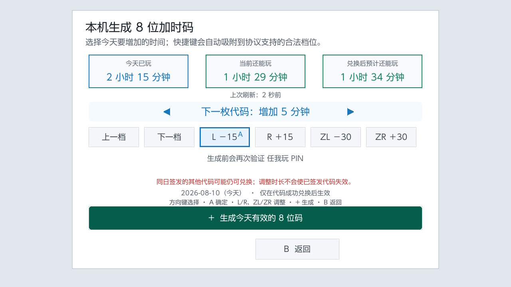
3. 把代码交给孩子，在主机应用或 任我玩 游戏内浮窗中输入。
4. 核对兑换后的预计时间，确认后完成兑换。

生成代码不会立刻修改额度；代码只在成功兑换后使用一次。同一天生成的新代码不会自动撤销之前生成的代码。

#### 使用手机或电脑生成

手机或电脑端的代码计算在本地完成。默认推荐完整交付包中的 `playwise-offline.html`，避免依赖 GitHub Pages；若要断网使用，请提前导出并导入本机配置。

##### 推荐：使用单文件离线版导入配置生成

1. 从 `playwise-complete-<版本>.zip` 完整交付包中取得 `playwise-offline.html`。
2. 在 Switch 打开“家长区 → 加时码与安全 → 加时码生成管理”，选择“导出手机/电脑配置”，得到 `sdmc:/switch/playwise/parent-import.json`。
3. 将 HTML 和配置文件传到可信的家长设备。手机上应先保存文件，再从文件管理器交给系统浏览器打开；不要使用聊天软件或网盘的内置预览器。
4. 在离线网页中选择“导入配置文件”，选择 `parent-import.json`，再选择“导入此设备”。
5. 选择 UTC+8 生效日期和分钟数，生成 8 位码。

准备完成后，日常生成无需访问互联网，也无需安装应用、Python、前端工具或本地服务器。二维码和配置文件都包含生成加时码的权限，请勿分享给他人。

##### 可选：联网扫码快捷生成

1. 在 Switch 打开“家长区 → 加时码与安全 → 手机/电脑生成加时码”。
2. 验证 PIN 后，用可信的家长设备扫描二维码。
   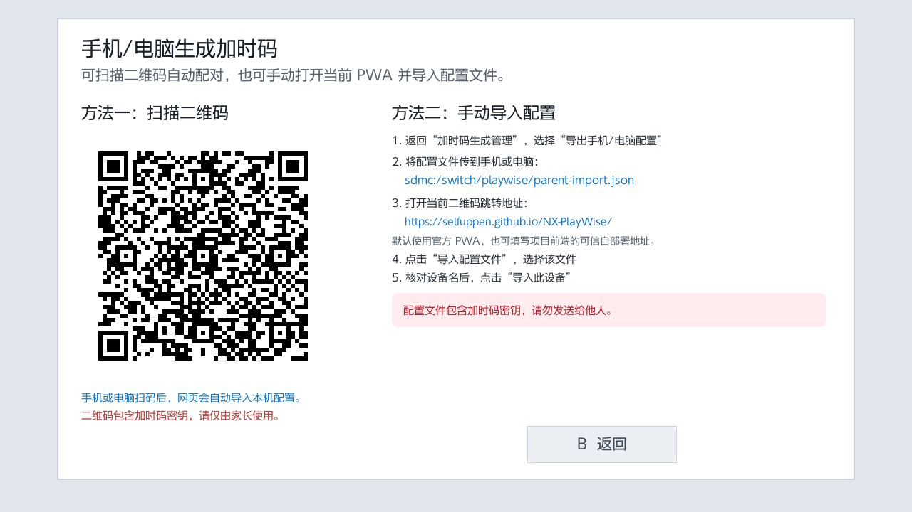
3. 在网页确认设备，选择 UTC+8 生效日期和分钟数，生成 8 位码。
4. 在主机应用或游戏内浮窗中输入并确认兑换。

此方式依赖二维码当前指向的 GitHub Pages 或可信自部署 HTTPS 页面可访问，适合需要自动配对时使用，不是网络受限环境下的默认路径。

### 兑换(使用)加时码

#### 在游戏内浮窗中兑换

##### 通过 Ultrahand 打开游戏内浮窗

1. 当家长控制已经限制启动程序使用，或其他需要快速加时的界面，使用你在 Atmosphère/Ultrahand 中设置的快捷键打开 Ultrahand。
2. 进入 **Overlay（浮窗）** 列表，选择 任我玩（文件名为 `pctc.ovl`）。
   
3. 按 `A` 加载游戏内浮窗；看到顶部标题“自律约定 / 兑换加时奖励”后，即可开始输入加时码。
4. 使用 `B` 可关闭 任我玩 游戏内浮窗，返回游戏。

##### 在游戏内浮窗中输入和兑换加时码

1. 用方向键或左摇杆移动数字高亮，按 `A` 输入当前数字；也可以直接点按屏幕上的数字键。
2. 重复输入 8 位数字，顶部输入槽会显示已输入的位数。
3. 输错时按 `X` 删除最后一位；按 `Y` 清空后重新输入。
4. 输入满 8 位后，按 `+` 或点按“提交加时奖励”。
5. 先检查预览中的“兑换前”和“兑换后预计还能玩”，再按 `A` 或 `+` 确认。若兑换后将没有可玩时间、状态未知或会从不限时变为限时，必须长按手柄 `A` 确认；触屏不能跳过这个确认。
6. 看到“加时成功”后，按 `A`、`B` 或 `+`，也可以点按页面关闭结果；若取消、预览失败或提交失败，代码不会被消费，可以重新输入。

`Y` 在未输入代码时用于刷新状态；`-`、`L` 或 `R` 可展开/收起状态详情。游戏内浮窗会先显示预览，确认后才正式兑换，不要在“结果确认中”时重复提交同一枚代码。
游戏内浮窗加时码输入步骤示意：
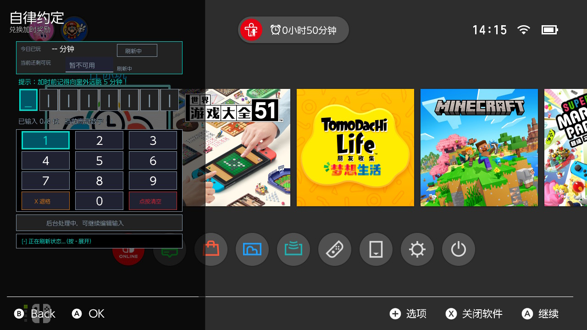

游戏内浮窗兑换加时码结果确认和成功示意：
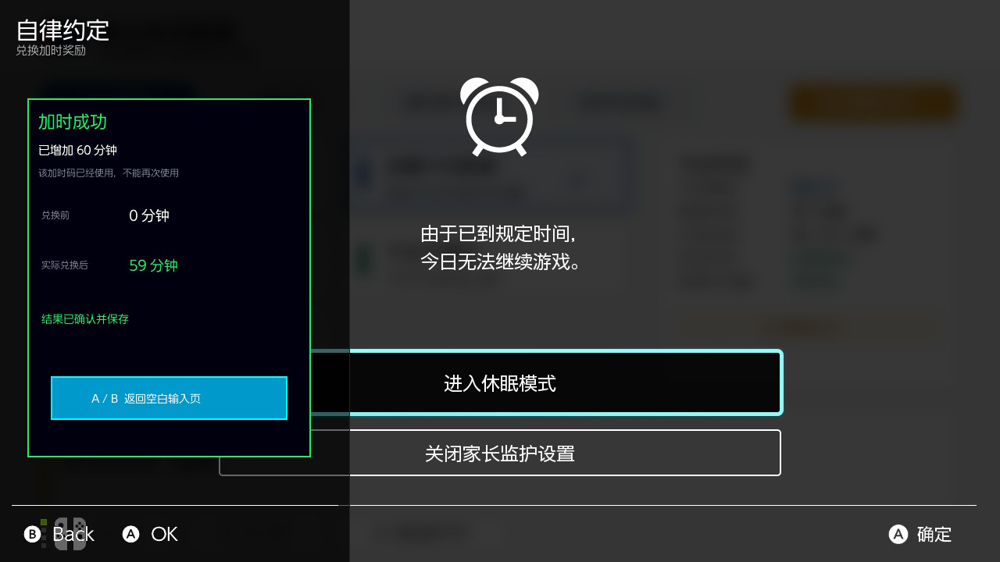

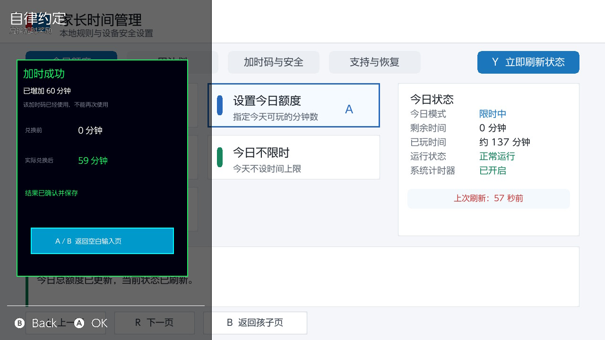

#### 在主机应用中兑换

1. 打开任我玩，进入小孩区


2. 点击“输入加时码”

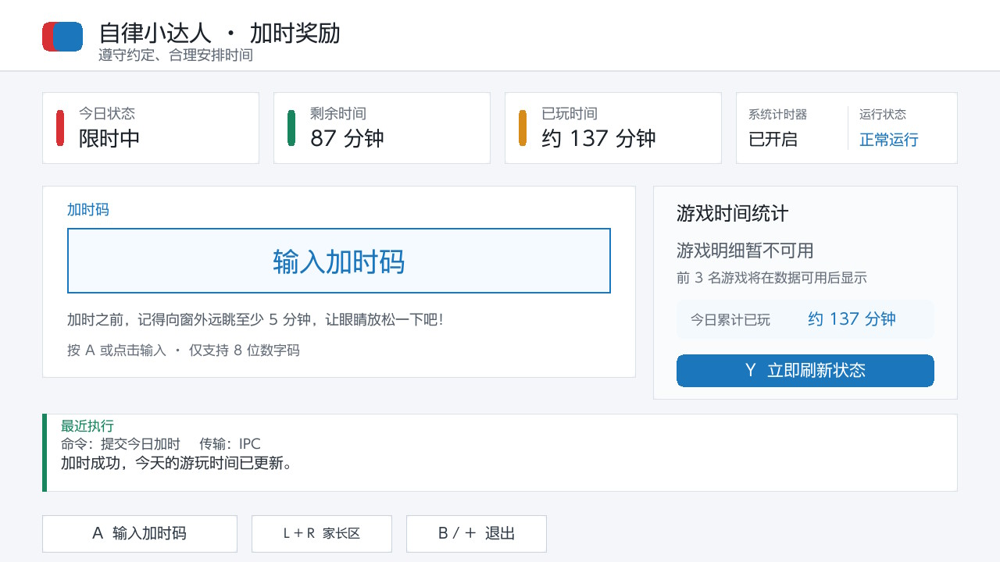

3. 输入 8 位兑换码

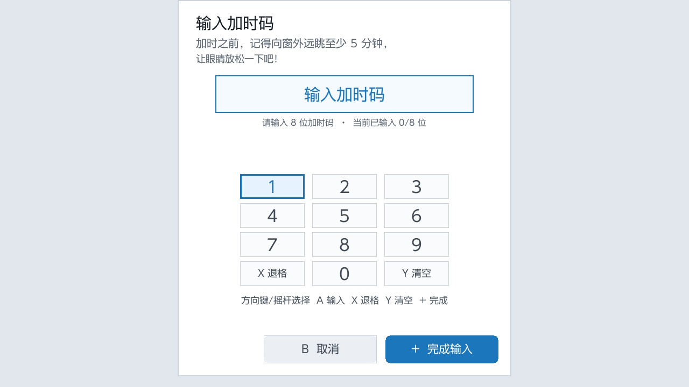

4. 提交兑换码

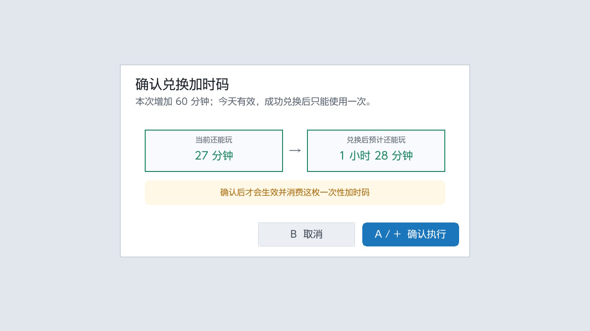

5. 确认兑换成功

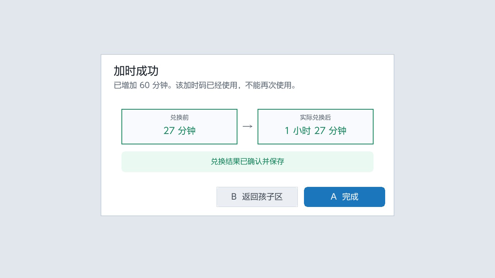

## 家长网页

普通用户优先使用完整交付包中的单文件离线版。网络可访问并需要扫码自动配对时，可选用公开演示网页：[https://selfuppen.github.io/NX-PlayWise/](https://selfuppen.github.io/NX-PlayWise/) 。


页面优先使用浏览器 Web Crypto 在本地生成加时码，不会把设备 ID、密钥、日期或代码提交给业务后端。单文件离线版在 Web Crypto 不可用时使用内置的兼容实现，生成结果仍通过同一固定向量自检。配对信息会保存在当前浏览器的本地存储中，因此只应在可信的家长设备上使用。

### 中国大陆访问说明

公开演示网页托管在 GitHub Pages，中国大陆网络环境下可能无法访问或加载不稳定。PlayWise 因此主推完整交付包内的单文件离线版；取得交付包后，生成加时码不再依赖访问 GitHub Pages。公开页面只作为网络可访问时的扫码和桌面安装便捷方式。

### 直接运行单文件离线版

`playwise-offline.html` 内含页面、样式和加时码算法，不依赖 Python、前端工具、本地服务器或网络资源。

1. 从 `playwise-complete-<版本>.zip` 完整交付包中取得 `playwise-offline.html`。如已能访问公开网页，也可在网页中选择“下载单文件离线版”。
2. 在电脑上双击该文件并选择 Chrome、Edge、Firefox 或 Safari 打开；在手机上先保存文件，再从文件管理器选择系统浏览器打开，不要使用聊天软件或网盘的内置预览器。部分 iPhone/iPad 文件预览器不会执行本地网页，此时应改用 HTTPS 家长网页。
3. 从 Switch 导出 `sdmc:/switch/playwise/parent-import.json`，复制到家长设备；在离线页面中选择“导入配置文件”，再选择“导入此设备”。
4. 选择 UTC+8 日期和分钟数，生成 8 位码。

单文件版不能作为 Switch 二维码的固定跳转地址，也不能安装到手机或电脑桌面；二维码自动配对和桌面安装仍需 HTTPS 页面。浏览器若禁止本地文件使用持久存储，页面会显示兼容提示，并在关闭后忘记配置和已签发记录；下次应重新导入，若 Switch 提示“加时码已使用”则重新生成。

### 在电脑上预览完整家长网页

需要测试二维码配对、离线缓存或安装到桌面等网页功能时，可从[项目仓库](https://github.com/selfuppen/NX-PlayWise)下载源码并在仓库根目录启动本地预览服务。此方式仅用于完整家长网页，普通离线生成优先使用上述单文件。

Windows：

```powershell
py .\tools\ptc_frontend_server.py
```

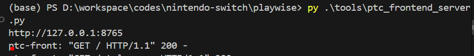
如果没有 `py` 命令，可把它换成 `python`。

macOS 或 Linux：

```sh
python3 tools/ptc_frontend_server.py
```

保持终端窗口运行，并在同一台电脑的浏览器打开：

```text
http://127.0.0.1:8765/
```

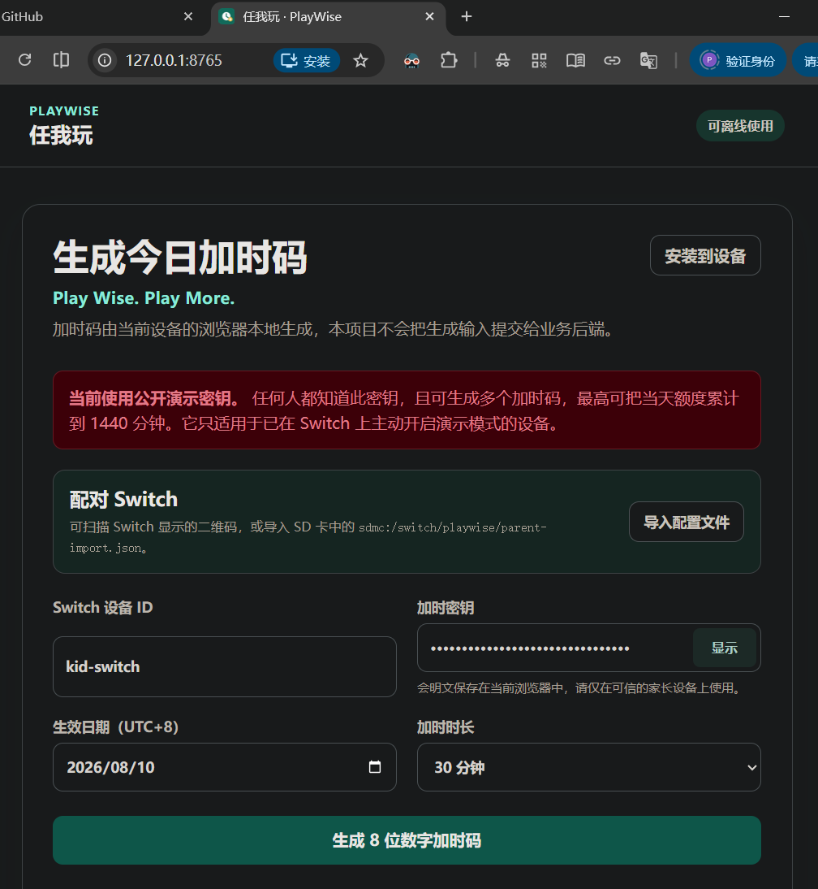

从 Switch 导出 `sdmc:/switch/playwise/parent-import.json`，复制到电脑；在本地页面中选择“导入配置文件”，再选择“导入此设备”。


选择日期和分钟数，即可生成 8 位码。

不要直接双击模块化家长网页的 `index.html`；直接打开只适用于已生成的 `playwise-offline.html`。从公开网页切换到本地地址后，需要重新导入设备，因为两个地址的浏览器存储互不相通。

### 部署给手机扫码使用

`localhost` 只代表当前设备：手机扫描指向 `localhost` 的二维码时，会访问手机自身，而不是电脑。普通的局域网 HTTP 地址通常也不满足浏览器的 Web Crypto 安全要求。

如需手机直接扫码配对：

1. 把仓库中的 `tools/ptc_frontend` **完整目录内容**上传到你信任的 HTTPS 静态站点。它是纯静态家长网页（采用 PWA 技术），无需 `npm`、无需构建、无需后端，可部署在域名根目录或子路径。
2. 用手机打开部署后的根地址，确认页面能正常加载。
3. 在 Switch 进入“加时码与安全 → 加时码生成管理 → 编辑二维码跳转地址”。
4. 填写部署后的完整 HTTPS 根地址，建议以 `/` 结尾。
5. 返回“手机/电脑生成加时码”，重新显示二维码并扫码配对。

自定义站点可以读取二维码中的设备名和加时码密钥，只能使用自己信任的部署地址。Switch 只检查地址格式，不会验证网页是否为完整、兼容的 PlayWise 家长网页。

## 常见问题

- **找不到“任我玩”**：检查 SD 卡上是否存在 `switch/playwise/pctc.nro`，并确认从 Homebrew Menu 打开。
- **找不到游戏内浮窗**：确认已安装 Ultrahand Overlay，并检查 `switch/.overlays/pctc.ovl` 是否存在。
- **加时码无效或已使用**：核对配对设备、UTC+8 日期和密钥；修改密钥后，需要重新配对并生成新代码。
- **一直显示“正在同步”或错误码 `306`**：先在“系统设置 → 家长控制”中开启家长控制，返回 PlayWise 后重新检测。
- **显示“保护模式”或“控制已停用”**：进入家长区的“支持与恢复”，执行页面显示的推荐操作；不要直接编辑或删除数据文件绕过检查。

需要提交问题时，可先在“支持与恢复”导出诊断包。诊断包不会包含 PIN、加时码密钥或完整离线码。项目 Issue 地址为 [https://github.com/selfuppen/NX-PlayWise/issues](https://github.com/selfuppen/NX-PlayWise/issues)。

## 相关文档

- [开发指南](开发指南.md)
- [开发环境指南](开发环境指南.md)
- [协议](协议.md)
- [测试指南](测试指南.md)
